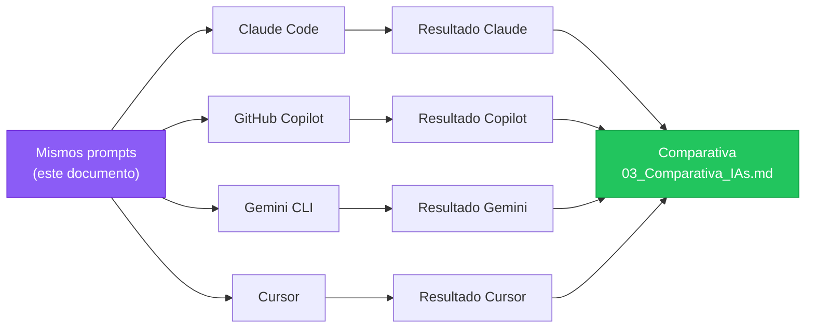
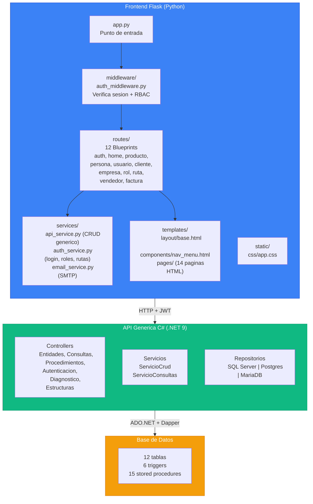
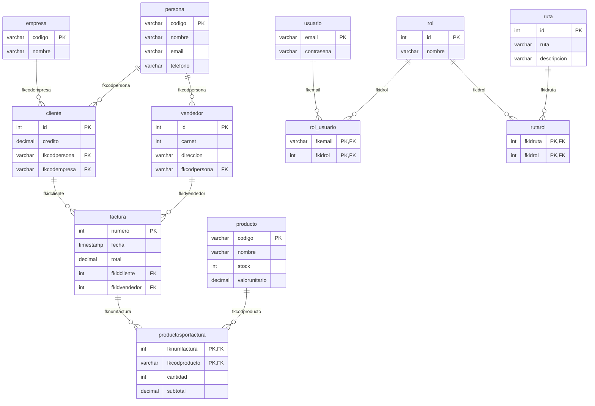
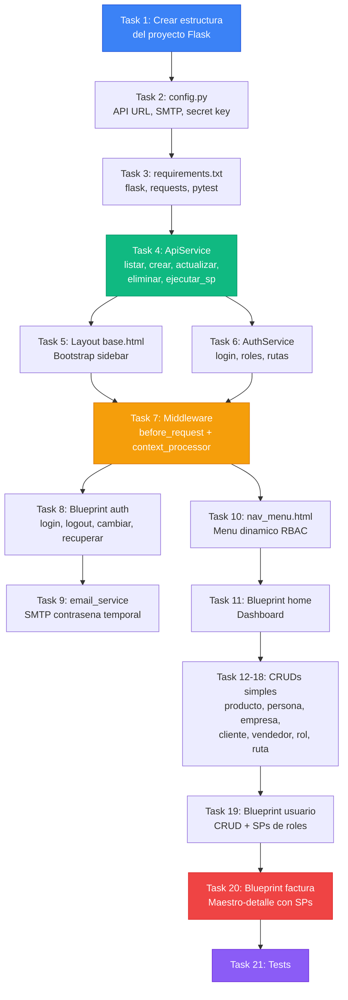

# Comandos SDD para el Proyecto FrontFlaskSDD

> **Autor:** Carlos Arturo Castro Castro
> **Fecha:** Abril 2026
> **Proposito:** Prompts exactos para generar la documentacion SDD del proyecto FrontFlaskSDD.
> Cada prompt esta disenado para ejecutarse en multiples IAs y comparar resultados.

---

## Tabla de Contenidos

- [1. Objetivo](#1-objetivo)
- [2. Contexto del Proyecto](#2-contexto-del-proyecto)
- [3. FASE 0: /constitution](#3-fase-0-constitution)
- [4. FASE 1: /specify](#4-fase-1-specify)
- [5. FASE 2: /clarify](#5-fase-2-clarify)
- [6. FASE 3: /plan](#6-fase-3-plan)
- [7. FASE 4: /tasks](#7-fase-4-tasks)
- [8. FASE 5: /analyze](#8-fase-5-analyze)
- [9. FASE 6: /checklist](#9-fase-6-checklist)
- [10. FASE 7: /implement](#10-fase-7-implement)
- [11. Tabla Resumen de Ejecucion](#11-tabla-resumen-de-ejecucion)
- [12. Protocolo de Comparacion entre IAs](#12-protocolo-de-comparacion-entre-ias)
- [13. Notas y Tips](#13-notas-y-tips)

---

## 1. Objetivo

Ejecutar las 7 fases de SDD (Spec-Driven Development) con GitHub Spec Kit sobre el proyecto **FrontFlaskSDD**: un frontend web en Flask que consume una API REST generica en C#.

El mismo conjunto de prompts se ejecutara en multiples IAs para comparar la calidad de la documentacion generada.

| IA | Herramienta | Modo |
|----|-------------|------|
| Claude Code | CLI / VS Code | Slash commands `/speckit-*` |
| GitHub Copilot | VS Code Chat | Slash commands `/specify`, `/plan`, `/tasks` |
| Gemini CLI | Terminal | Slash commands |
| Cursor | IDE | Chat con contexto |



---

## 2. Contexto del Proyecto

### Descripcion general

**FrontFlaskSDD** es un frontend web construido con Flask (Python) que consume una API REST generica en C# (.NET 9). La API permite operaciones CRUD sobre cualquier tabla de base de datos y ejecucion de stored procedures. El frontend implementa autenticacion JWT, control de acceso por roles (RBAC) y gestion de facturas maestro-detalle.

> **Repositorio de la API:** [https://github.com/ccastro2050/ApiGenericaCsharp](https://github.com/ccastro2050/ApiGenericaCsharp)
> **Repositorio de este proyecto SDD:** [https://github.com/ccastro2050/FrontFlaskSDD](https://github.com/ccastro2050/FrontFlaskSDD)

### Arquitectura



### Stack tecnologico

| Capa | Tecnologia |
|------|-----------|
| Frontend | Python 3.12, Flask 3.x, Jinja2, Bootstrap 5 |
| Comunicacion | HTTP REST + JWT Bearer |
| Backend (API) | C# .NET 9, ASP.NET Core, Dapper |
| Bases de datos | SQL Server, PostgreSQL, MySQL/MariaDB |
| Autenticacion | JWT + BCrypt |
| Email | SMTP (Gmail) con contrasena de aplicacion |

### Modulos del frontend

| Blueprint | Ruta | Tipo | Descripcion |
|-----------|------|------|-------------|
| `auth` | `/login`, `/logout`, `/cambiar-contrasena`, `/recuperar-contrasena` | Autenticacion | Login JWT, cambio y recuperacion de contrasena |
| `home` | `/` | Dashboard | Pagina principal |
| `producto` | `/producto` | CRUD simple | Codigo, nombre, stock, valor unitario |
| `persona` | `/persona` | CRUD simple | Codigo, nombre, email, telefono |
| `empresa` | `/empresa` | CRUD simple | Codigo, nombre |
| `cliente` | `/cliente` | CRUD simple | Id, credito, FK persona, FK empresa |
| `vendedor` | `/vendedor` | CRUD simple | Id, carnet, direccion, FK persona |
| `rol` | `/rol` | CRUD simple | Id, nombre |
| `ruta` | `/ruta` | CRUD simple | Id, ruta, descripcion |
| `usuario` | `/usuario` | CRUD + SP | Email (PK), contrasena. Gestion de roles via SP |
| `factura` | `/factura` | Maestro-detalle via SP | Crear/consultar/listar/actualizar/eliminar facturas con productos |

### Base de datos

**12 tablas:**

```
empresa, persona, producto, rol, ruta, usuario,
cliente, vendedor, factura, productosporfactura,
rol_usuario, rutarol
```

**15 stored procedures:**

| Grupo | SPs |
|-------|-----|
| Facturas (5) | `sp_insertar_factura_y_productosporfactura`, `sp_consultar_factura_y_productosporfactura`, `sp_listar_facturas_y_productosporfactura`, `sp_actualizar_factura_y_productosporfactura`, `sp_borrar_factura_y_productosporfactura` |
| Usuarios (6) | `crear_usuario_con_roles`, `actualizar_usuario_con_roles`, `eliminar_usuario_con_roles`, `actualizar_roles_usuario`, `consultar_usuario_con_roles`, `listar_usuarios_con_roles` |
| Permisos (4) | `verificar_acceso_ruta`, `listar_rutarol`, `crear_rutarol`, `eliminar_rutarol` |

### Diagrama Entidad-Relacion



---

## 3. FASE 0: /constitution

> **Comando:** `/speckit-constitution` (Claude Code) o `/constitution` (Copilot/Gemini)
> **Archivo que genera:** `memory/constitution.md`
> **Proposito:** Establecer los principios inmutables que todos los demas comandos deben respetar.

### Prompt exacto

```
/constitution

El proyecto FrontFlaskSDD es un frontend web que consume una API REST generica en C#.
Repositorio de la API: https://github.com/ccastro2050/ApiGenericaCsharp

PRINCIPIOS DE TECNOLOGIA:
- Python 3.12 con Flask 3.x como framework web
- Templates con Jinja2 y Bootstrap 5.3
- NO usar ORM ni acceso directo a base de datos. Todo se consume via API REST
- La API REST esta en C# .NET 9 con Dapper (no Entity Framework)
- Comunicacion frontend-API mediante HTTP (requests) + JWT Bearer token
- La API soporta SQL Server, PostgreSQL y MySQL/MariaDB con el mismo codigo

PRINCIPIOS DE ARQUITECTURA:
- Patron Blueprint: cada modulo del frontend es un Blueprint independiente de Flask
- Servicio generico centralizado (ApiService) para operaciones CRUD (listar, crear, actualizar, eliminar)
- Servicio generico centralizado para ejecucion de stored procedures (ejecutar_sp)
- Servicio de autenticacion separado (AuthService) con descubrimiento dinamico de PKs y FKs
- Middleware de autenticacion con @app.before_request que verifica sesion y permisos
- Context processor para inyectar variables de sesion (usuario, roles, rutas_permitidas) en todas las templates

PRINCIPIOS DE SEGURIDAD:
- Autenticacion JWT: el frontend obtiene token de la API y lo almacena en session de Flask
- Control de acceso RBAC: las rutas permitidas por rol se consultan a la BD y se verifican en cada request
- Contrasenas encriptadas con BCrypt (la API lo maneja via parametro camposEncriptar)
- Secret key de Flask para encriptar cookies de sesion
- Rutas publicas: /login, /logout, /recuperar-contrasena, /static
- Recuperacion de contrasena via SMTP (Gmail) con contrasena temporal

PRINCIPIOS DE CODIGO:
- Archivos en espanol (nombres de variables, comentarios, mensajes flash)
- snake_case para variables y funciones Python
- Cada Blueprint en su propio archivo dentro de routes/
- Templates organizadas en templates/pages/, templates/layout/, templates/components/
- Un solo archivo CSS personalizado en static/css/app.css
- No usar JavaScript frameworks (React, Vue, etc). Solo Jinja2 server-side rendering
- Los stored procedures se llaman via el metodo ejecutar_sp del ApiService

PRINCIPIOS DE TESTING:
- Tests con pytest
- Tests de integracion contra la API real (no mocks)
- Cada Blueprint debe tener tests de sus rutas principales

PRINCIPIOS DE DOCUMENTACION:
- Docstrings en cada archivo Python explicando que hace y como se relaciona con otros archivos
- Comentarios extensos tipo tutorial (el proyecto es educativo)
- Diagramas Mermaid en documentacion Markdown
```

### Explicacion de cada principio

| Principio | Por que se incluye |
|-----------|-------------------|
| Flask + Jinja2 + Bootstrap | Evita que la IA sugiera React, Vue, Django o FastAPI |
| No ORM, todo via API REST | Evita que genere modelos SQLAlchemy o acceso directo a BD |
| Blueprint por modulo | Define la estructura de carpetas que debe respetar |
| Servicio generico centralizado | Evita que cree clientes HTTP diferentes en cada Blueprint |
| Middleware con before_request | Define COMO se implementa la seguridad (no con decoradores por ruta) |
| BCrypt via API (camposEncriptar) | Aclara que el frontend NO encripta, delega a la API |
| Espanol en codigo | Evita que genere variables en ingles |
| No JavaScript frameworks | Evita que sugiera SPA o frontend separado |
| Tests contra API real | Evita mocks que no reflejan el comportamiento real |
| Estilo tutorial | El codigo es educativo, los comentarios son extensos a proposito |

---

## 4. FASE 1: /specify

> **Comando:** `/speckit-specify` (Claude Code) o `/specify` (Copilot/Gemini)
> **Archivo que genera:** `spec.md`
> **Proposito:** Definir QUE se va a construir con requisitos formales, flujos de usuario y criterios de aceptacion.

### Prompt exacto

```
/specify

El proyecto FrontFlaskSDD es un frontend Flask que consume la API REST generica ApiGenericaCsharp.
Repositorio de la API: https://github.com/ccastro2050/ApiGenericaCsharp

FUNCIONALIDADES DEL SISTEMA:

1. AUTENTICACION Y SEGURIDAD
   - Login con email y contrasena (POST a /api/autenticacion/token)
   - La API valida credenciales con BCrypt y retorna JWT
   - Almacenar token JWT en session de Flask
   - Logout (limpiar sesion)
   - Cambiar contrasena (verificar actual, validar nueva, encriptar con BCrypt via API)
   - Recuperar contrasena olvidada (generar temporal, enviar por SMTP Gmail, forzar cambio al login)
   - Validacion de contrasena: minimo 6 caracteres, 1 mayuscula, 1 numero, no trivial

2. CONTROL DE ACCESO RBAC
   - Al hacer login, consultar roles del usuario (tabla rol_usuario → rol)
   - Al hacer login, consultar rutas permitidas por rol (tabla rutarol → ruta)
   - Middleware @app.before_request verifica en cada request:
     a) Si es ruta publica (/login, /static) → dejar pasar
     b) Si no hay sesion → redirigir a /login
     c) Si debe cambiar contrasena → redirigir a /cambiar-contrasena
     d) Si la ruta no esta en rutas_permitidas → mostrar pagina 403
   - Menu de navegacion dinamico: solo muestra las rutas permitidas para el usuario
   - La consulta de roles y rutas se hace con UNA sola consulta SQL via ConsultasController
     (JOIN de 5 tablas: usuario → rol_usuario → rol → rutarol → ruta)
   - Fallback: si ConsultasController falla, usar 5 GETs separados al CRUD generico

3. CRUDS SIMPLES (7 modulos)
   Cada modulo tiene: listado con tabla, formulario crear, formulario editar, eliminar con confirmacion.
   Todos usan el ApiService generico (mismos 4 metodos: listar, crear, actualizar, eliminar).
   - Producto: codigo (PK), nombre, stock, valorunitario
   - Persona: codigo (PK), nombre, email, telefono
   - Empresa: codigo (PK), nombre
   - Cliente: id (PK auto), credito, fkcodpersona (FK→persona), fkcodempresa (FK→empresa)
   - Vendedor: id (PK auto), carnet, direccion, fkcodpersona (FK→persona)
   - Rol: id (PK auto), nombre
   - Ruta: id (PK auto), ruta, descripcion

4. GESTION DE USUARIOS CON ROLES (via Stored Procedures)
   - Listar usuarios con sus roles (SP: listar_usuarios_con_roles)
   - Crear usuario con roles (SP: crear_usuario_con_roles) - contrasena se encripta con BCrypt
   - Actualizar usuario con roles (SP: actualizar_usuario_con_roles)
   - Eliminar usuario con roles (SP: eliminar_usuario_con_roles)
   - Consultar un usuario con roles (SP: consultar_usuario_con_roles)
   - Actualizar solo roles sin tocar contrasena (SP: actualizar_roles_usuario)

5. GESTION DE PERMISOS RBAC (via Stored Procedures)
   - Listar permisos ruta-rol (SP: listar_rutarol)
   - Crear permiso ruta-rol (SP: crear_rutarol)
   - Eliminar permiso ruta-rol (SP: eliminar_rutarol)
   - Verificar acceso de usuario a ruta (SP: verificar_acceso_ruta)

6. FACTURAS MAESTRO-DETALLE (via Stored Procedures)
   - Listar todas las facturas con productos, cliente y vendedor (SP: sp_listar_facturas_y_productosporfactura)
   - Consultar una factura con detalle (SP: sp_consultar_factura_y_productosporfactura)
   - Crear factura: seleccionar cliente, vendedor, agregar N productos con cantidad (SP: sp_insertar_factura_y_productosporfactura)
   - Actualizar factura: cambiar cliente/vendedor, reemplazar productos (SP: sp_actualizar_factura_y_productosporfactura)
   - Eliminar factura con cascada (SP: sp_borrar_factura_y_productosporfactura)
   - Los triggers de la BD calculan subtotales, totales y ajustan stock automaticamente

7. LAYOUT Y NAVEGACION
   - Template base (base.html) con Bootstrap 5 sidebar layout
   - Barra superior con nombre de usuario y boton logout
   - Menu lateral (nav_menu.html) con links condicionales segun rutas_permitidas
   - Sistema de mensajes flash (alertas Bootstrap dismissible)
   - CSS personalizado en static/css/app.css

FLUJOS DE USUARIO CRITICOS:
- Login → cargar roles/rutas → redirigir a home
- Crear factura → seleccionar cliente y vendedor → agregar productos → enviar SP
- Recuperar contrasena → generar temporal → enviar email SMTP → forzar cambio al login
- Navegacion RBAC → middleware verifica permisos → mostrar/ocultar menu segun rol
```

### Desglose del prompt por seccion

| Seccion | Que cubre | Por que es importante |
|---------|-----------|----------------------|
| Autenticacion | Login, logout, cambio, recuperacion | Es el flujo mas complejo del frontend |
| RBAC | Roles, rutas, middleware, menu dinamico | Define la seguridad de toda la app |
| CRUDs simples | 7 modulos identicos con CRUD generico | Son el 70% del proyecto pero el patron es el mismo |
| Usuarios con roles | 6 SPs de usuario | Mezcla CRUD + stored procedures |
| Permisos | 4 SPs de rutarol | Administracion del RBAC |
| Facturas | 5 SPs maestro-detalle | El modulo mas complejo (formulario dinamico) |
| Layout | Templates, menu, flash | Estructura visual compartida |

---

## 5. FASE 2: /clarify

> **Comando:** `/speckit-clarify` (Claude Code) o `/clarify` (Copilot/Gemini)
> **Archivo que modifica:** `spec.md`
> **Proposito:** Identificar ambiguedades y resolverlas antes de planificar.

### Prompt exacto

```
/clarify
```

(No necesita prompt adicional — el agente lee `spec.md` y genera preguntas)

### Preguntas anticipadas y respuestas preparadas

La IA probablemente preguntara sobre estos puntos ambiguos. Estas son las respuestas correctas basadas en el proyecto real:

| Pregunta probable | Respuesta |
|-------------------|-----------|
| *"La encriptacion BCrypt se hace en el frontend Flask o en la API C#?"* | En la API C#. El frontend envia la contrasena en texto plano, la API la encripta con BCrypt via el parametro `?camposEncriptar=contrasena` en el query string del PUT. |
| *"El descubrimiento de PKs y FKs es dinamico o hardcodeado?"* | Dinamico. AuthService consulta `GET /api/estructuras/{tabla}/modelo` para descubrir PKs y FKs. Los resultados se cachean en memoria (`_fk_cache`). |
| *"La consulta de roles y rutas usa ConsultasController o el CRUD generico?"* | Primero intenta ConsultasController (1 sola consulta SQL con JOINs). Si falla, usa fallback con 5 GETs separados al CRUD generico. |
| *"El menu de navegacion se genera en cada request o se cachea?"* | Se cachea en la sesion de Flask al momento del login. Las rutas_permitidas se guardan en `session["rutas_permitidas"]` y el context_processor las inyecta en todas las templates. |
| *"Las facturas se crean desde un formulario con productos dinamicos. Como se manejan los N productos?"* | Con campos HTML de nombre `prod_codigo[]` y `prod_cantidad[]`. Flask los recoge con `request.form.getlist()`. Se construye un JSON array y se pasa al SP como parametro `p_productos`. |
| *"La recuperacion de contrasena usa un link de reset o una contrasena temporal?"* | Contrasena temporal. Se genera un string aleatorio de 8 caracteres (1 mayuscula, 1 minuscula, 1 numero + 5 random), se guarda en la BD encriptada con BCrypt, se envia por SMTP y se fuerza el cambio al siguiente login. |
| *"El frontend maneja multiples bases de datos o solo una?"* | Solo una. El frontend no sabe cual BD usa la API. La API cambia de motor con `DatabaseProvider` en `appsettings.json`. El frontend es identico para SQL Server, Postgres o MariaDB. |

---

## 6. FASE 3: /plan

> **Comando:** `/speckit-plan` (Claude Code) o `/plan` (Copilot/Gemini)
> **Archivo que genera:** `plan.md`
> **Proposito:** Definir COMO se construira el proyecto (arquitectura, componentes, dependencias).

### Prompt exacto

```
/plan
```

(No necesita prompt adicional — el agente lee `constitution.md` y `spec.md`)

### Arquitectura de carpetas esperada

El plan generado deberia reflejar esta estructura:

```
FrontFlaskSDD/
├── app.py                          # Punto de entrada Flask
├── config.py                       # Variables de configuracion (API URL, SMTP, secret key)
├── requirements.txt                # Dependencias Python
├── middleware/
│   └── auth_middleware.py          # @app.before_request + context_processor
├── services/
│   ├── __init__.py
│   ├── api_service.py              # CRUD generico + ejecutar_sp
│   ├── auth_service.py             # Login, roles, rutas, cambiar contrasena
│   └── email_service.py            # SMTP para contrasena temporal
├── routes/
│   ├── __init__.py
│   ├── auth.py                     # /login, /logout, /cambiar, /recuperar
│   ├── home.py                     # /
│   ├── producto.py                 # /producto (CRUD)
│   ├── persona.py                  # /persona (CRUD)
│   ├── empresa.py                  # /empresa (CRUD)
│   ├── cliente.py                  # /cliente (CRUD)
│   ├── vendedor.py                 # /vendedor (CRUD)
│   ├── rol.py                      # /rol (CRUD)
│   ├── ruta.py                     # /ruta (CRUD)
│   ├── usuario.py                  # /usuario (CRUD + SPs)
│   └── factura.py                  # /factura (maestro-detalle SPs)
├── templates/
│   ├── layout/
│   │   └── base.html               # Layout Bootstrap con sidebar
│   ├── components/
│   │   └── nav_menu.html           # Menu lateral dinamico por RBAC
│   └── pages/
│       ├── login.html
│       ├── home.html
│       ├── producto.html
│       ├── persona.html
│       ├── empresa.html
│       ├── cliente.html
│       ├── vendedor.html
│       ├── rol.html
│       ├── ruta.html
│       ├── usuario.html
│       ├── factura.html
│       ├── cambiar_contrasena.html
│       ├── recuperar_contrasena.html
│       └── sin_acceso.html
├── static/
│   └── css/
│       └── app.css                 # Estilos personalizados
└── tests/
    ├── test_auth.py
    ├── test_crud.py
    └── test_factura.py
```

---

## 7. FASE 4: /tasks

> **Comando:** `/speckit-tasks` (Claude Code) o `/tasks` (Copilot/Gemini)
> **Archivo que genera:** `tasks.md`
> **Proposito:** Descomponer el plan en tareas concretas, ordenadas por dependencia.

### Prompt exacto

```
/tasks
```

(No necesita prompt adicional — el agente lee `spec.md` y `plan.md`)

### Orden esperado de tareas

Las tareas deberian seguir este orden logico de dependencias:



---

## 8. FASE 5: /analyze

> **Comando:** `/speckit-analyze` (Claude Code) o `/analyze` (Copilot/Gemini)
> **Archivo que genera:** Reporte en pantalla
> **Proposito:** Validar consistencia entre constitution, spec, plan y tasks.

### Prompt exacto

```
/analyze
```

### Que validaciones esperar

| Validacion | Que revisa |
|------------|-----------|
| Constitution vs Spec | Que la spec respete las tecnologias y patrones definidos |
| Spec vs Plan | Que cada requisito funcional tenga componentes en el plan |
| Plan vs Tasks | Que cada componente del plan tenga tareas asignadas |
| Tasks vs Constitution | Que ninguna tarea viole los principios inmutables |
| Completitud | Que no haya requisitos sin tareas ni tareas sin requisitos |
| Dependencias | Que el orden de tareas respete las dependencias |

---

## 9. FASE 6: /checklist

> **Comando:** `/speckit-checklist` (Claude Code) o `/checklist` (Copilot/Gemini)
> **Archivo que genera:** Checklist integrada en los artefactos
> **Proposito:** Criterios de aceptacion para verificar que cada requisito se cumplio.

### Prompt exacto

```
/checklist
```

### Criterios de aceptacion esperados por modulo

| Modulo | Criterios clave |
|--------|----------------|
| **Login** | Acepta email+contrasena, retorna JWT, almacena en sesion, redirige a home |
| **RBAC** | Middleware bloquea rutas no permitidas, menu se adapta a roles, pagina 403 funciona |
| **CRUD producto** | Listar, crear, editar, eliminar. Formulario valida campos requeridos |
| **CRUD cliente** | Muestra nombre de persona y empresa (no solo FKs). Dropdown con FK |
| **Usuario + roles** | Crear con roles, editar roles, eliminar con roles. BCrypt via API |
| **Factura** | Crear con N productos, calcular totales (trigger), editar productos, eliminar cascada |
| **Recuperar contrasena** | Genera temporal, envia SMTP, fuerza cambio al login |
| **Layout** | Sidebar responsive, flash messages, boton logout visible |

---

## 10. FASE 7: /implement

> **Comando:** `/speckit-implement` (Claude Code) o `/implement` (Copilot/Gemini)
> **Archivo que genera:** Codigo fuente del proyecto
> **Proposito:** Generar el codigo tarea por tarea.

### Prompt exacto

```
/implement
```

### Estrategia de ejecucion por fases

No ejecutar todo de golpe. Dividir en 4 rondas con revision entre cada una:

| Ronda | Tareas | Que se genera | Punto de revision |
|-------|--------|---------------|-------------------|
| **Ronda 1: Cimientos** | Tasks 1-5 | Estructura, config, ApiService, layout | Verificar que `api_service.py` se conecta a la API |
| **Ronda 2: Seguridad** | Tasks 6-11 | AuthService, middleware, login, menu | Verificar login funcional con JWT y RBAC |
| **Ronda 3: CRUDs** | Tasks 12-18 | 7 Blueprints CRUD | Verificar que cada CRUD lista, crea, edita, elimina |
| **Ronda 4: Avanzado** | Tasks 19-21 | Usuario+roles, factura, tests | Verificar SPs y maestro-detalle |

### Prompt para cada ronda

**Ronda 1:**
```
/implement

Ejecutar solamente las tareas 1 a 5 (estructura, config, ApiService, layout base).
Detenerse despues de completarlas para revision.
```

**Ronda 2:**
```
/implement

Continuar con las tareas 6 a 11 (AuthService, middleware, login, email, menu, home).
Detenerse despues para verificar que el login funciona.
```

**Ronda 3:**
```
/implement

Continuar con las tareas 12 a 18 (CRUDs simples: producto, persona, empresa, cliente, vendedor, rol, ruta).
Detenerse despues para verificar que todos los CRUDs funcionan.
```

**Ronda 4:**
```
/implement

Continuar con las tareas 19 a 21 (usuario con roles via SPs, factura maestro-detalle via SPs, tests).
```

---

## 11. Tabla Resumen de Ejecucion

| # | Fase | Comando | Archivo generado | Entrada requerida |
|---|------|---------|-----------------|-------------------|
| 0 | Constitution | `/constitution` | `constitution.md` | Prompt con principios del proyecto |
| 1 | Specify | `/specify` | `spec.md` | Prompt con funcionalidades completas |
| 2 | Clarify | `/clarify` | Actualiza `spec.md` | Responder preguntas de la IA |
| 3 | Plan | `/plan` | `plan.md` | Automatico (lee constitution + spec) |
| 4 | Tasks | `/tasks` | `tasks.md` | Automatico (lee spec + plan) |
| 5 | Analyze | `/analyze` | Reporte en pantalla | Automatico (lee todo) |
| 6 | Checklist | `/checklist` | Checklist en artefactos | Automatico (lee spec + tasks) |
| 7 | Implement | `/implement` | Codigo fuente | Automatico o por rondas |

---

## 12. Protocolo de Comparacion entre IAs

### Que evaluar

Despues de ejecutar las 7 fases en cada IA, evaluar con esta rubrica:

| Criterio | Descripcion | Peso |
|----------|-------------|------|
| **Completitud** | Cubrio todos los requisitos del prompt? | 25% |
| **Adherencia a constitution** | Respeto tecnologias, patrones, convenciones? | 20% |
| **Calidad de la spec** | Requisitos claros, criterios de aceptacion, flujos de usuario? | 15% |
| **Calidad del plan** | Arquitectura coherente, dependencias correctas? | 15% |
| **Calidad de las tasks** | Orden logico, tareas aisladas, dependencias marcadas? | 10% |
| **Codigo funcional** | El codigo generado compila/ejecuta sin errores? | 10% |
| **Estilo educativo** | Comentarios claros, docstrings, estilo tutorial? | 5% |

### Rubrica de puntuacion (1-5)

| Puntaje | Significado |
|---------|-------------|
| 5 | Excelente — supera expectativas |
| 4 | Bueno — cumple sin errores significativos |
| 3 | Aceptable — cumple parcialmente, requiere ajustes |
| 2 | Deficiente — omisiones importantes |
| 1 | Inaceptable — no sirve |

### Tabla de resultados (llenar despues de ejecutar)

| Criterio | Claude Code | GitHub Copilot | Gemini CLI | Cursor |
|----------|:-----------:|:--------------:|:----------:|:------:|
| Completitud | /5 | /5 | /5 | /5 |
| Adherencia a constitution | /5 | /5 | /5 | /5 |
| Calidad de la spec | /5 | /5 | /5 | /5 |
| Calidad del plan | /5 | /5 | /5 | /5 |
| Calidad de las tasks | /5 | /5 | /5 | /5 |
| Codigo funcional | /5 | /5 | /5 | /5 |
| Estilo educativo | /5 | /5 | /5 | /5 |
| **TOTAL PONDERADO** | **/5** | **/5** | **/5** | **/5** |

---

## 13. Notas y Tips

### Tips por IA

| IA | Tip |
|----|-----|
| **Claude Code** | Los comandos son `/speckit-constitution`, `/speckit-specify`, `/speckit-plan`, `/speckit-tasks`, `/speckit-implement`. Tiene buena adherencia a constitution |
| **GitHub Copilot** | Los comandos son `/constitution`, `/specify`, `/plan`, `/tasks`. Funciona mejor si abres los archivos `.specify/` en el editor |
| **Gemini CLI** | Similar a Copilot. Puede necesitar mas contexto en el prompt inicial |
| **Cursor** | No tiene slash commands nativos de Spec Kit. Copiar los prompts directamente al chat con los archivos constitution.md y spec.md adjuntos |

### Orden estricto

```
constitution → specify → clarify → plan → tasks → analyze → checklist → implement
```

> **Nunca saltar fases.** Cada fase depende de los artefactos generados por la fase anterior. Si se salta `/specify` y se va directo a `/plan`, el plan no tendra requisitos claros que seguir.

### Versionamiento

Despues de cada fase, hacer commit del artefacto generado:

```bash
git add constitution.md && git commit -m "SDD fase 0: constitution"
git add spec.md && git commit -m "SDD fase 1: specify"
git add plan.md && git commit -m "SDD fase 3: plan"
git add tasks.md && git commit -m "SDD fase 4: tasks"
```

Esto permite comparar los artefactos generados por cada IA en branches separados.
