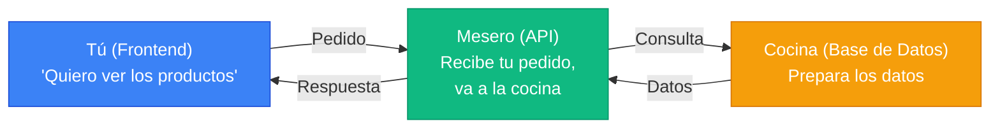
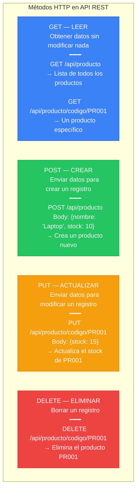
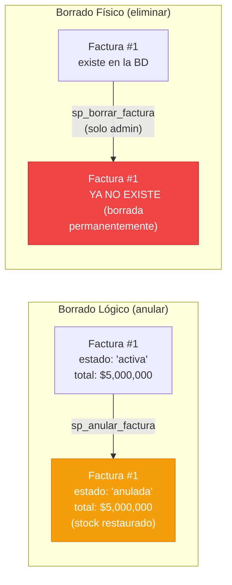
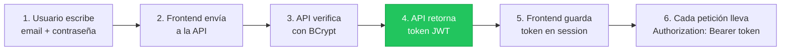
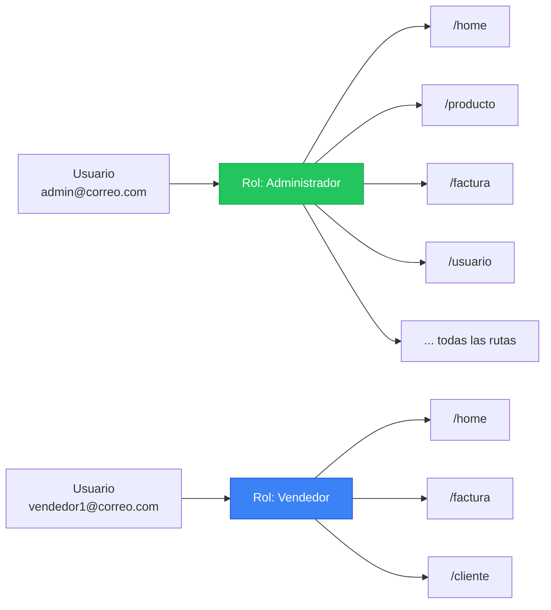
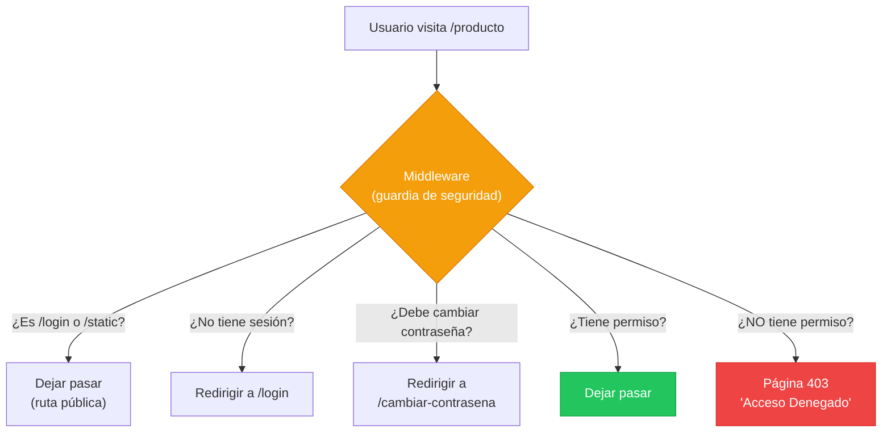
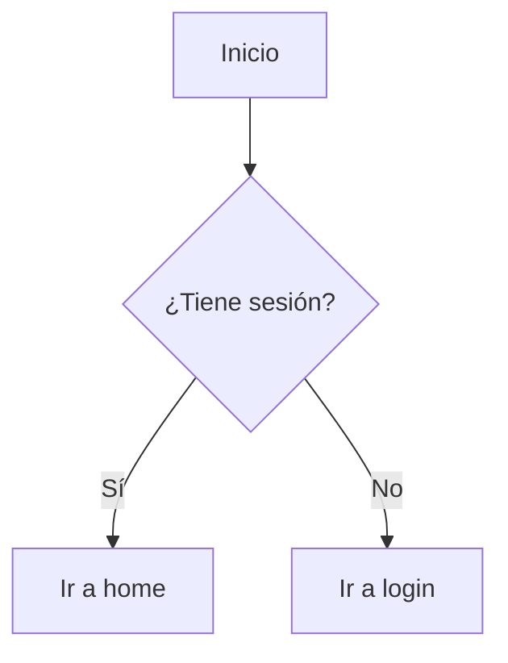
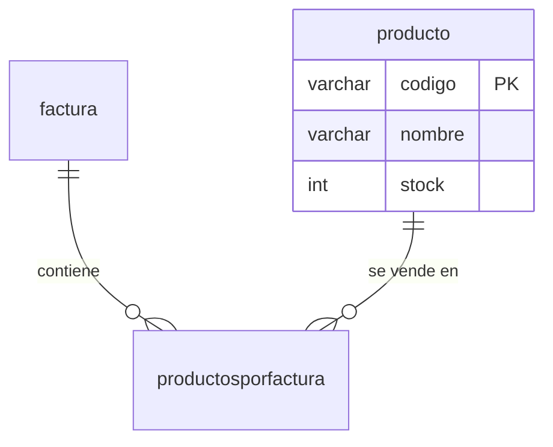
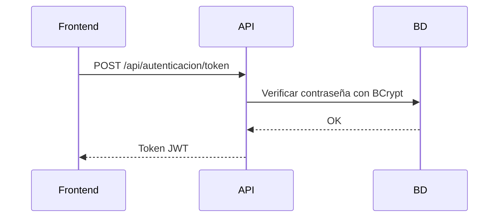
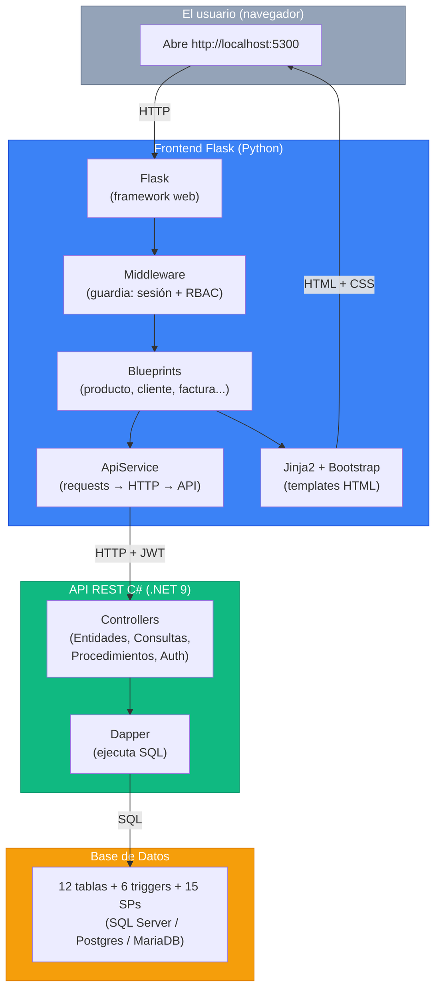

# Glosario de Conceptos: Todo lo que necesitas saber antes de empezar

> **Autor:** Carlos Arturo Castro Castro
> **Fecha:** Abril 2026
> **Propósito:** Explicar TODOS los términos técnicos que aparecen en el tutorial y en los prompts SDD, para que el estudiante entienda qué está pidiendo antes de ejecutar cada comando.
> **Cómo usar este documento:** Léelo completo antes de empezar el tutorial (04_Tutorial), o consúltalo como referencia cada vez que encuentres un término que no entiendas.

---

## Tabla de Contenidos

- [1. Lenguajes de Programación](#1-lenguajes-de-programación)
- [2. Frameworks y Librerías](#2-frameworks-y-librerías)
- [3. APIs — Cómo se comunican los programas](#3-apis--cómo-se-comunican-los-programas)
- [4. Base de Datos](#4-base-de-datos)
- [5. Seguridad](#5-seguridad)
- [6. Patrones y Arquitectura](#6-patrones-y-arquitectura)
- [7. Templates y Frontend](#7-templates-y-frontend)
- [8. Herramientas de Desarrollo](#8-herramientas-de-desarrollo)
- [9. Testing](#9-testing)
- [10. Documentación](#10-documentación)
- [11. Diagramas](#11-diagramas)
- [12. Resumen Visual: Cómo se conecta todo](#12-resumen-visual-cómo-se-conecta-todo)

---

## 1. Lenguajes de Programación

### Python

**Qué es:** Un lenguaje de programación de alto nivel, fácil de leer y escribir. Es uno de los más populares del mundo por su sintaxis limpia y su enorme ecosistema de librerías.

**Por qué lo usamos:** Nuestro frontend está escrito en Python. Flask (el framework web) es una librería de Python.

**Ejemplo:**

```python
# Esto es Python — se lee casi como inglés
nombre = "Carlos"
edad = 30
if edad >= 18:
    print(f"Hola {nombre}, eres mayor de edad")
```

**Instalación:** [python.org/downloads](https://www.python.org/downloads/) — Descargar la versión 3.12 o superior.

> **Versión recomendada:** 3.12+. Nuestro proyecto usa 3.12 pero funciona con 3.13 y 3.14.

### C# (C Sharp)

**Qué es:** Un lenguaje de programación de Microsoft, usado para construir aplicaciones de escritorio, web y APIs. Es más estricto que Python (tipado fuerte).

**Por qué aparece en nuestro proyecto:** La API REST que consumimos está escrita en C# con .NET 9. **No necesitas saber C#** para seguir el tutorial — el frontend en Python solo llama a la API, no modifica su código.

**Ejemplo:**

```csharp
// Esto es C# — más estricto que Python
string nombre = "Carlos";
int edad = 30;
if (edad >= 18)
{
    Console.WriteLine($"Hola {nombre}, eres mayor de edad");
}
```

### snake_case vs camelCase vs PascalCase

**Qué es:** Son convenciones para nombrar variables y funciones. Cada lenguaje tiene su estilo preferido.

| Convención | Ejemplo | Se usa en |
|-----------|---------|-----------|
| **snake_case** | `nombre_usuario`, `obtener_datos` | Python (nuestro frontend) |
| **camelCase** | `nombreUsuario`, `obtenerDatos` | JavaScript, Java |
| **PascalCase** | `NombreUsuario`, `ObtenerDatos` | C# (la API) |

**En nuestro proyecto:** Usamos `snake_case` porque es la convención de Python. Si ves `PascalCase` en algún archivo, es código C# de la API.

---

## 2. Frameworks y Librerías

### Qué es un Framework vs una Librería

**Analogía del restaurante:**

- **Librería** = Un ingrediente que TÚ decides cuándo usar. Ejemplo: compras salsa de tomate y la usas cuando quieres. Tú tienes el control.
- **Framework** = Una cocina equipada con reglas. La cocina te dice "primero precalienta el horno, luego pon la bandeja". El framework tiene el control y tú llenas los espacios.

| Aspecto | Librería | Framework |
|---------|----------|-----------|
| ¿Quién llama a quién? | Tú llamas a la librería | El framework te llama a ti |
| Control | Tú decides el flujo | El framework decide el flujo |
| Ejemplo Python | `requests` (tú decides cuándo hacer HTTP) | `Flask` (Flask decide cuándo ejecutar tu ruta) |

### Flask

**Qué es:** Un framework web **ligero** de Python para crear aplicaciones web. Es "micro" porque solo incluye lo esencial (rutas, templates, sesiones) y tú agregas lo que necesites.

**Por qué Flask y no otros:**

| Framework | Tipo | Diferencia con Flask |
|-----------|------|---------------------|
| **Django** | Python, pesado | Viene con ORM, admin, formularios, autenticación... todo incluido. Demasiado para nuestro caso |
| **FastAPI** | Python, APIs | Diseñado para crear APIs, no frontends con HTML |
| **Express** | JavaScript (Node.js) | Otro lenguaje (JavaScript). Similar en filosofía a Flask |
| **Flask** | **Python, ligero** | Solo lo que necesitamos. Sin ORM (no accedemos a BD directamente) |

**Instalación:** `pip install flask` (ya lo hiciste en la preparación del entorno)

**Sitio oficial:** [flask.palletsprojects.com](https://flask.palletsprojects.com/)

**Ejemplo mínimo:**

```python
from flask import Flask
app = Flask(__name__)

@app.route("/")           # Cuando visiten la URL "/"
def inicio():
    return "¡Hola mundo!" # Mostrar este texto en el navegador

app.run(port=5300)         # Arrancar en http://localhost:5300
```

### Jinja2

**Qué es:** Un **motor de templates** (plantillas) para Python. Permite meter variables y lógica dentro de archivos HTML.

**Analogía:** Es como una carta modelo con espacios en blanco que se llenan automáticamente:

```
Estimado __________, su pedido #________ por $________ está listo.
```

**Ejemplo real en nuestro proyecto:**

```html
<!-- templates/pages/producto.html -->
<h1>Lista de Productos</h1>
<table>
    
    <tr>
        <td>{{ producto.codigo }}</td>
        <td>{{ producto.nombre }}</td>
        <td>{{ producto.stock }}</td>
        <td>${{ producto.valorunitario }}</td>
    </tr>
    
</table>
```

**Sintaxis básica:**

| Sintaxis | Qué hace | Ejemplo |
|----------|---------|---------|
| `{{ variable }}` | Mostrar un valor | `{{ nombre_usuario }}` → "Carlos" |
| `` | Condicional | `Disponible` |
| `` | Repetir por cada elemento | `...` |
| `` | Incluir otro HTML | `` |
| `` | Definir sección reemplazable | `` |
| `` | Heredar de otro template | `` |

**No se instala aparte** — viene incluido con Flask.

### Bootstrap

**Qué es:** Una librería de **CSS y componentes** prediseñados creada por Twitter. Proporciona botones, tablas, formularios, barras de navegación y layouts listos para usar.

**Analogía:** Es como comprar muebles de IKEA en vez de construirlos desde cero. Ya vienen diseñados, solo los colocas.

**Sin Bootstrap vs Con Bootstrap:**

```html
<!-- SIN Bootstrap: tienes que escribir todo el CSS -->
<button style="background-color: #0d6efd; color: white; padding: 8px 16px; 
               border: none; border-radius: 4px; cursor: pointer; font-size: 14px;">
    Guardar
</button>

<!-- CON Bootstrap: una clase CSS y listo -->
<button class="btn btn-primary">Guardar</button>
```

**Clases más usadas en nuestro proyecto:**

| Clase Bootstrap | Qué hace |
|----------------|---------|
| `btn btn-primary` | Botón azul |
| `btn btn-danger` | Botón rojo |
| `btn btn-success` | Botón verde |
| `table` | Tabla con bordes y estilo |
| `form-control` | Input con estilo |
| `alert alert-success` | Alerta verde (mensaje de éxito) |
| `alert alert-danger` | Alerta roja (mensaje de error) |
| `container` | Contenedor centrado con márgenes |
| `row` / `col` | Sistema de grilla (dividir la página en columnas) |

**No se instala con pip** — se incluye vía CDN en el HTML:

```html
<link href="https://cdn.jsdelivr.net/npm/bootstrap@5.3.3/dist/css/bootstrap.min.css" rel="stylesheet" />
```

**Sitio oficial:** [getbootstrap.com](https://getbootstrap.com/)

**Versión que usamos:** 5.3

### requests (librería Python)

**Qué es:** Una librería de Python para hacer peticiones HTTP. Es lo que usa nuestro frontend para "hablar" con la API.

**Analogía:** Si la API es un restaurante, `requests` es el teléfono con el que llamas para hacer tu pedido.

**Ejemplo:**

```python
import requests

# Pedir la lista de productos a la API
respuesta = requests.get("http://localhost:5035/api/producto")
productos = respuesta.json()  # Convertir la respuesta a diccionario Python
print(productos)
```

**Los 4 métodos que usamos:**

```python
# LEER datos
requests.get(url)

# CREAR un registro
requests.post(url, json=datos)

# ACTUALIZAR un registro
requests.put(url, json=datos)

# ELIMINAR un registro
requests.delete(url)
```

**Instalación:** `pip install requests`

**Sitio oficial:** [docs.python-requests.org](https://docs.python-requests.org/)

### Dapper

**Qué es:** Un Micro-ORM para C# que ejecuta SQL directamente y mapea los resultados a objetos. Es mucho más ligero que Entity Framework.

**Por qué importa:** La API usa Dapper, no Entity Framework. Esto significa que la API ejecuta SQL directo contra la base de datos, lo que la hace más rápida y transparente.

**No necesitas saber Dapper** — es interno de la API. Lo mencionamos en la constitution solo para que la IA no sugiera Entity Framework.

### Entity Framework

**Qué es:** El ORM completo de Microsoft para C#. Genera SQL automáticamente a partir de clases C#.

**Por qué NO lo usamos:** Es más pesado y opaco que Dapper. La API usa Dapper para tener control total del SQL.

**Solo necesitas saber:** Que cuando el prompt de constitution dice "no Entity Framework", está diciéndole a la IA que NO sugiera este ORM.

---

## 3. APIs — Cómo se comunican los programas

### Qué es una API

**API** = Application Programming Interface (Interfaz de Programación de Aplicaciones).

**Analogía:** Una API es como el mesero de un restaurante. Tú (el cliente/frontend) no entras a la cocina (la base de datos). Le dices al mesero (la API) qué quieres, y él te trae la comida (los datos).



### Tipos de API

| Tipo | Cómo se comunica | Formato | Se usa en |
|------|-----------------|---------|-----------|
| **REST** | URLs + métodos HTTP (GET, POST, PUT, DELETE) | JSON | La mayoría de apps web modernas. **Nuestro proyecto** |
| **SOAP** | XML con estructura rígida | XML | Sistemas bancarios y empresariales legacy |
| **GraphQL** | Una sola URL, el cliente pide exactamente lo que necesita | JSON | Facebook, GitHub, Shopify |
| **gRPC** | Binario, muy rápido | Protocol Buffers | Microservicios internos (Google, Netflix) |

### API REST en detalle

**REST** = Representational State Transfer. Es un estilo de arquitectura donde cada URL representa un "recurso" (producto, cliente, factura) y usas métodos HTTP para operar sobre él.

**Los 4 métodos HTTP:**



### HTTP

**Qué es:** HyperText Transfer Protocol. Es el "idioma" que hablan los navegadores y los servidores para comunicarse. Cada vez que abres una página web, tu navegador envía una petición HTTP al servidor y recibe una respuesta HTTP.

**Partes de una petición HTTP:**

| Parte | Ejemplo | Qué es |
|-------|---------|--------|
| **URL** | `http://localhost:5035/api/producto` | A dónde va la petición |
| **Método** | GET, POST, PUT, DELETE | Qué tipo de operación |
| **Headers** | `Authorization: Bearer eyJhbG...` | Información adicional (como el token JWT) |
| **Body** | `{"nombre": "Laptop", "stock": 10}` | Datos que envías (solo en POST/PUT) |

**Partes de una respuesta HTTP:**

| Parte | Ejemplo | Qué es |
|-------|---------|--------|
| **Status Code** | 200, 404, 500 | Si la petición fue exitosa o falló |
| **Body** | `{"datos": [...]}` | Los datos que retorna el servidor |

**Códigos de estado más comunes:**

| Código | Significado | Cuándo aparece |
|--------|------------|----------------|
| **200** | OK — Todo bien | La petición fue exitosa |
| **201** | Created — Creado | Se creó un registro nuevo |
| **400** | Bad Request — Petición incorrecta | Enviaste datos inválidos |
| **401** | Unauthorized — No autenticado | No enviaste token JWT o el token expiró |
| **403** | Forbidden — Prohibido | Tienes token pero no tienes permiso |
| **404** | Not Found — No encontrado | La URL o el recurso no existe |
| **500** | Internal Server Error — Error del servidor | Algo falló en el servidor/API |

### JSON

**Qué es:** JavaScript Object Notation. Es un formato de texto para intercambiar datos. Es legible por humanos y por máquinas.

**Analogía:** Si HTTP es el sobre, JSON es la carta que va dentro.

**Ejemplo:**

```json
{
    "codigo": "PR001",
    "nombre": "Laptop Lenovo IdeaPad",
    "stock": 17,
    "valorunitario": 2500000
}
```

**Reglas de JSON:**
- Las claves van entre comillas dobles: `"nombre"`
- Los textos van entre comillas dobles: `"Laptop"`
- Los números NO llevan comillas: `17`, `2500000`
- Los booleanos son: `true` o `false`
- Nulo es: `null`
- Las listas van entre corchetes: `[1, 2, 3]`
- Los objetos van entre llaves: `{"clave": "valor"}`

### Swagger

**Qué es:** Una herramienta que genera documentación interactiva de una API automáticamente. Permite probar endpoints desde el navegador sin escribir código.

**Analogía:** Es el menú del restaurante — te muestra todos los platos disponibles (endpoints), sus ingredientes (parámetros) y te deja pedir desde ahí.

**Dónde verlo:** Con la API corriendo, abrir `http://localhost:5035/swagger`

**Sitio oficial:** [swagger.io](https://swagger.io/)

---

## 4. Base de Datos

### Qué es una Base de Datos

**Analogía:** Una base de datos es como un archivo de Excel gigante con múltiples hojas (tablas). Cada hoja tiene columnas (campos) y filas (registros).

| Concepto BD | Analogía Excel | Ejemplo |
|-------------|---------------|---------|
| Base de datos | Archivo .xlsx | `bdfacturas` |
| Tabla | Hoja del Excel | `producto`, `cliente`, `factura` |
| Columna | Encabezado de columna | `nombre`, `stock`, `precio` |
| Fila / Registro | Una fila de datos | "Laptop Lenovo", 17, 2500000 |
| Primary Key (PK) | El número de fila único | `codigo` en producto, `id` en cliente |
| Foreign Key (FK) | Una referencia a otra hoja | `fkcodpersona` en cliente apunta a `persona` |

### ORM (Object-Relational Mapping)

**Qué es:** Una librería que traduce objetos del lenguaje de programación a tablas de base de datos y viceversa. En vez de escribir SQL, escribes código en tu lenguaje.

**Ejemplo comparativo:**

```python
# CON ORM (SQLAlchemy en Python):
productos = Producto.query.filter(Producto.stock > 10).all()

# SIN ORM (SQL directo):
cursor.execute("SELECT * FROM producto WHERE stock > 10")
productos = cursor.fetchall()
```

**Por qué NO usamos ORM en nuestro proyecto:** Nuestro frontend no accede a la base de datos directamente. Llama a la API REST, que es quien habla con la BD. El frontend solo hace `requests.get("http://api/producto")`.

### SQL Server, PostgreSQL, MySQL/MariaDB

Son los 3 motores de base de datos que soporta nuestra API:

| Motor | Creador | Licencia | Cuándo usarlo |
|-------|---------|----------|---------------|
| **SQL Server** | Microsoft | Comercial (hay Express gratis) | Si tienes Visual Studio o trabajas con Microsoft |
| **PostgreSQL** | Comunidad | Open source (gratis) | Si quieres un motor robusto y gratuito |
| **MySQL/MariaDB** | Oracle/Comunidad | Open source (gratis) | Si tienes XAMPP, Laragon o un hosting compartido |

**Lo importante:** Nuestra API funciona con los 3 motores usando el mismo código. Solo cambias `DatabaseProvider` en la configuración. El frontend **no sabe** qué motor usa la API.

### Stored Procedure (SP)

**Qué es:** Un programa guardado dentro de la base de datos que ejecuta múltiples operaciones SQL como una sola instrucción.

**Analogía:** En un restaurante, en vez de pedirle al mesero "tráeme pan, luego mantequilla, luego un cuchillo, luego un plato", le dices "tráeme el combo desayuno". El combo es el stored procedure.

**Por qué facturas lo necesita:** Crear una factura requiere:

1. Insertar la factura (número, cliente, vendedor)
2. Insertar cada producto (código, cantidad)
3. Calcular subtotales
4. Descontar stock de cada producto
5. Calcular el total

Si el paso 4 falla (stock insuficiente), TODOS los pasos se revierten. Eso se llama **transacción** y los SPs lo manejan automáticamente.

**Nuestros 15 SPs:**

| Grupo | SPs | Qué hacen |
|-------|-----|-----------|
| Facturas (6) | `sp_insertar_factura_y_productosporfactura`, `sp_consultar_...`, `sp_listar_...`, `sp_actualizar_...`, `sp_anular_factura`, `sp_borrar_...` | CRUD completo de facturas con productos + anulación |
| Usuarios (6) | `crear_usuario_con_roles`, `actualizar_...`, `eliminar_...`, `actualizar_roles_...`, `consultar_...`, `listar_...` | Gestión de usuarios y sus roles |
| Permisos (4) | `verificar_acceso_ruta`, `listar_rutarol`, `crear_rutarol`, `eliminar_rutarol` | Control de acceso RBAC |

### Trigger

**Qué es:** Un programa en la base de datos que se ejecuta **automáticamente** cuando ocurre un INSERT, UPDATE o DELETE en una tabla.

**En nuestro proyecto:** Cuando se inserta un producto en una factura, el trigger automáticamente:
- Calcula el subtotal (cantidad × precio unitario)
- Descuenta el stock del producto
- Recalcula el total de la factura

**No necesitas escribir triggers** — ya están en los scripts de la BD.

### Transacción

**Qué es:** Un grupo de operaciones que se ejecutan **todas o ninguna**. Si una falla, todas se revierten.

**Analogía:** Es como una transferencia bancaria. Si transfieres $100 de cuenta A a cuenta B, los pasos son: 1) restar $100 de A, 2) sumar $100 a B. Si el paso 2 falla, el paso 1 se revierte — no se pierden los $100.

### Borrado Físico vs Borrado Lógico

**Qué es:** Dos formas de "eliminar" un registro de la base de datos.

| Tipo | Qué hace | Se puede recuperar? | Ejemplo |
|------|---------|---------------------|---------|
| **Borrado físico** | `DELETE FROM factura WHERE numero = 1` — Elimina la fila de la BD permanentemente | No. El registro desaparece para siempre | Eliminar un producto descontinuado |
| **Borrado lógico** | `UPDATE factura SET estado = 'anulada' WHERE numero = 1` — Marca la fila como inactiva pero NO la borra | Sí. El registro sigue en la BD, solo cambia su estado | Anular una factura (obligatorio por ley en muchos países) |

**Analogía:** 
- **Borrado físico** = Romper una factura en papel y tirarla a la basura. Ya no existe.
- **Borrado lógico** = Sellar la factura con "ANULADA" en rojo. Sigue existiendo en el archivo, pero no se cuenta como activa.

**Por qué las facturas usan borrado lógico:**

En contabilidad y legislación, las facturas **no se pueden borrar**. Una factura emitida debe quedar registrada aunque se anule, por razones de:
- **Auditoría:** Los auditores necesitan ver todas las facturas, incluyendo las anuladas
- **Consecutivo:** Los números de factura deben ser consecutivos sin huecos
- **Impuestos:** Las autoridades tributarias exigen el registro completo
- **Trazabilidad:** Saber quién anuló qué factura y cuándo

**En nuestro proyecto:**
- **Anular factura** (borrado lógico) → `sp_anular_factura` — Cambia `estado` a 'anulada' y restaura el stock. Lo puede hacer cualquier usuario con permiso
- **Eliminar factura** (borrado físico) → `sp_borrar_factura_y_productosporfactura` — DELETE real de la BD. **Solo el administrador** puede hacerlo



---

## 5. Seguridad

### JWT (JSON Web Token)

**Qué es:** Una "credencial digital" que el servidor te da cuando haces login y que debes presentar en cada petición posterior.

**Analogía:** Es como la pulsera de un parque de diversiones. Cuando entras (login), te dan una pulsera (token). Cada vez que quieres subir a un juego (hacer una petición), muestras la pulsera. Si no la tienes, no puedes subir.

**Cómo se ve un JWT:**

```
eyJhbGciOiJIUzI1NiIsInR5cCI6IkpXVCJ9.eyJlbWFpbCI6ImFkbWluQGNvcnJlby5jb20ifQ.abc123...
```

Son 3 partes separadas por puntos:
1. **Header** (algoritmo de firma)
2. **Payload** (datos del usuario: email, roles, fecha de expiración)
3. **Signature** (firma digital que prueba que es auténtico)

**Flujo en nuestro proyecto:**



### BCrypt

**Qué es:** Un algoritmo de **hash** (cifrado irreversible) para contraseñas. Convierte una contraseña legible en un código que no se puede revertir.

**Ejemplo:**

```
Contraseña original:  "miPassword123"
Hash BCrypt:          "$2a$12$3UgI.Eof.FhzsYUWESI9n.qFaqkV2JPhvW3L/1GTKowNJnGaD8F.G"
```

**Importante:** El hash no se puede "desencriptar". Para verificar una contraseña, se hashea la nueva y se compara con el hash guardado.

**En nuestro proyecto:** El frontend envía la contraseña en texto plano (por HTTPS). La API la encripta con BCrypt vía el parámetro `?camposEncriptar=contrasena`. El frontend **nunca** maneja hashes directamente.

### RBAC (Role-Based Access Control)

**Qué es:** Un sistema de permisos donde los accesos se asignan a **roles** (no a usuarios individuales) y los roles se asignan a usuarios.

**Analogía:** En una empresa, los permisos no se dan persona por persona. Se crean roles (Gerente, Vendedor, Cajero) y cada rol tiene permisos. Cuando contratas a alguien, le asignas un rol y automáticamente tiene los permisos de ese rol.

**Cómo funciona en nuestro proyecto:**



**Tablas involucradas:**

```
usuario ──< rol_usuario >── rol ──< rutarol >── ruta
```

| Tabla | Qué guarda |
|-------|-----------|
| `usuario` | email + contraseña (hash BCrypt) |
| `rol` | id + nombre (Administrador, Vendedor, Cajero...) |
| `rol_usuario` | Qué roles tiene cada usuario (N:M) |
| `ruta` | Cada página del sistema (/producto, /cliente...) |
| `rutarol` | Qué rutas puede ver cada rol (N:M) |

### SMTP

**Qué es:** Simple Mail Transfer Protocol. Es el protocolo estándar para enviar correos electrónicos.

**En nuestro proyecto:** Cuando un usuario olvida su contraseña, el sistema genera una contraseña temporal y la envía por email usando SMTP (Gmail).

**Configuración necesaria:** Una cuenta de Gmail con "contraseña de aplicación" (no la contraseña normal). Se configura en `config.py`.

### Session (Sesión de Flask)

**Qué es:** Un diccionario que Flask guarda para cada usuario entre peticiones. Se almacena en una cookie encriptada en el navegador.

**Analogía:** Es como la pulsera del parque de diversiones, pero además tiene un bolsillo donde guardas tu nombre, tus roles y tus permisos. El guardia (middleware) revisa la pulsera en cada juego (página).

**Qué guardamos en la sesión:**

```python
session["usuario"] = "admin@correo.com"       # Email del usuario
session["token"] = "eyJhbG..."                 # Token JWT para la API
session["roles"] = ["Administrador"]           # Roles del usuario
session["rutas_permitidas"] = ["/home", "/producto", "/factura"]  # Páginas permitidas
```

### Secret Key

**Qué es:** Una cadena de texto secreta que Flask usa para **encriptar** las cookies de sesión. Sin ella, cualquiera podría leer o falsificar la sesión.

**Regla:** Nunca debe estar en el código fuente público. Se guarda en `config.py` o en variables de entorno.

---

## 6. Patrones y Arquitectura

### Blueprint (Flask)

**Qué es:** Un módulo independiente de Flask con sus propias rutas y templates que se "enchufa" a la aplicación principal.

**Analogía:** Es como un bloque de LEGO. Puedes agregar o quitar módulos sin afectar al resto. El módulo de producto no sabe que existe el módulo de factura.

**Ejemplo:**

```python
# routes/producto.py — Un Blueprint independiente
from flask import Blueprint, render_template
from services.api_service import ApiService

bp = Blueprint('producto', __name__)   # Crear el bloque
api = ApiService()

@bp.route('/producto')                  # Ruta de este bloque
def index():
    productos = api.listar('producto')  # Llamar a la API
    return render_template('pages/producto.html', registros=productos)
```

```python
# app.py — Enchufar el bloque
from routes.producto import bp as producto_bp
app.register_blueprint(producto_bp)     # /producto ya funciona
```

**En nuestro proyecto hay 12 Blueprints:** auth, home, producto, persona, empresa, cliente, vendedor, rol, ruta, usuario, factura.

### Servicio Genérico (ApiService)

**Qué es:** Una clase Python que centraliza todas las llamadas HTTP a la API. En vez de que cada Blueprint haga sus propias peticiones, todos usan el mismo servicio.

**Analogía:** Es como tener un solo teléfono de la oficina en vez de que cada empleado tenga su propia línea. Todos llaman por el mismo teléfono (ApiService) pero piden cosas diferentes.

**Los 5 métodos del ApiService:**

| Método | HTTP | Qué hace |
|--------|------|---------|
| `listar(tabla)` | GET | Obtener todos los registros de una tabla |
| `crear(tabla, datos)` | POST | Crear un registro nuevo |
| `actualizar(tabla, clave, valor, datos)` | PUT | Actualizar un registro existente |
| `eliminar(tabla, clave, valor)` | DELETE | Eliminar un registro |
| `ejecutar_sp(nombre_sp, parametros)` | POST | Ejecutar un stored procedure |

### Middleware

**Qué es:** Código que se ejecuta **automáticamente antes de cada petición HTTP**. En Flask se implementa con `@app.before_request`.

**Analogía:** Es el guardia de seguridad en la puerta del edificio. Antes de que entres a cualquier oficina (página), el guardia verifica tu identidad y permisos.



### Context Processor

**Qué es:** Una función de Flask que inyecta variables en **todas** las templates automáticamente. En vez de pasar `usuario`, `roles`, `rutas_permitidas` manualmente en cada `render_template()`, el context processor las hace disponibles en todas las páginas.

**Ejemplo:**

```python
# SIN context processor: hay que pasar las variables en CADA ruta
@bp.route('/producto')
def index():
    return render_template('pages/producto.html',
        registros=productos,
        usuario=session["usuario"],        # Repetido en cada ruta
        roles=session["roles"],            # Repetido en cada ruta
        rutas_permitidas=session["rutas"]  # Repetido en cada ruta
    )

# CON context processor: se inyectan automáticamente
@app.context_processor
def inyectar_sesion():
    return {
        "usuario": session.get("usuario"),
        "roles": session.get("roles"),
        "rutas_permitidas": session.get("rutas_permitidas")
    }
# Ahora {{ usuario }} y {{ roles }} están disponibles en TODAS las templates
```

### Maestro-Detalle

**Qué es:** Un patrón donde un registro principal (maestro) tiene N registros hijos (detalle).

**Ejemplo en nuestro proyecto:**

```
Factura #1 (MAESTRO)
├── Cliente: Ana Torres
├── Vendedor: Carlos Pérez
├── Total: $5,000,000
│
├── Producto: Laptop Lenovo × 2  (DETALLE)
└── Producto: Mouse HP × 3       (DETALLE)
```

**Por qué es especial:** No se puede crear con un simple CRUD genérico. Se necesita un stored procedure que:
1. Cree la factura (maestro)
2. Cree cada producto (detalle)
3. Todo dentro de una transacción (si falla uno, se revierte todo)

---

## 7. Templates y Frontend

### Server-Side Rendering vs Single Page Application

| Aspecto | Server-Side Rendering (nosotros) | Single Page Application (React, Vue) |
|---------|-------------------------------|-------------------------------------|
| Quién genera el HTML | El servidor (Flask + Jinja2) | El navegador (JavaScript) |
| Cada página | Se carga completa del servidor | Solo se actualiza la parte que cambió |
| Complejidad | Menor | Mayor |
| SEO | Mejor (el HTML llega listo) | Peor (el HTML se genera en el navegador) |
| Ejemplo | Flask + Jinja2, Django, PHP | React, Vue, Angular |

**Por qué usamos Server-Side Rendering:** Es más simple para aprender, no requiere JavaScript frameworks, y el proyecto es educativo.

### CSS

**Qué es:** Cascading Style Sheets. Es el lenguaje que define cómo se VE una página web (colores, tamaños, posiciones, fuentes).

**En nuestro proyecto:** Usamos Bootstrap para el 95% del estilo y un archivo `static/css/app.css` para ajustes personalizados.

### CDN

**Qué es:** Content Delivery Network. Es un servidor externo que aloja librerías como Bootstrap para que no tengas que descargarlas. Incluyes un link en tu HTML y listo.

```html
<!-- Cargar Bootstrap desde CDN (no necesitas descargar nada) -->
<link href="https://cdn.jsdelivr.net/npm/bootstrap@5.3.3/dist/css/bootstrap.min.css" rel="stylesheet" />
```

---

## 8. Herramientas de Desarrollo

### pip

**Qué es:** El instalador de paquetes de Python. Es como la "tienda de apps" de Python.

```bash
pip install flask         # Instalar una librería
pip list                  # Ver qué librerías tienes instaladas
pip freeze > requirements.txt  # Guardar la lista de librerías
pip install -r requirements.txt  # Instalar desde la lista
```

### venv (Entorno Virtual)

**Qué es:** Una "burbuja" aislada donde instalas las librerías de tu proyecto sin afectar al Python del sistema.

**Por qué es necesario:** Si tienes 2 proyectos, uno con Flask 2 y otro con Flask 3, entran en conflicto si comparten el mismo Python. Cada venv tiene sus propias versiones.

```bash
python -m venv venv          # Crear la burbuja
venv\Scripts\activate        # Entrar a la burbuja (Windows)
source venv/bin/activate     # Entrar a la burbuja (Mac/Linux)
deactivate                   # Salir de la burbuja
```

### Git

**Qué es:** Un sistema de control de versiones. Guarda el historial completo de cambios de tu proyecto.

**Analogía:** Es como el "Ctrl+Z" del proyecto completo. Puedes volver a cualquier punto anterior, ver quién cambió qué y cuándo.

**Comandos básicos:**

```bash
git init                    # Iniciar un repo nuevo
git add archivo.py          # Preparar un archivo para commit
git commit -m "mensaje"     # Guardar un punto en la historia
git push origin main        # Subir cambios a GitHub
git pull                    # Descargar cambios de GitHub
git status                  # Ver qué archivos cambiaron
git log --oneline           # Ver historial de commits
```

**Sitio oficial:** [git-scm.com](https://git-scm.com/)

### GitHub

**Qué es:** Una plataforma web para almacenar repositorios Git en la nube y colaborar con otros.

**Analogía:** Si Git es tu cuaderno de notas, GitHub es la biblioteca donde guardas copias de tus cuadernos para que otros los lean.

**Sitio oficial:** [github.com](https://github.com/)

### .gitignore

**Qué es:** Un archivo que le dice a Git cuáles archivos NO debe incluir en el repositorio.

**Qué excluimos:**

```
venv/           # La burbuja de Python (cada quien crea la suya)
__pycache__/    # Cache compilado de Python (se regenera)
*.pyc           # Archivos compilados de Python
```

### VS Code

**Qué es:** Visual Studio Code. Un editor de código gratuito de Microsoft con extensiones para casi cualquier lenguaje.

**Sitio oficial:** [code.visualstudio.com](https://code.visualstudio.com/)

### requirements.txt

**Qué es:** La "lista de compras" del proyecto. Contiene todas las librerías de Python con sus versiones exactas.

```
flask==3.1.3
requests==2.33.1
pytest==9.0.3
```

**Para qué sirve:** Cuando alguien clone tu proyecto, ejecuta `pip install -r requirements.txt` y tiene exactamente las mismas librerías.

### .NET 9

**Qué es:** La plataforma de Microsoft para ejecutar aplicaciones C#. La API está construida con .NET 9.

**No necesitas programar en .NET** — solo necesitas tenerlo instalado para ejecutar la API con `dotnet run`.

**Sitio oficial:** [dotnet.microsoft.com](https://dotnet.microsoft.com/download)

---

## 9. Testing

### pytest

**Qué es:** El framework de testing más popular de Python. Permite escribir tests simples y expresivos.

**Ejemplo:**

```python
# tests/test_ejemplo.py
def test_suma():
    assert 2 + 2 == 4       # Pasa: 2+2 sí es 4

def test_resta():
    assert 10 - 3 == 7      # Pasa: 10-3 sí es 7
```

**Ejecutar tests:**

```bash
pytest                       # Ejecutar todos los tests
pytest tests/test_auth.py    # Ejecutar solo un archivo
pytest -v                    # Ver detalle de cada test
```

**Instalación:** `pip install pytest`

**Sitio oficial:** [docs.pytest.org](https://docs.pytest.org/)

### Test unitario vs Test de integración vs Test de aceptación

| Tipo | Qué verifica | Quién lo hace | Ejemplo |
|------|-------------|---------------|---------|
| **Unitario** | Una función individual funciona | Programador | `listar("producto")` retorna una lista |
| **Integración** | Dos componentes funcionan juntos | Programador | El Blueprint de producto llama al ApiService y obtiene datos |
| **Aceptación** | La funcionalidad cumple lo que pidió el usuario | Usuario/QA | "Puedo crear una factura con 3 productos y el total se calcula bien" |

### Mocks vs Tests reales

| Enfoque | Qué hace | Ventaja | Desventaja |
|---------|---------|---------|-----------|
| **Mock** | Simula la API sin llamarla realmente | Rápido, no necesita API corriendo | No detecta errores reales de la API |
| **Test real** | Llama a la API real | Detecta errores reales | Más lento, necesita API + BD corriendo |

**En nuestro proyecto:** Usamos tests reales (contra la API real) porque los mocks pueden enmascarar bugs reales.

---

## 10. Documentación

### Docstrings

**Qué es:** Un comentario especial en Python que documenta qué hace una función, clase o módulo. Se escribe entre triple comillas.

```python
def listar(self, tabla, limite=None):
    """
    Obtiene todos los registros de una tabla vía GET /api/{tabla}.

    Args:
        tabla: Nombre de la tabla (ej: 'producto', 'cliente')
        limite: Máximo de registros a retornar (opcional)

    Returns:
        Lista de diccionarios con los registros
    """
    ...
```

### Markdown

**Qué es:** Un formato de texto simple para crear documentos con formato (títulos, listas, tablas, código) sin usar un procesador de texto como Word.

**Ejemplo:**

```markdown
# Título principal
## Subtítulo

**Negrita** y *cursiva*

- Lista item 1
- Lista item 2

| Columna 1 | Columna 2 |
|-----------|-----------|
| Dato 1    | Dato 2    |

```python
print("Bloque de código")
```
```

**Extensión de archivo:** `.md` (como este documento)

**Dónde se usa:** README.md de GitHub, documentación de proyectos, este tutorial.

---

## 11. Diagramas

### Mermaid

**Qué es:** Un lenguaje para crear diagramas dentro de archivos Markdown. En vez de usar un programa externo (como draw.io), escribes el diagrama como texto y se renderiza automáticamente.

**Tipos de diagramas que usamos:**

#### Diagrama de flujo (flowchart)



Se escribe así:

````markdown

````

#### Diagrama entidad-relación (ER)



#### Diagrama de secuencia



**Cómo ver diagramas Mermaid:** Instalar la extensión "Markdown Preview Mermaid" en VS Code. También se renderizan automáticamente en GitHub.

**Sitio oficial:** [mermaid.js.org](https://mermaid.js.org/)

---

## 12. Resumen Visual: Cómo se conecta todo



**Flujo completo de una petición:**

1. El usuario abre `http://localhost:5300/producto` en su navegador
2. Flask recibe la petición
3. El **middleware** verifica que tiene sesión y permiso para `/producto`
4. El **Blueprint** de producto llama a `ApiService.listar("producto")`
5. **ApiService** hace `requests.get("http://localhost:5035/api/producto")` con el token JWT
6. La **API C#** recibe la petición, verifica el JWT, consulta la BD con **Dapper**
7. La BD retorna los datos
8. La API retorna **JSON** al frontend
9. El Blueprint pasa los datos a **Jinja2**
10. Jinja2 genera HTML con **Bootstrap**
11. Flask envía el HTML al navegador
12. El usuario ve la tabla de productos
