# Tutorial SDD Paso a Paso: De Cero a Frontend Completo

> **Autor:** Carlos Arturo Castro Castro
> **Fecha:** Abril 2026
> **Nivel:** Principiante — no se asume experiencia previa en desarrollo web
> **Duracion estimada:** 4-6 horas (ejecutando cada fase con calma)
> **Repositorio API:** [https://github.com/ccastro2050/ApiGenericaCsharp](https://github.com/ccastro2050/ApiGenericaCsharp)
> **Repositorio SDD:** [https://github.com/ccastro2050/FrontFlaskSDD](https://github.com/ccastro2050/FrontFlaskSDD)

---

## Tabla de Contenidos

- [1. Para quien es este tutorial](#1-para-quien-es-este-tutorial)
- [2. Preparacion del entorno](#2-preparacion-del-entorno)
- [3. FASE 0: /constitution — Las reglas del juego](#3-fase-0-constitution--las-reglas-del-juego)
- [4. FASE 1: /specify — El contrato de lo que vamos a construir](#4-fase-1-specify--el-contrato-de-lo-que-vamos-a-construir)
- [5. FASE 2: /clarify — Las preguntas que no te hiciste](#5-fase-2-clarify--las-preguntas-que-no-te-hiciste)
- [6. FASE 3: /plan — El plano de la casa](#6-fase-3-plan--el-plano-de-la-casa)
- [7. FASE 4: /tasks — La lista de trabajo](#7-fase-4-tasks--la-lista-de-trabajo)
- [8. FASE 5: /analyze — La auditoria](#8-fase-5-analyze--la-auditoria)
- [9. FASE 6: /checklist — La lista del inspector](#9-fase-6-checklist--la-lista-del-inspector)
- [10. FASE 7: /implement — Manos a la obra](#10-fase-7-implement--manos-a-la-obra)
- [11. Mapa completo de competencias](#11-mapa-completo-de-competencias)
- [12. Que hacer despues](#12-que-hacer-despues)
- [13. Glosario](#13-glosario)

---

## 1. Para quien es este tutorial

### Perfil del estudiante

Este tutorial esta disenado para personas que:

- Quieren aprender a desarrollar software de forma profesional
- Han escuchado sobre IA para programar pero no saben como usarla con metodologia
- Quieren entender **por que** se hacen las cosas, no solo copiar/pegar comandos

### Que NO necesitas saber (mitos)

| Mito | Realidad |
|------|----------|
| "Necesito saber programar para empezar" | No. El flujo SDD empieza con documentacion, no con codigo |
| "Necesito saber usar la terminal como experto" | No. Solo necesitas escribir un comando a la vez y leer la salida |
| "Necesito entender toda la API antes de empezar" | No. Iremos entendiendo cada parte conforme la necesitemos |
| "La IA hace todo sola" | No. Tu defines que hacer, la IA genera, tu revisas y corriges |

### Que SI necesitas saber (minimos)

| Competencia | Nivel | Como verificarlo |
|-------------|-------|-----------------|
| Usar un computador | Basico | Puedes abrir programas, crear carpetas, copiar archivos |
| Escribir en la terminal | Basico | Puedes abrir una terminal y escribir `python --version` |
| Saber que es una pagina web | Basico | Entiendes que un navegador muestra paginas y que hay un "servidor" detras |
| Ingles tecnico basico | Basico | Puedes leer palabras como `install`, `run`, `error`, `success` |
| Ganas de aprender | Alto | Estas leyendo esto, asi que ya lo tienes |

### Mapa de competencias: que vas a aprender

```mermaid
graph TB
    subgraph INICIO["Antes del tutorial"]
        S0["Saber usar un computador
        y escribir en la terminal"]
    end

    subgraph FASE0["Fase 0: /constitution"]
        C1["Que es una arquitectura de software"]
        C2["Que es un framework"]
        C3["Que es un patron de diseno"]
        C4["Que son JWT, BCrypt y RBAC"]
    end

    subgraph FASE1["Fase 1: /specify"]
        C5["Que es un requisito funcional"]
        C6["Que es un CRUD"]
        C7["Que es un stored procedure"]
        C8["Que es un flujo de usuario"]
    end

    subgraph FASE2["Fase 2: /clarify"]
        C9["Identificar ambiguedades"]
        C10["Hacer preguntas con criterio"]
    end

    subgraph FASE3["Fase 3: /plan"]
        C11["Leer una arquitectura de carpetas"]
        C12["Que es una API REST"]
        C13["Que es un middleware"]
        C14["Que es un template engine"]
    end

    subgraph FASE4["Fase 4: /tasks"]
        C15["Planificar trabajo por dependencias"]
        C16["Identificar tareas paralelizables"]
    end

    subgraph FASE56["Fases 5-6: /analyze + /checklist"]
        C17["Auditar documentacion tecnica"]
        C18["Definir criterios de calidad"]
    end

    subgraph FASE7["Fase 7: /implement"]
        C19["Configurar un proyecto Flask"]
        C20["Crear un servicio que consume API"]
        C21["Implementar autenticacion JWT"]
        C22["Construir CRUDs completos"]
        C23["Maestro-detalle con SPs"]
    end

    subgraph FIN["Despues del tutorial"]
        CF["Puedes construir un frontend
        web completo y profesional"]
    end

    S0 --> FASE0 --> FASE1 --> FASE2 --> FASE3 --> FASE4 --> FASE56 --> FASE7 --> FIN

    style INICIO fill:#94a3b8,stroke:#64748b,color:#fff
    style FASE0 fill:#8b5cf6,stroke:#6d28d9,color:#fff
    style FASE1 fill:#3b82f6,stroke:#1d4ed8,color:#fff
    style FASE2 fill:#06b6d4,stroke:#0891b2,color:#fff
    style FASE3 fill:#10b981,stroke:#059669,color:#fff
    style FASE4 fill:#f59e0b,stroke:#d97706,color:#fff
    style FASE56 fill:#ef4444,stroke:#dc2626,color:#fff
    style FASE7 fill:#6366f1,stroke:#4f46e5,color:#fff
    style FIN fill:#22c55e,stroke:#16a34a,color:#fff
```

---

## 2. Preparacion del entorno

### Que necesitas instalar

Antes de empezar cualquier fase, tu computador necesita estas herramientas:

| Herramienta | Que es | Para que la usamos | Como instalar |
|-------------|--------|-------------------|---------------|
| **Python 3.12+** | Lenguaje de programacion | El frontend Flask esta escrito en Python | [python.org/downloads](https://python.org/downloads) |
| **Git** | Control de versiones | Guardar el progreso y subir a GitHub | [git-scm.com](https://git-scm.com) |
| **VS Code** | Editor de codigo | Escribir y leer archivos del proyecto | [code.visualstudio.com](https://code.visualstudio.com) |
| **Node.js** (opcional) | Runtime de JavaScript | Solo si usas GitHub Copilot | [nodejs.org](https://nodejs.org) |

### Extensiones de VS Code recomendadas

| Extension | Para que |
|-----------|---------|
| Python (Microsoft) | Resaltado de sintaxis y autocompletado Python |
| Markdown Preview Mermaid | Ver los diagramas Mermaid de este tutorial |
| GitHub Copilot (opcional) | Si vas a comparar con Copilot despues |

### Verificar que todo funciona

Abre una terminal (en VS Code: `Ctrl+Ñ` o `Ctrl+backtick`) y ejecuta:

```bash
# Verificar Python
python --version
# Debe mostrar: Python 3.12.x o superior

# Verificar Git
git --version
# Debe mostrar: git version 2.x.x

# Verificar pip (instalador de paquetes Python)
pip --version
# Debe mostrar: pip 24.x.x
```

> **Si algun comando falla:** significa que la herramienta no esta instalada o no esta en el PATH. Busca en YouTube "instalar Python en Windows" o "instalar Git en Windows" segun el caso.

### Clonar el repositorio de la API

La API es el "backend" que nuestro frontend va a consumir. Necesitamos tenerla corriendo.

```bash
# Ir al escritorio
cd ~/Desktop

# Clonar la API
git clone https://github.com/ccastro2050/ApiGenericaCsharp.git

# Entrar a la carpeta
cd ApiGenericaCsharp

# Ejecutar la API (necesita .NET 9 instalado)
dotnet run
```

### Verificar que la API responde

Con la API corriendo, abre el navegador y visita:

```
http://localhost:5035/swagger
```

Deberias ver la documentacion Swagger de la API. Si la ves, la API esta lista.

> **Que es Swagger:** Es una pagina web automatica que muestra todos los "endpoints" (URLs) que la API ofrece. Es como el menu de un restaurante — te dice que puedes pedir.

### Crear la carpeta del proyecto

```bash
# Volver al escritorio
cd ~/Desktop/SDD/FrontFlaskSDD

# Verificar que estas en la carpeta correcta
pwd
# Debe mostrar: .../SDD/FrontFlaskSDD
```

### Competencias adquiridas en esta seccion

- [x] Saber instalar herramientas de desarrollo
- [x] Verificar que una instalacion funciona desde la terminal
- [x] Clonar un repositorio de GitHub
- [x] Arrancar una API y verificar que responde

---

## 3. FASE 0: /constitution — Las reglas del juego

### Antes de ejecutar: conceptos que necesitas entender

#### Que es una arquitectura de software

**Analogia:** Imagina que vas a construir una casa. Antes de poner el primer ladrillo, necesitas decidir:
- Cuantos pisos tendra (estructura)
- Donde va la cocina y donde el bano (organizacion)
- Que materiales usaras — ladrillo, madera, concreto (tecnologia)
- Si tendra garage o no (funcionalidades)

La **arquitectura de software** es exactamente eso, pero para programas. Define:
- Como se organizan los archivos (estructura de carpetas)
- Que tecnologias se usan (lenguajes, frameworks, librerias)
- Como se comunican las partes entre si (patrones)

#### Que es un framework

**Analogia:** Un framework es como un kit de construccion de LEGO. En vez de fabricar cada pieza desde cero, usas piezas prefabricadas que encajan entre si.

| Sin framework | Con framework (Flask) |
|---------------|----------------------|
| Tienes que programar como recibir una peticion HTTP | Flask lo hace por ti con `@app.route("/ruta")` |
| Tienes que programar como enviar HTML al navegador | Flask lo hace por ti con `render_template()` |
| Tienes que programar como manejar sesiones | Flask lo hace por ti con `session["usuario"]` |

**Por que Flask y no otros:**

| Framework | Tipo | Por que NO lo usamos |
|-----------|------|---------------------|
| Django | Python, pesado | Viene con ORM y admin. Nosotros no usamos BD directa |
| FastAPI | Python, APIs | Es para hacer APIs, no frontends con HTML |
| React | JavaScript | Es frontend SPA. Nosotros usamos server-side rendering |
| **Flask** | **Python, ligero** | **Perfecto: solo lo que necesitamos, nada mas** |

#### Que es un patron de diseno

**Analogia:** Un patron es una solucion probada a un problema comun. Como una receta de cocina — no inventas como hacer arroz cada vez, sigues la receta que funciona.

Patrones que usaremos:

| Patron | Que resuelve | En nuestro proyecto |
|--------|-------------|-------------------|
| **Blueprint** | Organizar un proyecto grande en modulos | Cada pagina (producto, cliente, factura) es un modulo independiente |
| **Servicio generico** | No repetir el mismo codigo en cada modulo | Un solo `ApiService` con `listar()`, `crear()`, `actualizar()`, `eliminar()` que todos los modulos reutilizan |
| **Middleware** | Ejecutar verificaciones antes de cada peticion | Verificar que el usuario esta logueado y tiene permiso para ver esa pagina |

#### Seguridad en una frase

| Concepto | Que es (una frase) |
|----------|-------------------|
| **JWT** (JSON Web Token) | Una "credencial digital" que el servidor te da cuando haces login y que debes presentar en cada peticion |
| **BCrypt** | Un algoritmo que convierte tu contrasena en un codigo irreversible para guardarla de forma segura en la BD |
| **RBAC** (Role-Based Access Control) | Un sistema donde los permisos se asignan a roles (Administrador, Vendedor) y los roles se asignan a usuarios |

### Ejecutar el comando

Ahora si. Abre tu asistente de IA y escribe:

```
/speckit-constitution

El proyecto FrontFlaskSDD es un frontend web que consume una API REST generica en C#.
Repositorio de la API: https://github.com/ccastro2050/ApiGenericaCsharp

PRINCIPIOS DE TECNOLOGIA:
- Python 3.12 con Flask 3.x como framework web
- Templates con Jinja2 y Bootstrap 5.3
- NO usar ORM ni acceso directo a base de datos. Todo se consume via API REST
- La API REST esta en C# .NET 9 con Dapper (no Entity Framework)
- Comunicacion frontend-API mediante HTTP (requests) + JWT Bearer token
- La API soporta SQL Server, PostgreSQL y MySQL/MariaDB con el mismo codigo

PRINCIPIOS DE ARQUITECTURA:
- Patron Blueprint: cada modulo del frontend es un Blueprint independiente de Flask
- Servicio generico centralizado (ApiService) para operaciones CRUD (listar, crear, actualizar, eliminar)
- Servicio generico centralizado para ejecucion de stored procedures (ejecutar_sp)
- Servicio de autenticacion separado (AuthService) con descubrimiento dinamico de PKs y FKs
- Middleware de autenticacion con @app.before_request que verifica sesion y permisos
- Context processor para inyectar variables de sesion (usuario, roles, rutas_permitidas) en todas las templates

PRINCIPIOS DE SEGURIDAD:
- Autenticacion JWT: el frontend obtiene token de la API y lo almacena en session de Flask
- Control de acceso RBAC: las rutas permitidas por rol se consultan a la BD y se verifican en cada request
- Contrasenas encriptadas con BCrypt (la API lo maneja via parametro camposEncriptar)
- Secret key de Flask para encriptar cookies de sesion
- Rutas publicas: /login, /logout, /recuperar-contrasena, /static
- Recuperacion de contrasena via SMTP (Gmail) con contrasena temporal

PRINCIPIOS DE CODIGO:
- Archivos en espanol (nombres de variables, comentarios, mensajes flash)
- snake_case para variables y funciones Python
- Cada Blueprint en su propio archivo dentro de routes/
- Templates organizadas en templates/pages/, templates/layout/, templates/components/
- Un solo archivo CSS personalizado en static/css/app.css
- No usar JavaScript frameworks (React, Vue, etc). Solo Jinja2 server-side rendering
- Los stored procedures se llaman via el metodo ejecutar_sp del ApiService

PRINCIPIOS DE TESTING:
- Tests con pytest
- Tests de integracion contra la API real (no mocks)
- Cada Blueprint debe tener tests de sus rutas principales

PRINCIPIOS DE DOCUMENTACION:
- Docstrings en cada archivo Python explicando que hace y como se relaciona con otros archivos
- Comentarios extensos tipo tutorial (el proyecto es educativo)
- Diagramas Mermaid en documentacion Markdown
```

### Despues de ejecutar: como revisar el resultado

La IA generara un archivo `constitution.md`. Abrelo y verifica con esta checklist:

#### Checklist de revision

- [ ] **Tecnologias correctas:** Menciona Flask, Jinja2, Bootstrap 5, Python 3.12?
- [ ] **Sin ORM:** Dice explicitamente que no se usa SQLAlchemy ni acceso directo a BD?
- [ ] **Blueprint:** Menciona el patron Blueprint para organizar modulos?
- [ ] **Servicio generico:** Menciona ApiService centralizado?
- [ ] **JWT + BCrypt + RBAC:** Menciona los 3 conceptos de seguridad?
- [ ] **Espanol:** Dice que el codigo y comentarios son en espanol?
- [ ] **Sin React/Vue:** Dice que no se usa JavaScript frameworks?
- [ ] **Tests reales:** Dice que los tests son contra la API real, no mocks?

#### Errores comunes y como corregirlos

| Error | Causa | Solucion |
|-------|-------|----------|
| La IA incluyo Django | No leyo bien los principios | Editar constitution.md y cambiar Django por Flask. O re-ejecutar con mas enfasis |
| Faltan principios de seguridad | El prompt fue muy largo y la IA se salto partes | Re-ejecutar solo la seccion de seguridad |
| El archivo esta en ingles | No especificaste el idioma | Agregar al prompt: "Todo el documento debe estar en espanol" |

#### Ejercicio practico

Agrega un principio propio a la constitution. Ejemplo:

```
- Toda pagina debe tener un titulo descriptivo en la pestana del navegador
```

Edita el archivo `constitution.md` directamente y guardalo. Este principio ahora sera respetado por todos los comandos siguientes.

### Competencia adquirida

> **Despues de completar esta fase, ya sabes:**
> Definir las reglas fundamentales de un proyecto de software — que tecnologias usar, como organizar el codigo, que practicas seguir. Esto es lo que hace un **arquitecto de software** al inicio de cada proyecto.

---

## 4. FASE 1: /specify — El contrato de lo que vamos a construir

### Antes de ejecutar: conceptos que necesitas entender

#### Que es un requisito funcional vs no funcional

**Analogia:** Si estas construyendo un carro:

| Tipo | Ejemplo carro | Ejemplo software |
|------|---------------|-----------------|
| **Funcional** (que hace) | "Debe tener 4 puertas" | "El usuario puede crear un producto" |
| **No funcional** (como lo hace) | "Debe ir a 200 km/h" | "La pagina debe cargar en menos de 2 segundos" |

Los requisitos funcionales describen **que puede hacer el usuario**. Los no funcionales describen **como debe comportarse el sistema**.

#### Que es un CRUD

CRUD son las 4 operaciones basicas sobre datos. Casi todo en software es un CRUD:

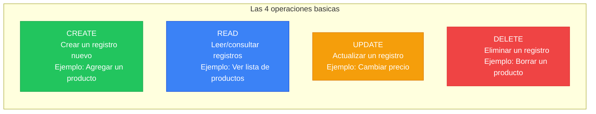

En nuestro proyecto hay **7 CRUDs simples** (producto, persona, empresa, cliente, vendedor, rol, ruta). Todos funcionan igual: una tabla con datos, un formulario para crear/editar, un boton para eliminar.

#### Que es un stored procedure (y por que facturas lo necesita)

**Analogia:** Imagina que en un restaurante, en vez de pedirle al mesero "traeme pan, luego mantequilla, luego un cuchillo", le dices "traeme el combo desayuno". El combo es un **procedimiento almacenado**: una instruccion que ejecuta varios pasos en la base de datos como una sola operacion.

**Por que facturas lo necesita:** Crear una factura implica:

1. Insertar la factura (numero, cliente, vendedor)
2. Insertar cada producto de la factura (producto, cantidad)
3. Calcular subtotales por producto
4. Descontar stock de cada producto
5. Calcular el total de la factura

Si alguno de estos pasos falla (por ejemplo, no hay stock suficiente), **todos** deben revertirse. Esto se llama **transaccion** y los stored procedures lo manejan automaticamente.

#### Que es un flujo de usuario

Es la secuencia de pasos que sigue un usuario para completar una tarea. Ejemplo del login:

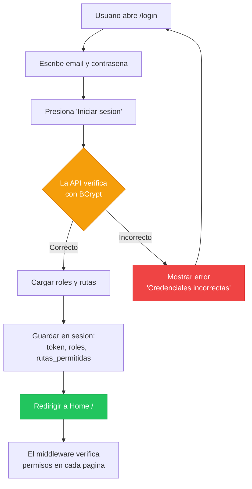

#### Que es un criterio de aceptacion

Es la respuesta a la pregunta: **"Como se que esto esta terminado y funciona?"**

| Funcionalidad | Criterio de aceptacion |
|---------------|----------------------|
| Login | Al ingresar email y contrasena correctos, se redirige al home con mensaje de bienvenida |
| Crear producto | Al llenar el formulario y presionar guardar, el producto aparece en la lista |
| Eliminar factura | Al confirmar la eliminacion, la factura desaparece y el stock de los productos se restaura |

### Ejecutar el comando

```
/speckit-specify

El proyecto FrontFlaskSDD es un frontend Flask que consume la API REST generica ApiGenericaCsharp.
Repositorio de la API: https://github.com/ccastro2050/ApiGenericaCsharp

FUNCIONALIDADES DEL SISTEMA:

1. AUTENTICACION Y SEGURIDAD
   - Login con email y contrasena (POST a /api/autenticacion/token)
   - La API valida credenciales con BCrypt y retorna JWT
   - Almacenar token JWT en session de Flask
   - Logout (limpiar sesion)
   - Cambiar contrasena (verificar actual, validar nueva, encriptar con BCrypt via API)
   - Recuperar contrasena olvidada (generar temporal, enviar por SMTP Gmail, forzar cambio al login)
   - Validacion de contrasena: minimo 6 caracteres, 1 mayuscula, 1 numero, no trivial

2. CONTROL DE ACCESO RBAC
   - Al hacer login, consultar roles del usuario (tabla rol_usuario -> rol)
   - Al hacer login, consultar rutas permitidas por rol (tabla rutarol -> ruta)
   - Middleware @app.before_request verifica en cada request:
     a) Si es ruta publica (/login, /static) -> dejar pasar
     b) Si no hay sesion -> redirigir a /login
     c) Si debe cambiar contrasena -> redirigir a /cambiar-contrasena
     d) Si la ruta no esta en rutas_permitidas -> mostrar pagina 403
   - Menu de navegacion dinamico: solo muestra las rutas permitidas para el usuario
   - La consulta de roles y rutas se hace con UNA sola consulta SQL via ConsultasController
     (JOIN de 5 tablas: usuario -> rol_usuario -> rol -> rutarol -> ruta)
   - Fallback: si ConsultasController falla, usar 5 GETs separados al CRUD generico

3. CRUDS SIMPLES (7 modulos)
   Cada modulo tiene: listado con tabla, formulario crear, formulario editar, eliminar con confirmacion.
   Todos usan el ApiService generico (mismos 4 metodos: listar, crear, actualizar, eliminar).
   - Producto: codigo (PK), nombre, stock, valorunitario
   - Persona: codigo (PK), nombre, email, telefono
   - Empresa: codigo (PK), nombre
   - Cliente: id (PK auto), credito, fkcodpersona (FK->persona), fkcodempresa (FK->empresa)
   - Vendedor: id (PK auto), carnet, direccion, fkcodpersona (FK->persona)
   - Rol: id (PK auto), nombre
   - Ruta: id (PK auto), ruta, descripcion

4. GESTION DE USUARIOS CON ROLES (via Stored Procedures)
   - Listar usuarios con sus roles (SP: listar_usuarios_con_roles)
   - Crear usuario con roles (SP: crear_usuario_con_roles) - contrasena se encripta con BCrypt
   - Actualizar usuario con roles (SP: actualizar_usuario_con_roles)
   - Eliminar usuario con roles (SP: eliminar_usuario_con_roles)
   - Consultar un usuario con roles (SP: consultar_usuario_con_roles)
   - Actualizar solo roles sin tocar contrasena (SP: actualizar_roles_usuario)

5. GESTION DE PERMISOS RBAC (via Stored Procedures)
   - Listar permisos ruta-rol (SP: listar_rutarol)
   - Crear permiso ruta-rol (SP: crear_rutarol)
   - Eliminar permiso ruta-rol (SP: eliminar_rutarol)
   - Verificar acceso de usuario a ruta (SP: verificar_acceso_ruta)

6. FACTURAS MAESTRO-DETALLE (via Stored Procedures)
   - Listar todas las facturas con productos, cliente y vendedor (SP: sp_listar_facturas_y_productosporfactura)
   - Consultar una factura con detalle (SP: sp_consultar_factura_y_productosporfactura)
   - Crear factura: seleccionar cliente, vendedor, agregar N productos con cantidad (SP: sp_insertar_factura_y_productosporfactura)
   - Actualizar factura: cambiar cliente/vendedor, reemplazar productos (SP: sp_actualizar_factura_y_productosporfactura)
   - Eliminar factura con cascada (SP: sp_borrar_factura_y_productosporfactura)
   - Los triggers de la BD calculan subtotales, totales y ajustan stock automaticamente

7. LAYOUT Y NAVEGACION
   - Template base (base.html) con Bootstrap 5 sidebar layout
   - Barra superior con nombre de usuario y boton logout
   - Menu lateral (nav_menu.html) con links condicionales segun rutas_permitidas
   - Sistema de mensajes flash (alertas Bootstrap dismissible)
   - CSS personalizado en static/css/app.css

FLUJOS DE USUARIO CRITICOS:
- Login -> cargar roles/rutas -> redirigir a home
- Crear factura -> seleccionar cliente y vendedor -> agregar productos -> enviar SP
- Recuperar contrasena -> generar temporal -> enviar email SMTP -> forzar cambio al login
- Navegacion RBAC -> middleware verifica permisos -> mostrar/ocultar menu segun rol
```

### Despues de ejecutar: como revisar el resultado

La IA generara un archivo `spec.md`. Este es el documento mas importante del proyecto — es el "contrato" de lo que se va a construir.

#### Como leer spec.md seccion por seccion

| Seccion del spec.md | Que buscar | Pregunta clave |
|---------------------|-----------|----------------|
| Descripcion del proyecto | Resumen general | Alguien que no conoce el proyecto, lo entenderia con esta descripcion? |
| Requisitos funcionales | Lista numerada (RF-001, RF-002...) | Cada funcionalidad que pedimos en el prompt tiene un requisito? |
| Requisitos no funcionales | Rendimiento, seguridad, usabilidad | Se menciona JWT, BCrypt, RBAC? |
| Flujos de usuario | Secuencias paso a paso | El flujo de login esta completo? El de factura? |
| Criterios de aceptacion | Condiciones de "terminado" | Cada requisito tiene al menos 1 criterio de aceptacion? |

#### Checklist de revision

- [ ] Hay al menos 7 requisitos para los CRUDs simples?
- [ ] Hay requisitos para los 15 stored procedures?
- [ ] El flujo de login incluye: verificar BCrypt, cargar roles, cargar rutas, guardar en sesion?
- [ ] El flujo de factura incluye: seleccionar cliente, vendedor, agregar N productos, enviar SP?
- [ ] Se menciona el middleware RBAC?
- [ ] Se menciona el menu dinamico?
- [ ] Se menciona la recuperacion de contrasena por email SMTP?

#### Ejercicio practico

Busca algo que falte en el spec.md. Ejemplo:

- "No menciona que el formulario de crear producto debe validar que el stock sea un numero positivo"
- "No dice que pasa si el usuario intenta crear una factura sin productos"

Agrega esos requisitos faltantes al spec.md manualmente. **Esto es lo que hace un analista de requisitos en la vida real.**

### Competencia adquirida

> **Despues de completar esta fase, ya sabes:**
> Escribir requisitos de software formales. Sabes la diferencia entre requisito funcional y no funcional. Sabes que es un CRUD, un stored procedure y un flujo de usuario. Esto es lo que hace un **analista de requisitos** o **product owner**.

---

## 5. FASE 2: /clarify — Las preguntas que no te hiciste

### Antes de ejecutar: conceptos que necesitas entender

#### Que es ambiguedad en requisitos

**Analogia:** Si alguien te dice "hazme una torta grande", eso es ambiguo:
- Grande para cuantas personas? 10? 50?
- De que sabor? Chocolate? Vainilla?
- Con decoracion o sin ella?

En software pasa lo mismo. Si el requisito dice "el usuario puede recuperar su contrasena", queda la duda:
- Se envia un link por email o una contrasena temporal?
- El link expira? En cuanto tiempo?
- Cuantos intentos puede hacer por hora?

**La ambiguedad es cara.** Si no la resuelves ahora, la resolveras despues con retrabajos, bugs y tiempo perdido.

#### Por que las preguntas son mas valiosas que las respuestas

> *"Un problema bien definido es un problema medio resuelto."*

La fase `/clarify` no es un paso burocratico — es donde se evitan los errores mas costosos. Un programador experimentado pasa mas tiempo preguntando que codificando.

### Ejecutar el comando

```
/speckit-clarify
```

La IA leera tu `spec.md` y generara entre 3 y 5 preguntas sobre puntos ambiguos.

### Despues de ejecutar: como responder las preguntas

**Regla de oro:** No respondas "si" o "no" a todo. Responde con contexto y razon.

| Forma incorrecta | Forma correcta |
|-------------------|----------------|
| "Si" | "Si, la encriptacion la hace la API C# via el parametro `?camposEncriptar=contrasena` en el query string. El frontend NUNCA maneja hashes directamente." |
| "No se" | "No estoy seguro. En el proyecto existente se cachea en sesion al login. Prefiero mantener ese enfoque para no hacer consultas en cada request." |

#### Preguntas que la IA probablemente hara (y como responder)

| Pregunta probable | Tu respuesta |
|-------------------|-------------|
| *"La encriptacion BCrypt se hace en el frontend o en la API?"* | En la API C#. El frontend envia la contrasena en texto plano por HTTPS, la API la encripta con BCrypt via `?camposEncriptar=contrasena`. |
| *"El menu de navegacion se genera en cada request?"* | No. Se cachea en la sesion de Flask al login. `session["rutas_permitidas"]` se carga una vez y el `context_processor` lo inyecta en todas las templates. |
| *"Como se agregan los N productos al formulario de factura?"* | Con campos HTML `prod_codigo[]` y `prod_cantidad[]`. Flask los recoge con `request.form.getlist()`. Se construye un JSON array y se pasa al SP como `p_productos`. |
| *"La recuperacion de contrasena usa link o contrasena temporal?"* | Contrasena temporal. Se genera un string aleatorio de 8 caracteres, se guarda encriptada en la BD, se envia por SMTP Gmail, y se fuerza el cambio al siguiente login. |
| *"El descubrimiento de PKs y FKs es dinamico?"* | Si. AuthService consulta `GET /api/estructuras/{tabla}/modelo` para descubrir PKs y FKs. Los resultados se cachean en `_fk_cache` en memoria. |

### Ejercicio practico

Piensa en 3 preguntas que la IA **no hizo** pero deberia haber hecho. Ejemplo:

1. "Que pasa si el usuario intenta acceder a una ruta que no existe (404)?"
2. "Cuanto tiempo dura la sesion de Flask antes de expirar?"
3. "Que pasa si la API no esta corriendo cuando el frontend intenta conectarse?"

Respondelas tu mismo y agrega las respuestas al `spec.md`.

### Competencia adquirida

> **Despues de completar esta fase, ya sabes:**
> Identificar puntos ambiguos en un documento de requisitos y resolverlos con preguntas especificas. Sabes que las preguntas correctas previenen bugs y retrabajos. Esto es lo que hace un **analista senior** o un **tech lead** en las reuniones de refinamiento.

---

## 6. FASE 3: /plan — El plano de la casa

### Antes de ejecutar: conceptos que necesitas entender

#### Que es una arquitectura de carpetas

**Analogia:** En una oficina, los documentos no se guardan todos en un solo cajon. Hay carpetas para "Finanzas", "Recursos Humanos", "Ventas". Cada carpeta tiene subcarpetas. Si alguien nuevo llega, sabe donde buscar.

En software es igual:

```
mi-proyecto/
├── routes/          <- Las "paginas" del sitio (producto, cliente, factura)
├── services/        <- La logica de negocio (conectarse a la API, autenticar)
├── templates/       <- Los archivos HTML que ve el usuario
├── static/          <- Imagenes, CSS, JavaScript
└── middleware/      <- Codigo que se ejecuta ANTES de cada pagina
```

**Por que importa:** Si un proyecto no tiene buena estructura de carpetas, se vuelve un caos cuando crece. No sabes donde esta cada cosa.

#### Que es una API REST

**Analogia:** Imagina un restaurante. Tu (el cliente/frontend) no entras a la cocina. Le dices al mesero (la API) lo que quieres y el te trae la comida (los datos).

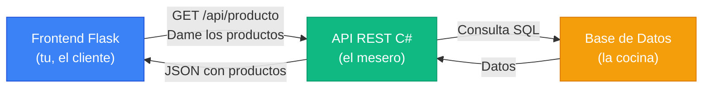

Los 4 "pedidos" que puedes hacer:

| Metodo HTTP | Analogia restaurante | Que hace |
|-------------|---------------------|----------|
| **GET** | "Traeme el menu" | Leer/consultar datos |
| **POST** | "Quiero ordenar un plato nuevo" | Crear un registro |
| **PUT** | "Cambiale la salsa a mi plato" | Actualizar un registro |
| **DELETE** | "Ya no quiero ese plato, retiremelo" | Eliminar un registro |

#### Que es un middleware

**Analogia:** Es el guardia de seguridad en la puerta de un edificio. Antes de que entres a cualquier oficina (pagina), el guardia verifica:

1. Tienes credencial? (sesion activa)
2. Tienes permiso para esta oficina? (ruta permitida)
3. Si no tienes credencial, te manda a recepcion (login)
4. Si no tienes permiso, te dice "acceso denegado" (pagina 403)

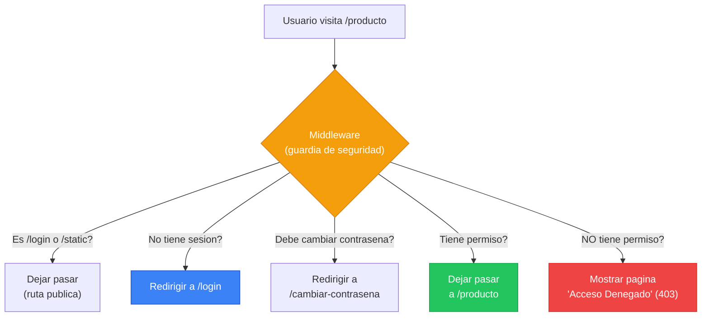

#### Que es un template engine (Jinja2)

**Analogia:** Imagina una carta modelo con espacios en blanco:

```
Estimado __________, su pedido #________ por $________ esta listo.
```

Jinja2 funciona igual, pero con HTML:

```html
<h1>Bienvenido, {{ nombre_usuario }}</h1>
<p>Tienes {{ roles|length }} roles asignados.</p>


    <a href="/producto">Ver productos</a>

```

| Sintaxis Jinja2 | Que hace |
|-----------------|---------|
| `{{ variable }}` | Muestra el valor de una variable |
| `` | Condicional (mostrar u ocultar algo) |
| `` | Repetir un bloque para cada elemento |
| `` | Incluir otro archivo HTML dentro de este |
| `` | Definir una seccion que las paginas hijas pueden llenar |

### Ejecutar el comando

```
/speckit-plan
```

(No necesita prompt adicional — lee `constitution.md` y `spec.md` automaticamente)

### Despues de ejecutar: como revisar el resultado

#### Checklist de revision

- [ ] **Arquitectura de carpetas:** El plan define donde va cada archivo?
- [ ] **Componentes:** Lista todos los archivos Python (app.py, routes/*.py, services/*.py)?
- [ ] **Dependencias:** Menciona Flask, requests, pytest en un requirements.txt?
- [ ] **ApiService:** Define los metodos listar, crear, actualizar, eliminar, ejecutar_sp?
- [ ] **AuthService:** Define login, obtener_roles, obtener_rutas, cambiar_contrasena?
- [ ] **Middleware:** Define before_request y context_processor?
- [ ] **Templates:** Define base.html, nav_menu.html y las 14 paginas?
- [ ] **Respeta constitution:** No sugiere Django, React, ORM ni nada prohibido?

#### Ejercicio practico

Dibuja en un papel (si, papel fisico) la arquitectura del plan:
- Cajas para cada componente (ApiService, AuthService, Middleware, Blueprints)
- Flechas mostrando quien llama a quien
- Colores para diferenciar frontend, servicios, API

Comparalo con el diagrama del plan.md. Son iguales? Falta algo?

### Competencia adquirida

> **Despues de completar esta fase, ya sabes:**
> Leer un plan tecnico de implementacion. Entiendes que es una API REST, un middleware, un template engine y una arquitectura de carpetas. Sabes como se organizan los componentes de un proyecto web. Esto es lo que hace un **desarrollador full-stack** cuando planifica una feature.

---

## 7. FASE 4: /tasks — La lista de trabajo

### Antes de ejecutar: conceptos que necesitas entender

#### Que es una dependencia entre tareas

**Analogia:** No puedes pintar una pared que no existe. Primero construyes la pared, luego la pintas.

En software:
- No puedes crear el Blueprint de producto si no existe el ApiService (porque el Blueprint lo usa)
- No puedes crear el middleware si no existe el AuthService (porque el middleware llama al auth)
- No puedes crear el login si no existe el middleware (porque el login necesita rutas publicas)

#### Que es una tarea aislada

Una buena tarea tiene estas caracteristicas:

| Caracteristica | Ejemplo bueno | Ejemplo malo |
|----------------|--------------|-------------|
| **Especifica** | "Crear api_service.py con metodo listar()" | "Hacer el servicio" |
| **Aislada** | "Crear Blueprint de producto" | "Crear todos los CRUDs" |
| **Testeable** | "Verificar que listar('producto') retorna una lista" | "Verificar que funciona" |
| **Pequena** | 30-60 minutos de trabajo | 2 dias de trabajo |

#### Que es paralelizable

Dos tareas son paralelizables cuando **no dependen una de la otra**. Se pueden hacer al mismo tiempo (o en cualquier orden):

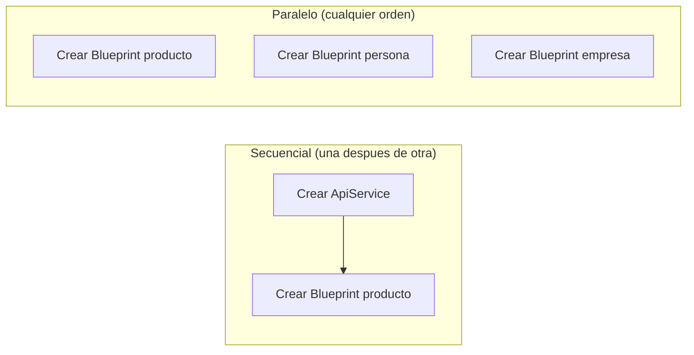

Los 7 CRUDs simples son paralelizables entre si (todos usan ApiService pero no dependen entre si).

### Ejecutar el comando

```
/speckit-tasks
```

(No necesita prompt adicional — lee `spec.md` y `plan.md`)

### Despues de ejecutar: como revisar el resultado

#### Como leer tasks.md

Cada tarea debe tener:

```markdown
- [ ] Task N: Titulo descriptivo
  - Depende de: Task X, Task Y
  - Archivo(s): ruta/al/archivo.py
  - Criterio: Como saber que esta terminada
```

#### Verificar el orden logico

Preguntate para cada tarea: "Puedo hacer esta tarea si las anteriores no estan hechas?" Si la respuesta es "no", entonces la dependencia esta correcta.

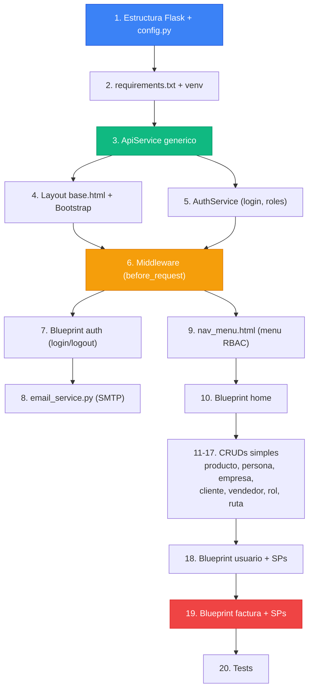

#### Ejercicio practico

Busca un error de dependencia en las tareas generadas. Ejemplo:
- Si la Task 7 (Blueprint auth) aparece antes de la Task 6 (Middleware), eso es un error — el login necesita que existan las rutas publicas definidas en el middleware.

Corrige el orden en tasks.md.

### Competencia adquirida

> **Despues de completar esta fase, ya sabes:**
> Descomponer un proyecto en tareas manejables, ordenarlas por dependencia e identificar cuales se pueden hacer en paralelo. Esto es lo que hace un **scrum master** o **tech lead** al planificar un sprint.

---

## 8. FASE 5: /analyze — La auditoria

### Antes de ejecutar: conceptos que necesitas entender

#### Que es consistencia entre documentos

Imagina que tu constitution dice "usar Flask" pero tu plan dice "instalar Django". Eso es una **inconsistencia**. El analyze busca este tipo de problemas entre los 4 documentos:

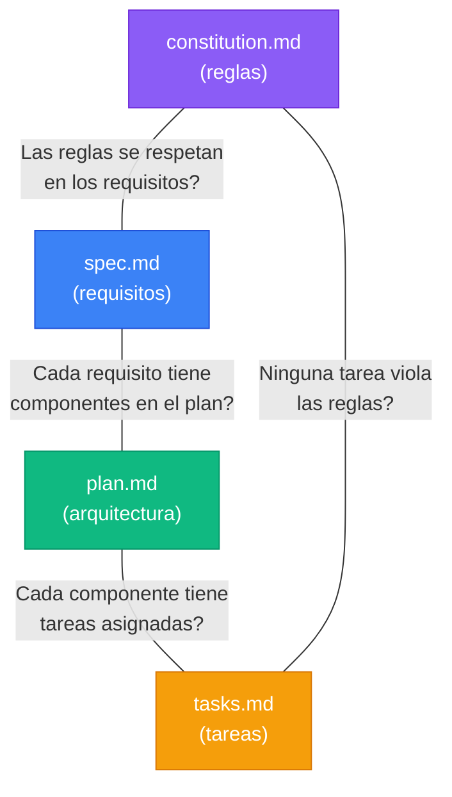

#### Que es un gap

Un **gap** es algo que falta. Ejemplos:

| Gap | Problema |
|-----|----------|
| Requisito sin tarea | La spec pide "recuperar contrasena" pero no hay tarea para implementarla |
| Tarea sin requisito | Hay una tarea "Crear modulo de reportes" pero la spec nunca pidio reportes |
| Componente sin plan | El plan menciona email_service.py pero no dice que metodos debe tener |

### Ejecutar el comando

```
/speckit-analyze
```

### Despues de ejecutar: como interpretar el reporte

El reporte mostrara:
- **Gaps:** requisitos sin tareas, tareas sin requisitos
- **Contradicciones:** reglas violadas, inconsistencias entre documentos
- **Sugerencias:** mejoras o puntos a clarificar

**Accion:** Corrige cada gap y contradiccion directamente en los archivos correspondientes. Luego re-ejecuta `/analyze` hasta que no haya errores.

### Competencia adquirida

> **Despues de completar esta fase, ya sabes:**
> Auditar documentacion tecnica y encontrar inconsistencias. Sabes que un proyecto profesional requiere que sus documentos "cuadren" entre si. Esto es lo que hace un **QA analyst** o un **auditor tecnico**.

---

## 9. FASE 6: /checklist — La lista del inspector

### Antes de ejecutar: conceptos que necesitas entender

#### Que es un test de aceptacion

| Tipo de test | Quien lo hace | Que verifica | Ejemplo |
|-------------|---------------|-------------|---------|
| **Test unitario** | El programador | Que una funcion individual funciona | `listar("producto")` retorna una lista |
| **Test de integracion** | El programador | Que dos componentes funcionan juntos | El Blueprint de producto puede llamar al ApiService |
| **Test de aceptacion** | El usuario/cliente | Que la funcionalidad cumple lo que se pidio | "Puedo crear una factura con 3 productos y el total se calcula correctamente" |

La checklist es la version escrita de los tests de aceptacion — lo que el "cliente" verificaria.

#### Que es "Definition of Done"

Es la respuesta a: **"Cuando podemos decir que esta tarea esta TERMINADA?"**

No es solo "el codigo compila". Es:
- El codigo funciona en el navegador
- Pasa los criterios de la checklist
- Respeta la constitution
- Esta documentado

### Ejecutar el comando

```
/speckit-checklist
```

### Despues de ejecutar: revisar criterios

Ejemplo de lo que debe generar:

```markdown
## Autenticacion
- [ ] Al ingresar email y contrasena correctos, redirige a home con flash "Bienvenido"
- [ ] Al ingresar credenciales incorrectas, muestra flash "Error de autenticacion" en rojo
- [ ] Al cerrar sesion, redirige a /login y no puede acceder a paginas protegidas
- [ ] La contrasena se valida: minimo 6 chars, 1 mayuscula, 1 numero

## CRUD Producto
- [ ] La tabla muestra codigo, nombre, stock, valorunitario de todos los productos
- [ ] Al crear un producto, aparece en la lista con flash "success"
- [ ] Al editar un producto, los cambios se reflejan en la tabla
- [ ] Al eliminar un producto, desaparece de la lista con confirmacion previa

## Factura
- [ ] Se puede seleccionar cliente y vendedor de dropdowns
- [ ] Se pueden agregar N productos con cantidad al formulario
- [ ] Al crear, el SP calcula subtotales, total y descuenta stock
- [ ] Al eliminar, el stock de los productos se restaura
```

#### Ejercicio practico

Marca cuales criterios ya se cumplen en el proyecto existente (FrontFlaskTutorial). Esto te da una idea de cuanto trabajo hay vs cuanto esta hecho.

### Competencia adquirida

> **Despues de completar esta fase, ya sabes:**
> Definir criterios de calidad medibles para cada funcionalidad. Sabes la diferencia entre un test unitario, de integracion y de aceptacion. Esto es lo que hace un **QA lead** al definir los criterios de entrega.

---

## 10. FASE 7: /implement — Manos a la obra

### Antes de ejecutar: conceptos que necesitas entender

#### Que es un entorno virtual de Python (venv)

**Analogia:** Imagina que tienes dos proyectos. Uno necesita Flask version 2 y otro Flask version 3. Si los dos usan el mismo Python del sistema, entran en conflicto. Un **entorno virtual** es como una "burbuja" donde cada proyecto tiene sus propias librerias sin afectar al otro.

```bash
# Crear entorno virtual
python -m venv venv

# Activar (Windows)
venv\Scripts\activate

# Activar (Mac/Linux)
source venv/bin/activate

# Instalar dependencias dentro de la burbuja
pip install flask requests pytest
```

#### Que es Flask y como arranca

```python
# app.py — esto es TODO lo que necesitas para arrancar
from flask import Flask
app = Flask(__name__)

@app.route("/")           # Cuando el usuario visite "/"
def home():
    return "Hola mundo"   # Mostrar este texto

if __name__ == '__main__':
    app.run(port=5300)    # Arrancar en http://localhost:5300
```

#### Que es un Blueprint

**Analogia:** Un Blueprint es un "modulo enchufable". Como un bloque de LEGO que puedes agregar o quitar sin afectar al resto.

```python
# routes/producto.py — Blueprint independiente
from flask import Blueprint, render_template
from services.api_service import ApiService

bp = Blueprint('producto', __name__)   # Crear el bloque
api = ApiService()

@bp.route('/producto')                  # Ruta de este bloque
def index():
    productos = api.listar('producto')  # Llamar a la API
    return render_template('pages/producto.html', registros=productos)
```

```python
# app.py — enchufar el bloque
from routes.producto import bp as producto_bp
app.register_blueprint(producto_bp)     # Listo, /producto funciona
```

#### Que es Bootstrap

**Analogia:** Es un "kit de CSS listo para usar". En vez de escribir 200 lineas de CSS para que un boton se vea bonito, escribes:

```html
<!-- Sin Bootstrap (tienes que escribir el CSS tu mismo) -->
<button style="background:blue; color:white; padding:10px; border-radius:5px; border:none; cursor:pointer;">
    Guardar
</button>

<!-- Con Bootstrap (una clase CSS y listo) -->
<button class="btn btn-primary">Guardar</button>
```

### Ejecutar por rondas

> **No ejecutes todo de golpe.** Divide en 4 rondas y verifica entre cada una.

#### Ronda 1: Cimientos (Tasks 1-5)

```
/speckit-implement

Ejecutar solamente las tareas 1 a 5 (estructura del proyecto, config.py, requirements.txt, ApiService generico, layout base.html con Bootstrap).
Detenerse despues de completarlas para revision.
```

**Que se crea en esta ronda:**

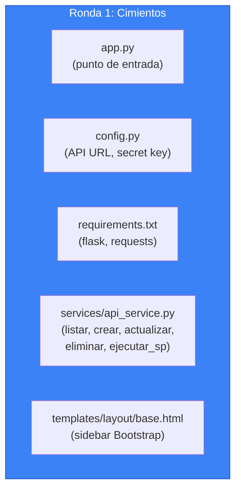

**Como verificar que funciona:**

```bash
# 1. Activar entorno virtual
venv\Scripts\activate

# 2. Instalar dependencias
pip install -r requirements.txt

# 3. Arrancar Flask
python app.py

# 4. Abrir navegador en http://localhost:5300
# Deberias ver la pagina base (aunque vacia)
```

**Prueba critica — ApiService se conecta a la API:**

Abre la terminal de Python y prueba:

```python
from services.api_service import ApiService
api = ApiService()
productos = api.listar("producto")
print(productos)
# Debe mostrar una lista de productos de la BD
```

Si muestra datos, el ApiService funciona. Si da error, la API no esta corriendo o la URL en config.py es incorrecta.

---

#### Ronda 2: Seguridad (Tasks 6-11)

```
/speckit-implement

Continuar con las tareas 6 a 11 (AuthService, middleware de autenticacion, Blueprint auth con login/logout/cambiar/recuperar contrasena, email_service, nav_menu.html, Blueprint home).
Detenerse despues para verificar que el login funciona.
```

**Que se crea en esta ronda:**

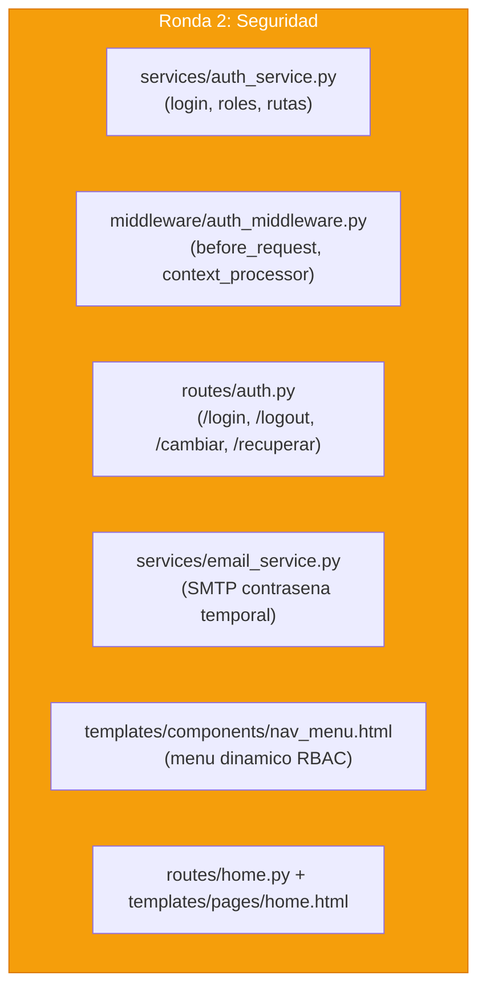

**Como verificar que funciona:**

1. Abrir `http://localhost:5300` — debe redirigir a `/login`
2. Ingresar `admin@correo.com` con su contrasena — debe redirigir a home con "Bienvenido"
3. Visitar `/producto` — debe mostrar "Acceso denegado" o la pagina segun los roles del usuario
4. Hacer logout — debe redirigir a `/login`

---

#### Ronda 3: CRUDs (Tasks 12-18)

```
/speckit-implement

Continuar con las tareas 12 a 18 (CRUDs simples: producto, persona, empresa, cliente, vendedor, rol, ruta).
Detenerse despues para verificar que todos los CRUDs funcionan.
```

**Que se crea en esta ronda:**

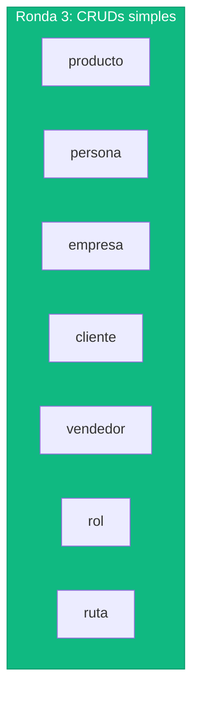

Cada uno genera 2 archivos: `routes/X.py` + `templates/pages/X.html`

**Como verificar que funciona:**

Para cada CRUD (producto, persona, etc.):

1. Visitar `/producto` — debe mostrar tabla con datos
2. Clic en "Nuevo" — debe mostrar formulario vacio
3. Llenar formulario y guardar — debe aparecer en la tabla con flash verde
4. Clic en "Editar" — debe mostrar formulario con datos actuales
5. Modificar y guardar — debe reflejar cambios
6. Clic en "Eliminar" — debe pedir confirmacion y eliminar

---

#### Ronda 4: Avanzado (Tasks 19-21)

```
/speckit-implement

Continuar con las tareas 19 a 21 (Blueprint usuario con gestion de roles via stored procedures, Blueprint factura maestro-detalle via stored procedures, tests con pytest).
```

**Que se crea en esta ronda:**

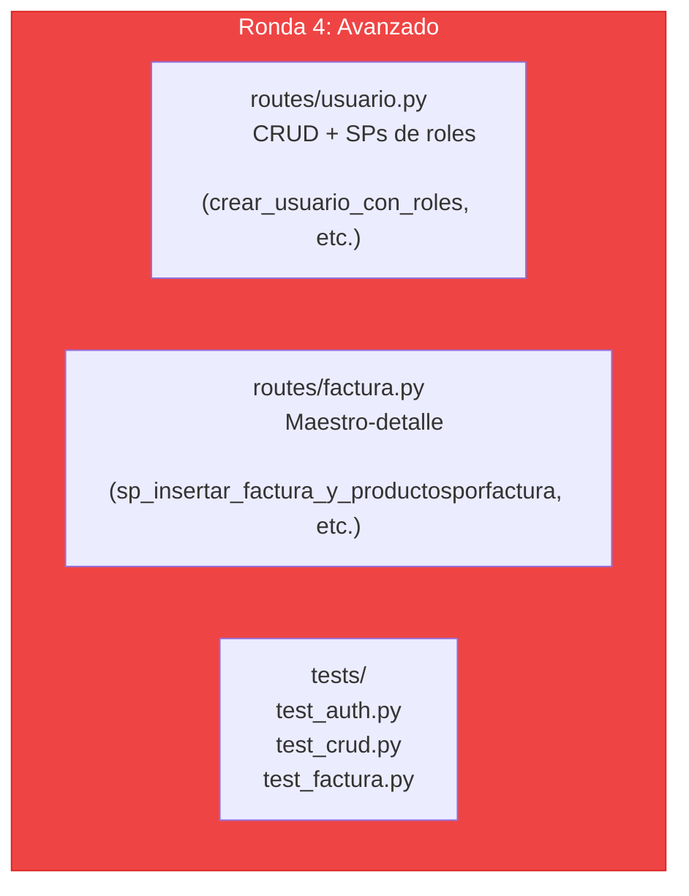

**Como verificar que funciona — Factura (la prueba mas completa):**

1. Ir a `/factura` — debe listar facturas existentes con totales
2. Clic en "Nueva factura"
3. Seleccionar un cliente del dropdown
4. Seleccionar un vendedor del dropdown
5. Agregar producto PR001 con cantidad 1
6. Agregar producto PR003 con cantidad 2
7. Guardar — debe crear la factura y redirigir a la lista
8. Verificar que el total se calculo correctamente (subtotales + total)
9. Verificar en `/producto` que el stock de PR001 y PR003 se desconto

### Competencia adquirida

> **Despues de completar esta fase, ya sabes:**
> Construir un frontend web completo con autenticacion JWT, control de acceso RBAC, CRUDs genericos, formularios maestro-detalle con stored procedures, y recuperacion de contrasena por email. Esto es lo que hace un **desarrollador full-stack junior-mid** en su dia a dia.

---

## 11. Mapa completo de competencias

```mermaid
graph TB
    subgraph Antes["ANTES del tutorial"]
        A1["Saber usar computador"]
        A2["Escribir en terminal"]
    end

    subgraph Fase0["FASE 0: Constitution"]
        B1["Arquitectura de software"]
        B2["Frameworks (Flask)"]
        B3["Patrones (Blueprint, Servicio, Middleware)"]
        B4["Seguridad (JWT, BCrypt, RBAC)"]
    end

    subgraph Fase1["FASE 1: Specify"]
        C1["Requisitos funcionales y no funcionales"]
        C2["CRUD y stored procedures"]
        C3["Flujos de usuario"]
        C4["Criterios de aceptacion"]
    end

    subgraph Fase2["FASE 2: Clarify"]
        D1["Identificar ambiguedades"]
        D2["Hacer preguntas con criterio"]
        D3["Tomar decisiones de diseno"]
    end

    subgraph Fase3["FASE 3: Plan"]
        E1["Leer arquitectura de carpetas"]
        E2["APIs REST (GET, POST, PUT, DELETE)"]
        E3["Middleware y template engines"]
        E4["Dependencias y librerias"]
    end

    subgraph Fase4["FASE 4: Tasks"]
        F1["Descomponer trabajo"]
        F2["Ordenar por dependencias"]
        F3["Identificar paralelismo"]
    end

    subgraph Fase56["FASES 5-6: Analyze + Checklist"]
        G1["Auditar documentacion"]
        G2["Encontrar gaps e inconsistencias"]
        G3["Definir criterios de calidad"]
    end

    subgraph Fase7["FASE 7: Implement"]
        H1["Configurar proyecto Flask"]
        H2["Crear servicio generico API"]
        H3["Implementar autenticacion JWT"]
        H4["Construir CRUDs completos"]
        H5["Maestro-detalle con SPs"]
        H6["Testing con pytest"]
    end

    subgraph Despues["DESPUES del tutorial"]
        I1["Desarrollador full-stack
        capaz de construir un frontend
        web profesional desde cero"]
    end

    Antes --> Fase0 --> Fase1 --> Fase2 --> Fase3 --> Fase4 --> Fase56 --> Fase7 --> Despues

    style Antes fill:#94a3b8,stroke:#64748b,color:#fff
    style Fase0 fill:#8b5cf6,stroke:#6d28d9,color:#fff
    style Fase1 fill:#3b82f6,stroke:#1d4ed8,color:#fff
    style Fase2 fill:#06b6d4,stroke:#0891b2,color:#fff
    style Fase3 fill:#10b981,stroke:#059669,color:#fff
    style Fase4 fill:#f59e0b,stroke:#d97706,color:#fff
    style Fase56 fill:#ef4444,stroke:#dc2626,color:#fff
    style Fase7 fill:#6366f1,stroke:#4f46e5,color:#fff
    style Despues fill:#22c55e,stroke:#16a34a,color:#fff
```

---

## 12. Que hacer despues

### Paso inmediato: comparar con otras IAs

Toma los prompts exactos del archivo `02_Comandos_SDD_FrontFlaskSDD.md` y ejecutalos en:

1. **GitHub Copilot** (VS Code Chat)
2. **Gemini CLI** (Terminal)
3. **Cursor** (IDE)

Usa la rubrica de comparacion de la seccion 12 del archivo 02 para evaluar cada resultado.

### Paso siguiente: modificar el proyecto

Prueba agregar un modulo nuevo usando SDD. Ejemplo: "Agregar un modulo de reportes que muestre las ventas por vendedor". Ejecuta las 7 fases para este modulo nuevo y observa como SDD te guia.

### Paso avanzado: aplicar SDD a un proyecto propio

Piensa en un proyecto que quieras construir (una tienda online, un sistema de reservas, un blog). Ejecuta las 7 fases desde cero. El flujo es siempre el mismo:

```
constitution → specify → clarify → plan → tasks → analyze → checklist → implement
```

---

## 13. Glosario

| Termino | Definicion |
|---------|-----------|
| **API** | Application Programming Interface. Conjunto de URLs que un servidor expone para que otros programas le pidan datos o acciones |
| **BCrypt** | Algoritmo de hash para contrasenas. Convierte "miPassword123" en "$2a$12$3UgI..." de forma irreversible |
| **Blueprint** | En Flask, un modulo independiente con sus propias rutas y templates que se "enchufa" a la app principal |
| **Bootstrap** | Libreria CSS que proporciona clases predefinidas para botones, tablas, formularios, etc. |
| **CRUD** | Create, Read, Update, Delete. Las 4 operaciones basicas sobre datos |
| **Endpoint** | Una URL especifica de una API. Ejemplo: `GET /api/producto` es un endpoint |
| **Flask** | Framework web ligero de Python para crear aplicaciones web |
| **Foreign Key (FK)** | Columna de una tabla que apunta a la clave primaria de otra tabla. Establece relaciones entre tablas |
| **Framework** | Conjunto de herramientas y convenciones que facilitan el desarrollo de software |
| **Gap** | Algo que falta entre dos documentos. Ejemplo: un requisito sin tarea asignada |
| **HTTP** | Protocolo de comunicacion entre navegadores/clientes y servidores web |
| **Jinja2** | Motor de templates de Python. Permite meter variables y logica dentro de archivos HTML |
| **JSON** | JavaScript Object Notation. Formato de texto para intercambiar datos: `{"nombre": "Laptop", "precio": 2500000}` |
| **JWT** | JSON Web Token. Credencial digital firmada que el servidor entrega al usuario despues del login |
| **Maestro-detalle** | Patron donde un registro principal (factura) tiene N registros hijos (productos de esa factura) |
| **Middleware** | Codigo que se ejecuta automaticamente ANTES de cada peticion HTTP |
| **ORM** | Object-Relational Mapping. Libreria que traduce objetos Python a tablas de BD (no lo usamos) |
| **Primary Key (PK)** | Columna que identifica de forma unica cada fila de una tabla. Ejemplo: `codigo` en producto |
| **RBAC** | Role-Based Access Control. Sistema de permisos basado en roles |
| **REST** | Representational State Transfer. Estilo de arquitectura para APIs web usando HTTP |
| **SDD** | Specification-Driven Development. Desarrollo guiado por especificaciones |
| **Session** | Datos que Flask guarda para cada usuario entre requests (en una cookie encriptada) |
| **SMTP** | Simple Mail Transfer Protocol. Protocolo para enviar correos electronicos |
| **Spec Kit** | Toolkit open-source de GitHub para aplicar SDD con agentes de IA |
| **Stored Procedure (SP)** | Programa guardado en la base de datos que ejecuta multiples operaciones SQL como una sola |
| **Template** | Archivo HTML con espacios para variables que se llenan dinamicamente |
| **Transaccion** | Grupo de operaciones en BD que se ejecutan todas o ninguna (todo o nada) |
| **Trigger** | Programa en la BD que se ejecuta automaticamente cuando se inserta, actualiza o elimina un registro |
| **venv** | Virtual environment. Entorno aislado de Python donde cada proyecto tiene sus propias librerias |
