# Tutorial SDD Paso a Paso: De Cero a Frontend Completo

> **Autor:** Carlos Arturo Castro Castro
> **Fecha:** Abril 2026
> **Nivel:** Principiante — no se asume experiencia previa en desarrollo web
> **Duración estimada:** 4-6 horas (ejecutando cada fase con calma)
> **Repositorio API:** [https://github.com/ccastro2050/ApiGenericaCsharp](https://github.com/ccastro2050/ApiGenericaCsharp)
> **Repositorio SDD:** [https://github.com/ccastro2050/FrontFlaskSDD](https://github.com/ccastro2050/FrontFlaskSDD)

---

## Tabla de Contenidos

- [1. Para quién es este tutorial](#1-para-quien-es-este-tutorial)
- [2. Preparación del entorno](#2-preparación-del-entorno)
- [3. FASE 0: /constitution — Las reglas del juego](#3-fase-0-constitution--las-reglas-del-juego)
- [4. FASE 1: /specify — El contrato de lo que vamos a construir](#4-fase-1-specify--el-contrato-de-lo-que-vamos-a-construir)
- [5. FASE 2: /clarify — Las preguntas que no te hiciste](#5-fase-2-clarify--las-preguntas-que-no-te-hiciste)
- [6. FASE 3: /plan — El plano de la casa](#6-fase-3-plan--el-plano-de-la-casa)
- [7. FASE 4: /tasks — La lista de trabajo](#7-fase-4-tasks--la-lista-de-trabajo)
- [8. FASE 5: /analyze — La auditoría](#8-fase-5-analyze--la-auditoria)
- [9. FASE 6: /checklist — La lista del inspector](#9-fase-6-checklist--la-lista-del-inspector)
- [10. FASE 7: /implement — Manos a la obra](#10-fase-7-implement--manos-a-la-obra)
- [11. Mapa completo de competencias](#11-mapa-completo-de-competencias)
- [12. Qué hacer después](#12-que-hacer-después)
- [13. Glosario](#13-glosario)

---

## 1. Para quién es este tutorial

### Perfil del estudiante

Este tutorial está diseñado para personas que:

- Quieren aprender a desarrollar software de forma profesional
- Han escuchado sobre IA para programar pero no saben cómo usarla con metodología
- Quieren entender **por qué** se hacen las cosas, no solo copiar/pegar comandos

### Que NO necesitas saber (mitos)

| Mito | Realidad |
|------|----------|
| "Necesito saber programar para empezar" | No. El flujo SDD empieza con documentación, no con código |
| "Necesito saber usar la terminal como experto" | No. Solo necesitas escribir un comando a la vez y leer la salida |
| "Necesito entender toda la API antes de empezar" | No. Iremos entendiendo cada parte conforme la necesitemos |
| "La IA hace todo sola" | No. Tu defines qué hacer, la IA genera, tu revisas y corriges |

### Que SI necesitas saber (mínimos)

| Competencia | Nivel | Cómo verificarlo |
|-------------|-------|-----------------|
| Usar un computador | Basíco | Puedes abrir programas, crear carpetas, copiar archivos |
| Escribir en la terminal | Basíco | Puedes abrir una terminal y escribir `python --version` |
| Saber qué es una página web | Basíco | Entiendes que un navegador muestra páginas y qué hay un "servidor" detras |
| Ingles técnico básico | Basíco | Puedes leer palabras como `install`, `run`, `error`, `success` |
| Ganas de aprender | Alto | Estas leyendo esto, así qué ya lo tienes |

### Tu nuevo rol: Desarrollador con IA

Antes de empezar, es importante que entiendas algo: en este tutorial **no vas a programar de la forma tradicional**. No vas a escribir cada línea de código manualmente. Vas a trabajar como un **Desarrollador con IA** — un rol que la industria llama la ["Clase Supervisora"](https://fortune.com/2026/03/31/fortune-com-2026-03-26-ai-agents-vibe-coding-developer-skills-supervisor-class/).

**Que significa esto en la practica:**

| Lo qué hacías antes | Lo qué harás ahora |
|---------------------|--------------------|
| Memorizar sintaxis de Python, HTML, CSS | Definir especificaciónes claras de lo que quieres construir |
| Escribir cada línea de código | Dirigir a la IA con prompts precisos |
| Debuggear buscando el error tu solo | Revisar lo que la IA generó y decidir si es correcto |
| Documentar al final (o nunca) | Documentar ANTES de codificar — eso es SDD |

> *"La IA produce volumen. Los humanos aseguran calidad."*
> — [DEV Community, 2026](https://dev.to/austinwdigital/ai-assisted-development-in-2026-best-practices-real-risks-and-the-new-bar-for-engineers-3fom)

**Las 5 competencias qué vas a desarrollar en este tutorial:**

| Competencia | Que significa | En qué fase la prácticas |
|-------------|--------------|--------------------------|
| **Especificacion** | Definir QUE construir con precision | Fase 0 (constitution) y Fase 1 (specify) |
| **Juicio crítico** | Evaluar si lo que generó la IA es correcto | Todas las fases (checklist de revisión) |
| **Revision de código** | Leer código generado como si fuera de un junior | Fase 7 (implement) |
| **Arquitectura** | Decidir cómo se conectan las piezas | Fase 3 (plan) |
| **Iteracion** | Refinar cuando el resultado no es satisfactorio | Todas las fases |

**Esto NO significa que no necesitas entender el código.** Necesitas entenderlo para juzgar si es correcto — pero no necesitas memorizarlo ni escribirlo desde cero. Segun [Gartner (citado por Shift Asia)](https://shiftasía.com/column/ai-in-software-development-the-rise-of-the-ai-augmented-developer/), para finales de 2026 el **75% de los desarrolladores** orquestaran agentes de IA en vez de codificar manualmente.

### Que hacer cuando la IA NO genera lo que esperabas

Esto te va a pasar en CADA fase. La IA no es perfecta. A veces genera documentos incompletos, ignora instrucciones o inventa cosas que no pediste. Cuando eso pase, tienes **3 opciones**:

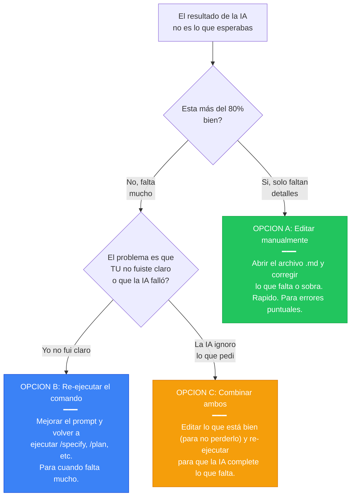

**Ejemplos concretos:**

| Situacion | Opcion | Que hacer |
|-----------|--------|-----------|
| La constitution dice Flask pero también menciona Django | **A** (editar) | Abrir `constitution.md`, borrar la línea de Django, guardar |
| La spec no menciona facturas ni stored procedures | **B** (re-ejecutar) | Rehacer el prompt de `/specify` agregando toda la sección de facturas |
| El plan tiene buena estructura de carpetas pero los servicios están vacios | **C** (ambos) | Mantener la estructura editada, re-ejecutar `/plan` pidiendo detalle en servicios |
| El código compila pero usa SQLAlchemy (prohibido en la constitution) | **B** (re-ejecutar) | Decirle a la IA: "El código viola la constitution. No usar ORM. Corregir" |
| Al tasks.md le falta 1 tarea para el email service | **A** (editar) | Agregar la tarea manualmente en la posicion correcta del tasks.md |

**La regla de oro:**

> Los documentos SDD son **tuyos**, no de la IA. La IA los genera pero tu eres el dueño. Puedes editarlos, reordenarlos, agregar o quitar lo que quieras. **Nunca aceptes un resultado sin revisarlo.** En cada fase de este tutorial hay una checklist — úsala.

> Para mayor detalle sobre estrategias de corrección por fase, consulta la [Sección 2 del documento 02](02_Comandos_SDD_FrontFlaskSDD.md#2-que-hacer-cuando-el-resultado-no-cumple-las-expectativas).

### Mapa de competencias: qué vas a aprender

```mermaid
graph TB
    subgraph INICIO["Antes del tutorial"]
        S0["Saber usar un computador
        y escribir en la terminal"]
    end

    subgraph FASE0["Fase 0: /constitution"]
        C1["Qué es una arquitectura de software"]
        C2["Qué es un framework"]
        C3["Qué es un patrón de diseño"]
        C4["Que son JWT, BCrypt y RBAC"]
    end

    subgraph FASE1["Fase 1: /specify"]
        C5["Qué es un requisito funcional"]
        C6["Qué es un CRUD"]
        C7["Qué es un stored procedure"]
        C8["Qué es un flujo de usuario"]
    end

    subgraph FASE2["Fase 2: /clarify"]
        C9["Identificar ambigüedades"]
        C10["Hacer preguntas con criterio"]
    end

    subgraph FASE3["Fase 3: /plan"]
        C11["Leer una arquitectura de carpetas"]
        C12["Qué es una API REST"]
        C13["Qué es un middleware"]
        C14["Qué es un template engine"]
    end

    subgraph FASE4["Fase 4: /tasks"]
        C15["Planificar trabajo por dependencias"]
        C16["Identificar tareas paralelizables"]
    end

    subgraph FASE56["Fases 5-6: /analyze + /checklist"]
        C17["Auditar documentación técnica"]
        C18["Definir criterios de calidad"]
    end

    subgraph FASE7["Fase 7: /implement"]
        C19["Configurar un proyecto Flask"]
        C20["Crear un servicio qué consume API"]
        C21["Implementar autenticación JWT"]
        C22["Construir CRUDs completos"]
        C23["Maestro-detalle con SPs"]
    end

    subgraph FIN["Despues del tutorial"]
        CF["Puedes construir un frontend
        web completo y profesional"]
    end

    S0 --> FASE0 --> FASE1 --> FASE2 --> FASE3 --> FASE4 --> FASE56 --> FASE7 --> FIN

    style INICIO fill:#94a3b8,stroke:#64748b,color:#fff
    style FASE0 fill:#8b5cf6,stroke:#6d28d9,color:#fff
    style FASE1 fill:#3b82f6,stroke:#1d4ed8,color:#fff
    style FASE2 fill:#06b6d4,stroke:#0891b2,color:#fff
    style FASE3 fill:#10b981,stroke:#059669,color:#fff
    style FASE4 fill:#f59e0b,stroke:#d97706,color:#fff
    style FASE56 fill:#ef4444,stroke:#dc2626,color:#fff
    style FASE7 fill:#6366f1,stroke:#4f46e5,color:#fff
    style FIN fill:#22c55e,stroke:#16a34a,color:#fff
```

---

## 2. Preparación del entorno

### Qué necesitas instalar

Antes de empezar cuálquier fase, tu computador necesita estás herramientas:

| Herramienta | Qué es | Para qué la usamos | Cómo instalar |
|-------------|--------|-------------------|---------------|
| **Python 3.12+** | Lenguaje de programación | El frontend Flask está escrito en Python | [python.org/downloads](https://python.org/downloads) |
| **Git** | Control de versiones | Guardar el progreso y subir a GitHub | [git-scm.com](https://git-scm.com) |
| **VS Code** | Editor de código | Escribir y leer archivos del proyecto | [code.visualstudio.com](https://code.visualstudio.com) |
| **Node.js** | Runtime de JavaScript | Necesario para instalar Claude Code CLI | [nodejs.org](https://nodejs.org) |
| **Claude Code CLI** | Asistente de IA en la terminal | Ejecutar los comandos SDD (/speckit-constitution, /speckit-specify, etc.) | `npm install -g @anthropic-ai/claude-code` |

### Extensiones de VS Code recomendadas

| Extension | Para qué |
|-----------|---------|
| Python (Microsoft) | Resaltado de sintaxis y autocompletado Python |
| Markdown Preview Mermaid | Ver los diagramás Mermaid de este tutorial |
| GitHub Copilot (opcional) | Si vas a comparar con Copilot después |

### Verificar qué todo funciona

Abre una terminal (en VS Code: `Ctrl+Ñ` o `Ctrl+backtick`) y ejecuta:

```bash
# Verificar Python
python --version
# Debe mostrar: Python 3.12.x o superior

# Verificar Git
git --version
# Debe mostrar: git versión 2.x.x

# Verificar pip (instalador de paquetes Python)
pip --version
# Debe mostrar: pip 24.x.x
```

> **Si algún comando falla:** significa que la herramienta no está instalada o no está en el PATH. Busca en YouTube "instalar Python en Windows" o "instalar Git en Windows" según el caso.

### Clonar el repositorio de la API

La API es el "backend" qué nuestro frontend va a consumir. Necesitamos tenerla corriendo.

```bash
# Ir al escritorio
cd ~/Desktop

# Clonar la API
git clone https://github.com/ccastro2050/ApiGenericaCsharp.git

# Entrar a la carpeta
cd ApiGenericaCsharp
```

### Crear la base de datos

La API necesita una base de datos para funcionar. Sin ella, la API arranca pero todos los endpoints dan error porque no hay tablas, datos ni stored procedures.

> **Que base de datos usar:** La API soporta 3 motores. Elige el qué tengas instalado:
>
> | Motor | Cuando usarlo |
> |-------|--------------|
> | **SQL Server** | Si tienes SQL Server o SQL Server Express instalado (viene con Visual Studio) |
> | **PostgreSQL** | Si prefieres un motor open-source robusto |
> | **MySQL/MariaDB** | Si tienes XAMPP, Laragon o MariaDB instalado |

Los scripts de creación de la base de datos están dentro de la API, en la carpeta `script_bd/`:

```
ApiGenericaCsharp/
└── script_bd/
    ├── bdfacturas_sqlserver.sql       # Para SQL Server
    ├── bdfacturas_postgres.sql        # Para PostgreSQL
    └── bdfacturas_mysql_mariadb.sql   # Para MySQL/MariaDB
```

**Paso 1 — Ejecutar el script según tu motor de base de datos:**

Para **SQL Server** (desde SQL Server Management Studio o sqlcmd):
```bash
# Primero crear la base de datos manualmente:
# CREATE DATABASE bdfacturas_sqlserver_local;
# Luego ejecutar el script:
sqlcmd -S localhost -d bdfacturas_sqlserver_local -i script_bd/bdfacturas_sqlserver.sql
```

Para **PostgreSQL** (desde psql o pgAdmin):
```bash
# Primero crear la base de datos:
# CREATE DATABASE bdfacturas_postgres_local;
# Luego ejecutar el script:
psql -U postgres -d bdfacturas_postgres_local -f script_bd/bdfacturas_postgres.sql
```

Para **MySQL/MariaDB** (desde la terminal o phpMyAdmin):
```bash
# El script crea la base de datos automáticamente
mysql -u root < script_bd/bdfacturas_mysql_mariadb.sql
```

> **Que crea el script:** 12 tablas, 6 triggers, 15 stored procedures y datos de ejemplo (empresas, personas, productos, usuarios con roles, facturas con detalle). Todo listo para usar.

**Paso 2 — Configurar la API para usar tu base de datos:**

Abre el archivo `appsettings.json` dentro de la carpeta `ApiGenericaCsharp` con tu editor y verifica dos cosas:

1. Que la **connection string** de tu motor tenga los datos correctos (servidor, usuario, contraseña)
2. Que el campo `"DatabaseProvider"` apunte a tu motor:

```json
{
  "DatabaseProvider": "SqlServer"
}
```

| Valor de DatabaseProvider | Motor |
|--------------------------|-------|
| `"SqlServer"` | SQL Server |
| `"Postgres"` | PostgreSQL |
| `"MariaDB"` | MySQL/MariaDB |

### Ejecutar la API

```bash
# Desde la carpeta ApiGenericaCsharp
dotnet run
```

### Verificar que la API responde

Con la API corriendo, abre el navegador y visita:

```
http://localhost:5035/swagger
```

Deberias ver la documentación Swagger de la API. Si la ves, la API está lista.

> **Qué es Swagger:** Es una página web automática qué muestra todos los "endpoints" (URLs) que la API ofrece. Es como el menú de un restaurante — te dice que puedes pedir.

**Verificar que la base de datos funciona:**

En el navegador, visita también:

```
http://localhost:5035/api/diagnostico/conexión
```

Debe responder con información de la base de datos (servidor, version, estado). Si da error, revisa la connection string en `appsettings.json`.

Tambien puedes probar:

```
http://localhost:5035/api/producto
```

Debe retornar una lista de productos en JSON. Si la ves, la base de datos está funcionando correctamente.

### Crear la carpeta del proyecto

Si la carpeta ya existe (porque clonaste el repo de GitHub), simplemente entra a ella. Si no existe, creala:

```bash
# Opcion A: Si ya clonaste el repo de GitHub
cd ~/Desktop/SDD/FrontFlaskSDD

# Opcion B: Si empiezas desde cero
mkdir -p ~/Desktop/SDD/FrontFlaskSDD
cd ~/Desktop/SDD/FrontFlaskSDD

# Verificar qué estás en la carpeta correcta
pwd
# Debe mostrar: .../SDD/FrontFlaskSDD
```

### Crear el entorno virtual de Python (venv)

> **Qué es un entorno virtual:** Es una "burbuja" aislada donde instalas las librerías de tu proyecto sin afectar al Python del sistema ni a otros proyectos. Cada proyecto tiene su propio venv con sus propias versiones de librerías.

**Por qué hacerlo ahora y no después:** Las fases de documentación (constitution, specify, plan, tasks) no necesitan el venv. Pero la fase de implementación si, y es mejor tenerlo listo desde el inicio para no interrumpir el flujo después.

```bash
# Crear el entorno virtual (esto crea una carpeta llamada "venv")
python -m venv venv
```

> **Que acaba de pasar:** Python creó una carpeta `venv/` dentro de tu proyecto con una copia aislada de Python y pip. Todo lo que instales a partir de ahora se guarda ahí, no en tu sistema.

```bash
# Activar el entorno virtual

# En Windows (CMD):
venv\Scripts\activate

# En Windows (PowerShell):
venv\Scripts\Activate.ps1

# En Windows (Git Bash):
source venv/Scripts/activate

# En Mac/Linux:
source venv/bin/activate
```

> **Cómo saber que se activo:** Tu terminal mostrará `(venv)` al inicio de la línea. Ejemplo:
> ```
> (venv) C:\Users\fcl\Desktop\SDD\FrontFlaskSDD>
> ```
> Si no ves `(venv)`, el entorno no está activo. Vuelve a ejecutar el comando de activacion.

### Instalar las dependencias del proyecto

Con el venv activo, instala las librerías qué necesita el frontend Flask:

```bash
pip install flask requests pytest
```

> **Qué es cada libreria:**
>
> | Libreria | Que hace |
> |----------|---------|
> | `flask` | El framework web — maneja rutas, templates, sesiónes |
> | `requests` | Cliente HTTP — para llamar a la API REST desde Python |
> | `pytest` | Framework de testing — para verificar que el código funciona |

Verifica que se instalaron correctamente:

```bash
pip list
# Debe mostrar flask, requests, pytest y sus dependencias
```

Genera el archivo `requirements.txt` para que otros puedan instalar las mismas librerías:

```bash
pip freeze > requirements.txt
```

> **Qué es requirements.txt:** Es la "lista de compras" del proyecto. Cuando alguien clone tu repo, ejecuta `pip install -r requirements.txt` y tiene exactamente las mismas librerías qué tu.

### Agregar venv al .gitignore

La carpeta `venv/` pesa mucho y no se debe subir a GitHub. Crea un archivo `.gitignore` para excluirla.

> **Qué es .gitignore:** Le dice a Git cuáles archivos NO debe incluir en el repositorio. El venv y los archivos de cache de Python no se suben porque son locales de cada maquína.

Abre tu editor (VS Code) y crea un archivo nuevo llamado `.gitignore` en la raiz de `FrontFlaskSDD/`. Escribe dentro:

```
venv/
__pycache__/
*.pyc
.specify/
.claude/
```

Guarda el archivo.

> **Nota:** El nombre del archivo es exactamente `.gitignore` (con el punto al inicio, sin extensión). En VS Code: File → New File → escribir `.gitignore` → guardar.

> **Por qué se excluyen `.specify/` y `.claude/`:**
> - `.specify/` contiene los templates y scripts de Spec Kit. Se regeneran con `specify init`.
> - `.claude/` contiene configuración y credenciales de Claude Code. Spec Kit advierte que puede tener tokens de autenticación que no deben subirse a GitHub.

### Instalar Node.js y Claude Code CLI

> **Qué es Claude Code CLI:** Es el asistente de IA de Anthropic que se ejecuta desde la terminal. Es diferente a la extensión de VS Code — el CLI se usa directamente en PowerShell/terminal y es el que Spec Kit necesita para funcionar.

> **Nota:** Si ya tienes la extensión Claude Code en VS Code, esta ya tiene los skills de Spec Kit integrados. Pero el camino estándar (que funciona con cualquier asistente de IA) es instalar el CLI y Spec Kit por separado. Este tutorial enseña el camino estándar.

**Paso 1 — Instalar Node.js:**

Si no lo tienes, descárgalo de [nodejs.org](https://nodejs.org) (versión LTS recomendada). Instálalo con las opciones por defecto.

Verifica que se instaló:

```bash
node --version
# Debe mostrar: v20.x.x o superior

npm --version
# Debe mostrar: 10.x.x o superior
```

**Paso 2 — Instalar Claude Code CLI:**

En PowerShell (Windows):

```powershell
npm install -g @anthropic-ai/claude-code
```

> **Nota para Linux/Mac:**
> ```bash
> npm install -g @anthropic-ai/claude-code
> ```
> Es el mismo comando. Si da error de permisos en Linux/Mac, usar `sudo npm install -g @anthropic-ai/claude-code`.

Verifica que se instaló:

```bash
claude --version
# Debe mostrar la versión de Claude Code CLI
```

> **Si `claude` no se reconoce después de instalar:** Cierra y abre PowerShell para que recargue el PATH.

### Instalar Spec Kit en el proyecto

> **Qué es Spec Kit:** Es un toolkit open-source de GitHub que proporciona la estructura y los comandos SDD (como `/speckit-constitution`, `/speckit-specify`, `/speckit-plan`, etc.) para usar con asistentes de IA. Sin instalarlo, esos comandos no existen en el CLI.

**Paso 1 — Instalar uv (gestor de paquetes de Python):**

```bash
pip install uv
```

**Paso 2 — Inicializar Spec Kit en el proyecto:**

```bash
uvx --from git+https://github.com/github/spec-kit.git specify init .
```

**Paso 3 — El wizard hace dos preguntas:**

Primera pregunta — La carpeta no está vacía:
```
Warning: Current directory is not empty (10 items)
Template files will be merged with existing content
and may overwrite existing files
Do you want to continue? [y/N]:
```
Escribe `y` y presiona Enter. Es normal porque ya tenemos archivos .md en la carpeta.

Segunda pregunta — Elegir asistente de IA:
```
Choose your AI assistant:
    agy (Antigravity)
    amp (Amp)
    ...
    claude (Claude Code)        ← SELECCIONAR ESTE
    copilot (GitHub Copilot)
    cursor-agent (Cursor)
    gemini (Gemini CLI)
    ...
```
Usa las flechas arriba/abajo para llegar a `claude (Claude Code)` y presiona Enter.

> **Si da error "claude not found":** Significa que Claude Code CLI no se instaló correctamente en el paso anterior. Verifica con `claude --version`. Si no funciona, cierra y abre PowerShell y reintenta.

**Paso 3 — Resultado esperado:**

Si todo salió bien, deberías ver algo como esto:

```
Selected AI assistant: claude
Selected script type: ps
Initialize Specify Project
├── ● Check required tools (ok)
├── ● Select AI assistant (claude)
├── ● Select script type (ps)
├── ● Install integration (Claude Code)
├── ● Install shared infrastructure (scripts (ps) + templates)
├── ○ Ensure scripts executable
├── ● Constitution setup (copied from template)
├── ● Install git extension (existing repo detected; extension installed)
├── ● Install bundled workflow (speckit installed)
└── ● Finalize (project ready)

Project ready.
```

Luego aparece una **advertencia de seguridad**:

```
Agent Folder Security
Some agents may store credentials, auth tokens, or other
identifying and private artifacts in the agent folder within
your project.
Consider adding .claude/ (or parts of it) to .gitignore to
prevent accidental credential leakage.
```

Esto significa que la carpeta `.claude/` puede contener credenciales que no deben subirse a GitHub. Por eso la agregamos al `.gitignore` en el paso anterior.

Luego aparecen los **próximos pasos** con los comandos disponibles:

```
Next Steps
1. You're already in the project directory!
2. Start Claude in this project directory; spec-kit skills
   were installed to .claude/skills
3. Start using skills with your AI agent:
   3.1 /speckit-constitution - Establish project principles
   3.2 /speckit-specify - Create baseline specification
   3.3 /speckit-plan - Create implementation plan
   3.4 /speckit-tasks - Generate actionable tasks
   3.5 /speckit-implement - Execute implementation
```

Y los **skills opcionales** (de mejora de calidad):

```
Enhancement Skills
○ /speckit-clarify (optional) - Ask structured questions to
  de-risk ambiguous areas before planning
○ /speckit-analyze (optional) - Cross-artifact consistency &
  alignment report
○ /speckit-checklist (optional) - Generate quality checklists
  to validate requirements completeness
```

> **¿Qué significa todo esto?** Que Spec Kit instaló los skills (comandos) en la carpeta `.claude/skills` y que ahora puedes usarlos dentro de Claude Code CLI. Los 5 skills principales son obligatorios (constitution → specify → plan → tasks → implement) y los 3 opcionales (clarify, analyze, checklist) mejoran la calidad del resultado.

**Paso 4 — Verificar que Spec Kit se instaló:**

Deberías ver nuevas carpetas `.specify/` y `.claude/` en tu proyecto:

```
FrontFlaskSDD/
├── .claude/                # Claude Code (skills, configuración)
│   └── skills/             # Los slash commands de Spec Kit
├── .specify/               # Spec Kit (templates, scripts, config)
│   ├── templates/
│   ├── scripts/
│   └── config.yaml
├── .gitignore
├── requirements.txt
└── venv/
```

Verifica con:

```powershell
# En PowerShell:
dir .specify

# Debe mostrar las subcarpetas templates, scripts y el archivo config.yaml
```

### Dónde se ejecutan los comandos SDD

> **Esto es importante:** Los comandos de Spec Kit (`/speckit-constitution`, `/speckit-specify`, etc.) se ejecutan en **Claude Code CLI** (en la terminal), NO directamente en PowerShell.
>
> Primero abres Claude Code CLI y luego dentro de él escribes los comandos.

```
┌─────────────────────────────────────────────────────────────┐
│  VS Code                                                    │
│  ┌──────────────────────────┐ ┌──────────────────────────┐  │
│  │                          │ │  CLAUDE CODE              │  │
│  │   Editor de código       │ │  (extensión VS Code       │  │
│  │   (archivos .py, .html)  │ │   o CLI en terminal)      │  │
│  │                          │ │                            │  │
│  │                          │ │  /speckit-constitution     │  │
│  │                          │ │  /speckit-specify          │  │
│  │                          │ │  /speckit-plan             │  │
│  ├──────────────────────────┤ │                            │  │
│  │  TERMINAL (PowerShell)   │ │  Aquí van los comandos    │  │
│  │                          │ │  de Spec Kit              │  │
│  │  python app.py           │ │                            │  │
│  │  pip install flask       │ │                            │  │
│  │  git push                │ │                            │  │
│  │  dotnet run              │ │                            │  │
│  │                          │ │                            │  │
│  │  Aquí van los comandos   │ │                            │  │
│  │  del sistema operativo   │ │                            │  │
│  └──────────────────────────┘ └──────────────────────────┘  │
└─────────────────────────────────────────────────────────────┘
```

**Si pegas el prompt de `/speckit-constitution` directamente en PowerShell, da error.** PowerShell interpreta cada línea como un comando del sistema operativo. Los comandos SDD van dentro de Claude Code (ya sea en el CLI o en la extensión de VS Code).

### Abrir Claude Code CLI (primera vez)

La primera vez que abres Claude Code CLI, te hace varias preguntas de configuración. Las siguientes veces se abre directamente.

**Paso 1 — Abrir Claude Code CLI:**

En PowerShell, estando en la carpeta del proyecto, ejecuta:

```bash
claude
```

**Paso 2 — Elegir tema visual:**

```
Choose the text style that looks best with your terminal
  1. Auto (match terminal)
❯ 2. Dark mode ✔
  3. Light mode
  ...
```

Selecciona `2. Dark mode` (o el que prefieras) y presiona Enter.

**Paso 3 — Seleccionar método de login:**

```
Select login method:
❯ 1. Claude account with subscription · Pro, Max, Team, or Enterprise
  2. Anthropic Console account · API usage billing
  3. 3rd-party platform · Amazon Bedrock, Microsoft Foundry, or Vertex AI
```

Selecciona `1. Claude account with subscription` y presiona Enter.

> **Nota:** Necesitas una suscripción a Claude (Pro, Max, Team o Enterprise) para usar Claude Code CLI. Si no la tienes, puedes usar la opción 2 con una cuenta de Anthropic Console (pago por uso de API).

**Paso 4 — Autorizar en el navegador:**

Se abre una página web en tu navegador que dice "Claude Code desea conectarse a su Claude chat account". Haz clic en **Autorizar**.

Verás el mensaje: "Ya estás listo para Claude Code. Ahora puedes cerrar esta ventana."

Vuelve a la terminal de PowerShell.

**Paso 5 — Configuración de terminal:**

```
Use Claude Code's terminal setup?
❯ 1. Yes, use recommended settings
  2. No, maybe later with /terminal-setup
```

Selecciona `1. Yes, use recommended settings` y presiona Enter.

**Paso 6 — Confirmar confianza en la carpeta:**

```
Quick safety check: Is this a project you created or one you trust?
❯ 1. Yes, I trust this folder
  2. No, exit
```

Selecciona `1. Yes, I trust this folder` y presiona Enter.

**Paso 7 — Notas de seguridad:**

```
Security notes:
1. Claude can make mistakes
2. Due to prompt injection risks, only use it with code you trust
Press Enter to continue…
```

Presiona Enter.

**Paso 8 — Claude Code CLI está listo:**

Verás algo como esto:

```
Claude Code v2.1.x
Opus 4.x · Claude Max
~\OneDrive\Desktop\SDD\FrontFlaskSDD

❯
```

El símbolo `❯` es el prompt de Claude Code CLI. **Ahí es donde pegas los comandos de Spec Kit** (`/speckit-constitution`, `/speckit-specify`, etc.).

> **Las siguientes veces:** Cuando vuelvas a ejecutar `claude` en la misma carpeta, se abre directamente en el prompt `❯` sin repetir las preguntas de configuración.

> **Para salir de Claude Code CLI:** Escribe `/exit` o presiona `Ctrl+C`.

### Verificar el estado final de la preparación

Tu carpeta debería verse así:

```
FrontFlaskSDD/
├── .specify/               # Spec Kit (templates y config)
├── .gitignore              # Archivos excluidos de Git
├── requirements.txt        # Dependencias Python
├── venv/                   # Entorno virtual (NO se sube a GitHub)
├── 01_Guia_SDD_SpecKit.md  # Documento de conceptos (si clonaste el repo)
├── 02_Comandos_SDD_FrontFlaskSDD.md  # Prompts exactos
├── 03_Glosario_Conceptos.md          # Glosario de terminos
├── 04_Tutorial_SDD_Paso_a_Paso.md    # Este tutorial
└── Manual_de_Marca_Zenith.md         # Identidad visual de la empresa
```

Verifica abriendo la carpeta `FrontFlaskSDD` en el explorador de archivos o en la terminal:

```powershell
# En PowerShell:
dir

# En CMD o Git Bash:
ls -la
```

Debes ver: `.gitignore`, `requirements.txt`, `venv/` y los archivos `.md`.

### Competencias adquiridas en está sección

- [x] Saber instalar herramientas de desarrollo
- [x] Verificar que una instalación funciona desde la terminal
- [x] Clonar un repositorio de GitHub
- [x] Crear una base de datos y ejecutar scripts SQL
- [x] Configurar una API para conectarse a la base de datos
- [x] Arrancar una API y verificar qué responde (Swagger + datos reales)
- [x] Crear y activar un entorno virtual de Python (venv)
- [x] Instalar librerías con pip y generar requirements.txt
- [x] Configurar .gitignore para excluir archivos innecesarios
- [x] Instalar Spec Kit y verificar que los slash commands funcionan en Claude Code
- [x] Saber la diferencia entre PowerShell (comandos del sistema) y Claude Code (comandos SDD)

---

## 3. FASE 0: /constitution — Las reglas del juego

### Antes de ejecutar: conceptos qué necesitas entender

#### Qué es una arquitectura de software

**Analogía:** Imagina que vas a construir una casa. Antes de poner el primer ladrillo, necesitas decidir:
- Cuantos pisos tendra (estructura)
- Donde va la cocina y donde el bano (organizacion)
- Que materiales usaras — ladrillo, madera, concreto (tecnologia)
- Si tendra garage o no (funcionalidades)

La **arquitectura de software** es exactamente eso, pero para programas. Define:
- Como se organizan los archivos (estructura de carpetas)
- Que tecnologías se usan (lenguajes, frameworks, librerías)
- Como se comunican las partes entre si (patrónes)

#### Qué es un framework

**Analogía:** Un framework es como un kit de construccion de LEGO. En vez de fabricar cada pieza desde cero, usas piezas prefabricadas qué encajan entre si.

| Sin framework | Con framework (Flask) |
|---------------|----------------------|
| Tienes qué programar como recibir una petición HTTP | Flask lo hace por ti con `@app.route("/ruta")` |
| Tienes qué programar como enviar HTML al navegador | Flask lo hace por ti con `render_template()` |
| Tienes qué programar como manejar sesiónes | Flask lo hace por ti con `session["usuario"]` |

**Por qué Flask y no otros:**

| Framework | Tipo | Por qué NO lo usamos |
|-----------|------|---------------------|
| Django | Python, pesado | Viene con ORM y admin. Nosotros no usamos BD directa |
| FastAPI | Python, APIs | Es para hacer APIs, no frontends con HTML |
| React | JavaScript | Es frontend SPA. Nosotros usamos server-side rendering |
| **Flask** | **Python, ligero** | **Perfecto: solo lo que necesitamos, nada más** |

#### Qué es un patrón de diseño

**Analogía:** Un patrón es una solucion probada a un problema comun. Como una receta de cocina — no inventas como hacer arroz cada vez, sigues la receta qué funciona.

Patrones qué usaremos:

| Patron | Que resuelve | En nuestro proyecto |
|--------|-------------|-------------------|
| **Blueprint** | Organizar un proyecto grande en módulos | Cada página (producto, cliente, factura) es un módulo independiente |
| **Servicio genérico** | No repetir el mismo código en cada módulo | Un solo `ApiService` con `listar()`, `crear()`, `actualizar()`, `eliminar()` qué todos los módulos reutilizan |
| **Middleware** | Ejecutar verificaciones antes de cada petición | Verificar que el usuario está logueado y tiene permiso para ver esa página |

#### Seguridad en una frase

| Concepto | Qué es (una frase) |
|----------|-------------------|
| **JWT** (JSON Web Token) | Una "credencial digital" que el servidor te da cuando haces login y que debes presentar en cada petición |
| **BCrypt** | Un algoritmo qué convierte tu contraseña en un código irreversible para guardarla de forma segura en la BD |
| **RBAC** (Role-Based Access Control) | Un sistema donde los permisos se asígnan a roles (Administrador, Vendedor) y los roles se asígnan a usuarios |

### Ejecutar el comando

> **Importante:** Este comando se ejecuta dentro de **Claude Code CLI** (el prompt `❯`), NO en PowerShell. Si todavía no abriste Claude Code CLI, ejecuta `claude` en PowerShell primero (ver sección "Abrir Claude Code CLI" más arriba).

En el prompt `❯` de Claude Code CLI, pega el siguiente prompt y presiona Enter:

```
/speckit-constitution

El proyecto FrontFlaskSDD es un frontend web qué consume una API REST genérica en C#.
Repositorio de la API: https://github.com/ccastro2050/ApiGenericaCsharp

PRINCIPIOS DE TECNOLOGÍA:
- Python 3.12 con Flask 3.x como framework web
- Templates con Jinja2 y Bootstrap 5.3
- NO usar ORM ni acceso directo a base de datos. Todo se consume vía API REST
- La API REST está en C# .NET 9 con Dapper (no Entity Framework)
- Comunicación frontend-API mediante HTTP (requests) + JWT Bearer token
- La API soporta SQL Server, PostgreSQL y MySQL/MariaDB con el mismo código

PRINCIPIOS DE ARQUITECTURA:
- Patrón Blueprint: cada módulo del frontend es un Blueprint independiente de Flask
- Servicio genérico centralizado (ApiService) para operaciones CRUD (listar, crear, actualizar, eliminar)
- Servicio genérico centralizado para ejecución de stored procedures (ejecutar_sp)
- Servicio de autenticación separado (AuthService) con descubrimiento dinámico de PKs y FKs
- Middleware de autenticación con @app.before_request qué verifica sesión y permisos
- Context processor para inyectar variables de sesión (usuario, roles, rutas_permitidas) en todas las templates

PRINCIPIOS DE SEGURIDAD:
- Autenticación JWT: el frontend obtiene token de la API y lo almacena en session de Flask
- Control de acceso RBAC: las rutas permitidas por rol se consultan a la BD y se verifican en cada request
- Contraseñas encriptadas con BCrypt (la API lo maneja vía parámetro camposEncriptar)
- Secret key de Flask para encriptar cookies de sesión
- Rutas públicas: /login, /logout, /recuperar-contraseña, /static
- Recuperación de contraseña vía SMTP (Gmail) con contraseña temporal
- Las facturas NO se borran físicamente. Se anulan (borrado lógico con campo estado: 'activa'/'anulada'). El borrado físico (DELETE) solo lo puede hacer el administrador

PRINCIPIOS DE IDENTIDAD VISUAL (ver Manual_de_Marca_Zenith.md):
- Color primario: Azul Zenith #0A2647 (sidebar, encabezados de tabla, fondo login)
- Color secundario: Dorado Zenith #E8AA2E (botónes primarios, hover del menú, links activos, focus de inputs)
- Color de acento: Azul Medio #144272 (hover sidebar, bordes activos)
- Tipografía principal: Inter (Google Fonts) para títulos y cuerpo
- Tipografía monoespaciada: JetBrains Mono para códigos de producto, números de factura y precios
- Todas las variables de color, tipografía, bordes y sombras deben estar en CSS custom properties (:root) en app.css
- NO usar los colores por defecto de Bootstrap. Sobrescribirlos con las variables de la marca Zenith
- Iconos: Bootstrap Icons (bi bi-*). Cada módulo del menú tiene su icono asígnado en el manual de marca
- Alertas/flash messages: borde izquierdo de 4px con color de estado (verde éxito, rojo error, ámbar advertencia, azul info)
- Login: fondo gradiente azul oscuro (#0A2647 → #144272), tarjeta blanca centrada, botón dorado 100% ancho

PRINCIPIOS DE CÓDIGO:
- Archivos en español (nombres de variables, comentarios, mensajes flash)
- snake_case para variables y funciónes Python
- Cada Blueprint en su propio archivo dentro de routes/
- Templates organizadas en templates/pages/, templates/layout/, templates/components/
- Un solo archivo CSS personalizado en static/css/app.css
- No usar JavaScript frameworks (React, Vue, etc). Solo Jinja2 server-side rendering
- Los stored procedures se llaman vía el método ejecutar_sp del ApiService

PRINCIPIOS DE TESTING:
- Tests con pytest
- Tests de integración contra la API real (no mocks)
- Cada Blueprint debe tener tests de sus rutas principales

PRINCIPIOS DE DOCUMENTACIÓN:
- Docstrings en cada archivo Python explicando qué hace y cómo se relaciona con otros archivos
- Comentarios extensos tipo tutorial (el proyecto es educativo)
- Diagramás Mermaid en documentación Markdown
```

### Qué pasa cuando ejecutas el comando

Claude Code CLI va a hacer varias cosas. Esto es lo que verás paso a paso:

**1. Pregunta de permiso para ejecutar un script de Git:**

```
Bash command
  bash .specify/extensions/git/scripts/bash/initialize-repo.sh 2>&1
  Run git initialize-repo script

This command requires approval
Do you want to proceed?
❯ 1. Yes
  2. Yes, and don't ask again for: bash *
  3. No
```

Selecciona `1. Yes`. Claude Code pide permiso antes de ejecutar cualquier comando del sistema.

> **Qué significan las 3 opciones:**
>
> | Opción | Significado |
> |--------|------------|
> | **1. Yes** | Aprueba SOLO esta acción. La próxima vez vuelve a preguntar |
> | **2. Yes, and don't ask again** | Aprueba esta y todas las similares sin volver a preguntar |
> | **3. No** | Rechaza la acción |
>
> Para el tutorial usa siempre `1. Yes` — así revisas cada acción antes de aprobarla. Eso es parte del rol del Desarrollador con IA.

**2. Claude trabaja generando el archivo (1-2 minutos):**

```
● Git already initialized — skipping. Proceeding with constitution update.
· Running… (1m 14s · ↓ 1.3k tokens)
```

Espera. No toques nada mientras trabaja.

**3. Pregunta de permiso para guardar el archivo:**

```
Write(.specify\memory\constitution.md)
  Do you want to make this edit to constitution.md?
  ❯ 1. Yes
    2. Yes, allow all edits during this session (shift+tab)
    3. No
```

Selecciona `1. Yes`. Esto guarda el archivo `constitution.md` que generó.

> **Qué significan las 3 opciones:**
>
> | Opción | Significado |
> |--------|------------|
> | **1. Yes** | Aprueba SOLO esta edición. La próxima vez que quiera editar otro archivo, vuelve a preguntar |
> | **2. Yes, allow all edits during this session** | Aprueba todas las ediciones sin preguntar hasta que cierres Claude Code CLI |
> | **3. No** | Rechaza la edición. El archivo no se guarda |

**4. Resultado final:**

Cuando termina, verás un resumen como este:

```
Resumen Final

Nueva versión: 1.0.0 (ratificación inicial)

Principios ratificados:
- I. Consumo Exclusivo de API REST (sin ORM)
- II. Arquitectura Blueprint + Servicios Genéricos
- III. Seguridad JWT + RBAC + Borrado Lógico
- IV. Identidad Visual Zenith (No Bootstrap por Defecto)
- V. Código en Español, Server-Side Rendering y Documentación Tutorial

Secciones añadidas: Restricciones Técnicas y de Seguridad · Flujo de Desarrollo y Calidad · Governance
```

Y al final sugiere un hook opcional de Git para hacer commit:

```
Extension Hooks
Optional Hook: git
Command: /speckit-git-commit
Description: Auto-commit after constitution update
```

Este hook es opcional — puedes ignorarlo y hacer el commit manualmente después.

**5. El archivo generado:**

El archivo se guarda en `.specify/memory/constitution.md`. Ábrelo en VS Code para revisarlo.

### Después de ejecutar: cómo revisar el resultado

La IA generó el archivo `.specify/memory/constitution.md`. Ábrelo y verifica con esta checklist:

#### Checklist de revisión

- [ ] **Tecnologías correctas:** ¿Menciona Flask, Jinja2, Bootstrap 5, Python 3.12?
- [ ] **Sin ORM:** ¿Dice explícitamente que no se usa SQLAlchemy ni acceso directo a BD?
- [ ] **Blueprint:** ¿Menciona el patrón Blueprint para organizar módulos?
- [ ] **Servicio genérico:** ¿Menciona ApiService centralizado?
- [ ] **JWT + BCrypt + RBAC:** ¿Menciona los 3 conceptos de seguridad?
- [ ] **Borrado lógico:** ¿Dice que las facturas se anulan en vez de borrarse?
- [ ] **Colores Zenith:** ¿Menciona #0A2647, #E8AA2E, #144272?
- [ ] **Inter + JetBrains Mono:** ¿Menciona las fuentes tipográficas?
- [ ] **Español:** ¿Dice que el código y comentarios son en español?
- [ ] **Sin React/Vue:** ¿Dice que no se usa JavaScript frameworks?
- [ ] **Tests reales:** ¿Dice que los tests son contra la API real, no mocks?
- [ ] **Manual de marca:** ¿Referencia el Manual_de_Marca_Zenith.md?

#### Errores comunes y cómo corregirlos

| Error | Causa | Solución |
|-------|-------|----------|
| La IA incluyó Django | No leyó bien los principios | **Opción A:** Editar constitution.md y cambiar Django por Flask |
| Faltan principios de seguridad | El prompt fue muy largo y la IA se saltó partes | **Opción B:** Re-ejecutar con más énfasis en la sección de seguridad |
| El archivo está en inglés | No especificaste el idioma | **Opción A:** Agregar al archivo manualmente o re-ejecutar |
| No menciona los colores Zenith | La IA ignoró la sección de identidad visual | **Opción A:** Agregar manualmente los colores y fuentes |
| Falta algo que sí pediste en el prompt | La IA omitió algún punto | **Opción A:** Agregar manualmente lo que falta. Tú eres el dueño del documento |

#### Ejercicio práctico — Corrección manual de la constitution

En este ejercicio vamos a simular algo que pasa en la vida real: **la IA generó una buena constitution pero olvidó algo importante.**

Revisando la constitution generada, notamos que no menciona nada sobre **transacciones obligatorias en operaciones maestro-detalle**. Esto es un principio inmutable (no es un detalle funcional, es una regla de arquitectura), así que debe estar en la constitution.

**¿Qué hacer?** Según la sección "Si el resultado no cumple tus expectativas", tenemos 3 opciones:

- **Opción A (editar manualmente):** La constitution está más del 95% bien. Solo falta una restricción. No justifica re-generar todo.
- **Opción B (re-ejecutar el comando):** No. Perderíamos lo que ya generó bien.
- **Opción C (combinar ambos):** No es necesario. Es solo agregar una línea.

**Decisión: Opción A — editar manualmente.**

Abre el archivo `.specify/memory/constitution.md` en VS Code. Busca la sección `## Restricciones Técnicas y de Seguridad` y agrega esta restricción al final de la lista:

```
- **Transacciones obligatorias en maestro-detalle**: Toda operación que involucre 
  múltiples tablas relacionadas (patrón maestro-detalle) **DEBE** ejecutarse dentro 
  de una transacción vía stored procedure. **NUNCA** insertar maestro y detalle con 
  llamadas CRUD separadas. Si una operación de detalle falla (ej: stock insuficiente), 
  toda la transacción **DEBE** revertirse (ROLLBACK) y el estado de la BD **DEBE** 
  quedar intacto.
```

Guarda el archivo.

> **¿Por qué no re-ejecutar `/speckit-constitution`?** Porque:
> 1. La constitution ya está bien al 95% — re-generarla arriesga perder lo bueno
> 2. Editar manualmente es más rápido y preciso
> 3. **Tú eres el dueño del documento**, no la IA. La IA lo generó, pero tú lo corriges y apruebas
> 4. La constitution queda así — no se vuelve a generar. Se edita manualmente cuando haga falta

> **Lección importante:** Esto va a pasar en TODAS las fases. La IA nunca genera algo perfecto al 100%. Tu trabajo como Desarrollador con IA es **revisar, detectar lo que falta y corregir**. Eso es lo que te diferencia de alguien que solo copia/pega sin revisar.

Haz commit de la corrección:

```bash
# En PowerShell (no en Claude Code CLI):
git add .specify/memory/constitution.md
git commit -m "docs: agregar restricción de transacciones obligatorias en maestro-detalle (corrección manual)"
git push origin main
```

### Competencia adquirida

> **Después de completar esta fase, ya sabes:**
> Definir las reglas fundamentales de un proyecto de software — qué tecnologías usar, cómo organizar el código, qué prácticas seguir. También sabes **revisar y corregir** lo que genera la IA cuando detectas que falta algo. Esto es lo que hace un **arquitecto de software** al inicio de cada proyecto.

---

## 4. FASE 1: /specify — El contrato de lo que vamos a construir

### Antes de ejecutar: conceptos qué necesitas entender

#### Qué es un requisito funcional vs no funcional

**Analogía:** Si estás construyendo un carro:

| Tipo | Ejemplo carro | Ejemplo software |
|------|---------------|-----------------|
| **Funcional** (que hace) | "Debe tener 4 puertas" | "El usuario puede crear un producto" |
| **No funcional** (cómo lo hace) | "Debe ir a 200 km/h" | "La página debe cargar en menos de 2 segúndos" |

Los requisitos funcionales describen **que puede hacer el usuario**. Los no funcionales describen **como debe comportarse el sistema**.

#### Qué es un CRUD

CRUD son las 4 operaciones básicas sobre datos. Casí todo en software es un CRUD:

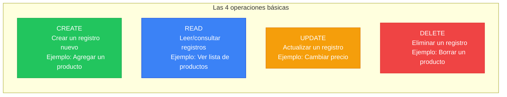

En nuestro proyecto hay **7 CRUDs simples** (producto, persona, empresa, cliente, vendedor, rol, ruta). Todos funcionan igual: una tabla con datos, un formulario para crear/editar, un botón para eliminar.

#### Qué es un stored procedure (y por qué facturas lo necesita)

**Analogía:** Imagina que en un restaurante, en vez de pedirle al mesero "traeme pan, luego mantequilla, luego un cuchillo", le dices "traeme el combo desayuno". El combo es un **procedimiento almacenado**: una instruccion qué ejecuta varios pasos en la base de datos como una sola operación.

**Por qué facturas lo necesita:** Crear una factura implica:

1. Insertar la factura (número, cliente, vendedor)
2. Insertar cada producto de la factura (producto, cantidad)
3. Calcular subtotales por producto
4. Descontar stock de cada producto
5. Calcular el total de la factura

Si alguno de estos pasos falla (por ejemplo, no hay stock suficiente), **todos** deben revertirse. Esto se llama **transacción** y los stored procedures lo manejan automáticamente.

#### Qué es el patrón maestro-detalle

**Analogía:** Piensa en una factura de papel. La factura tiene un encabezado (número, fecha, cliente) y abajo una tabla con los productos comprados. El encabezado es el **maestro** y cada fila de productos es un **detalle**. No existe una factura sin productos, ni productos de factura sin factura.

```
┌────────────────────────────────────────┐
│  FACTURA #1 (MAESTRO)                  │
│  Fecha: 2025-12-03                     │
│  Cliente: Ana Torres                   │
│  Vendedor: Carlos Pérez               │
├────────────────────────────────────────┤
│  Producto          Cant.   Subtotal    │
│  ──────────────────────────────────    │
│  Laptop Lenovo     × 2    $5,000,000  │  ← DETALLE 1
│  Mouse HP          × 3    $  270,000  │  ← DETALLE 2
├────────────────────────────────────────┤
│  TOTAL:                   $5,270,000  │  ← Calculado por trigger
└────────────────────────────────────────┘
```

**Por qué no funciona con un CRUD genérico:** El CRUD genérico opera sobre **una tabla a la vez**. Pero crear una factura necesita insertar en **dos tablas** (`factura` + `productosporfactura`) dentro de una **transacción**. Si insertas la factura pero falla un producto, la factura queda huérfana. Por eso se usan stored procedures.

**La interfaz gráfica integra todo:** El formulario de crear factura no es un formulario simple con campos fijos. Tiene:
- Dropdown de clientes (datos de la API)
- Dropdown de vendedores (datos de la API)
- Una sección dinámica para agregar N productos con su cantidad
- Un botón "Guardar" que empaqueta todo en un JSON y llama al SP

> **Para más detalle:** Consulta la sección "Maestro-Detalle" y "Transacción" en el [Glosario de Conceptos (03)](03_Glosario_Conceptos.md#maestro-detalle), donde está el diagrama completo del flujo frontend → API → SP → BD con transacción.

#### Qué es una transacción (y por qué es crítica para facturas)

**Analogía:** Es como una transferencia bancaria. Si transfieres $100 de cuenta A a cuenta B, los pasos son: 1) restar $100 de A, 2) sumar $100 a B. Si el paso 2 falla, el paso 1 se revierte — los $100 vuelven a la cuenta A.

**En facturas:** Si al insertar el tercer producto de una factura el stock es insuficiente, la transacción revierte TODO: la factura, los dos productos anteriores y los descuentos de stock. Como si nada hubiera pasado.

**Sin transacción = datos inconsistentes:** Facturas sin productos, stock descontado pero sin factura, totales que no cuadran.

**Con transacción = datos siempre consistentes:** Todo se guarda o nada se guarda.

> **Dato importante:** PostgreSQL es transaccional por naturaleza — toda operación está dentro de una transacción implícita. Si algo falla, nada se guarda automáticamente. En SQL Server y MySQL/MariaDB hay que usar `BEGIN TRANSACTION / COMMIT / ROLLBACK` explícitamente (que es lo que hacen nuestros stored procedures).

#### Qué es un flujo de usuario

Es la secuencia de pasos qué sigue un usuario para completar una tarea. Ejemplo del login:

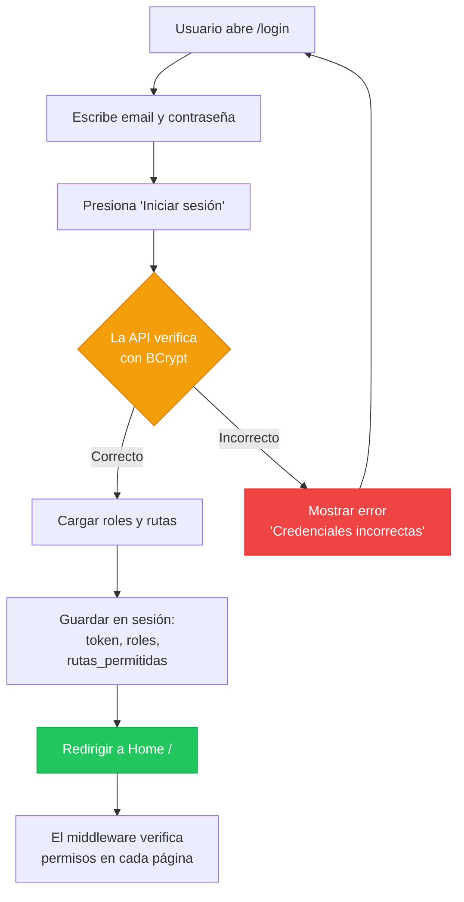

#### Qué es un criterio de aceptación

Es la respuestá a la pregunta: **"Como se qué esto está terminado y funciona?"**

| Funcionalidad | Criterio de aceptación |
|---------------|----------------------|
| Login | Al ingresar email y contraseña correctos, se redirige al home con mensaje de bienvenida |
| Crear producto | Al llenar el formulario y presionar guardar, el producto aparece en la lista |
| Eliminar factura | Al confirmar la eliminación, la factura desaparece y el stock de los productos se restaura |

### Ejecutar el comando

```
/speckit-specify

El proyecto FrontFlaskSDD es un frontend Flask qué consume la API REST genérica ApiGenericaCsharp.
Repositorio de la API: https://github.com/ccastro2050/ApiGenericaCsharp

FUNCIONALIDADES DEL SISTEMA:

1. AUTENTICACIÓN Y SEGURIDAD
   - Login con email y contraseña (POST a /api/autenticación/token)
   - La API valida credenciales con BCrypt y retorna JWT
   - Almacenar token JWT en session de Flask
   - Logout (limpiar sesión)
   - Cambiar contraseña (verificar actual, validar nueva, encriptar con BCrypt vía API)
   - Recuperar contraseña olvidada (generar temporal, enviar por SMTP Gmail, forzar cambio al login)
   - Validación de contraseña: mínimo 6 caracteres, 1 mayúscula, 1 número, no trivial

2. CONTROL DE ACCESO RBAC
   - Al hacer login, consultar roles del usuario (tabla rol_usuario → rol)
   - Al hacer login, consultar rutas permitidas por rol (tabla rutarol → ruta)
   - Middleware @app.before_request verifica en cada request:
     a) Si es ruta pública (/login, /static) → dejar pasar
     b) Si no hay sesión → redirigir a /login
     c) Si debe cambiar contraseña → redirigir a /cambiar-contraseña
     d) Si la ruta no está en rutas_permitidas → mostrar página 403
   - Menú de navegación dinámico: solo muestra las rutas permitidas para el usuario
   - La consulta de roles y rutas se hace con UNA sola consulta SQL vía ConsultasController
     (JOIN de 5 tablas: usuario → rol_usuario → rol → rutarol → ruta)
   - Fallback: si ConsultasController falla, usar 5 GETs separados al CRUD genérico

3. CRUDS SIMPLES (7 módulos)
   Cada módulo tiene: listado con tabla, formulario crear, formulario editar, eliminar con confirmación.
   Todos usan el ApiService genérico (mismos 4 métodos: listar, crear, actualizar, eliminar).
   - Producto: código (PK), nombre, stock, valorunitario
   - Persona: código (PK), nombre, email, telefono
   - Empresa: código (PK), nombre
   - Cliente: id (PK auto), credito, fkcodpersona (FK→persona), fkcodempresa (FK→empresa)
   - Vendedor: id (PK auto), carnet, dirección, fkcodpersona (FK→persona)
   - Rol: id (PK auto), nombre
   - Ruta: id (PK auto), ruta, descripción

4. GESTIÓN DE USUARIOS CON ROLES (vía Stored Procedures)
   - Listar usuarios con sus roles (SP: listar_usuarios_con_roles)
   - Crear usuario con roles (SP: crear_usuario_con_roles) - contraseña se encripta con BCrypt
   - Actualizar usuario con roles (SP: actualizar_usuario_con_roles)
   - Eliminar usuario con roles (SP: eliminar_usuario_con_roles)
   - Consultar un usuario con roles (SP: consultar_usuario_con_roles)
   - Actualizar solo roles sin tocar contraseña (SP: actualizar_roles_usuario)

5. GESTIÓN DE PERMISOS RBAC (vía Stored Procedures)
   - Listar permisos ruta-rol (SP: listar_rutarol)
   - Crear permiso ruta-rol (SP: crear_rutarol)
   - Eliminar permiso ruta-rol (SP: eliminar_rutarol)
   - Verificar acceso de usuario a ruta (SP: verificar_acceso_ruta)

6. FACTURAS MAESTRO-DETALLE (vía Stored Procedures)
   - Listar todas las facturas con productos, cliente y vendedor (SP: sp_listar_facturas_y_productosporfactura)
   - Consultar una factura con detalle (SP: sp_consultar_factura_y_productosporfactura)
   - Crear factura: seleccionar cliente, vendedor, agregar N productos con cantidad (SP: sp_insertar_factura_y_productosporfactura)
   - Actualizar factura: cambiar cliente/vendedor, reemplazar productos (SP: sp_actualizar_factura_y_productosporfactura)
   - Anular factura — borrado lógico (SP: sp_anular_factura) - cambia estado a 'anulada' y restaura stock
   - Eliminar factura — borrado físico, solo admin (SP: sp_borrar_factura_y_productosporfactura)
   - Los triggers de la BD calculan subtotales, totales y ajustan stock automáticamente

7. LAYOUT Y NAVEGACIÓN
   - Template base (base.html) con Bootstrap 5 sidebar layout
   - Barra superior con nombre de usuario y botón logout
   - Menú lateral (nav_menu.html) con links condicionales según rutas_permitidas
   - Sistema de mensajes flash (alertas Bootstrap dismissible)
   - CSS personalizado en static/css/app.css

FLUJOS DE USUARIO CRÍTICOS:
- Login → cargar roles/rutas → redirigir a home
- Crear factura → seleccionar cliente y vendedor → agregar productos → enviar SP
- Recuperar contraseña → generar temporal → enviar email SMTP → forzar cambio al login
- Navegación RBAC → middleware verifica permisos → mostrar/ocultar menú según rol
```

### Despues de ejecutar: como revisar el resultado

La IA generara un archivo `spec.md`. Este es el documento más importante del proyecto — es el "contrato" de lo que se va a construir.

#### Cómo leer spec.md sección por sección

| Sección del spec.md | Que buscar | Pregunta clave |
|---------------------|-----------|----------------|
| Descripción del proyecto | Resumen general | Alguien que no conoce el proyecto, lo entendería con está descripción? |
| Requisitos funcionales | Lista numerada (RF-001, RF-002...) | Cada funcionalidad qué pedimos en el prompt tiene un requisito? |
| Requisitos no funcionales | Rendimiento, seguridad, usabilidad | Se menciona JWT, BCrypt, RBAC? |
| Flujos de usuario | Secuencias paso a paso | El flujo de login está completo? El de factura? |
| Criterios de aceptación | Condiciones de "terminado" | Cada requisito tiene al menos 1 criterio de aceptación? |

#### Checklist de revisión

- [ ] Hay al menos 7 requisitos para los CRUDs simples?
- [ ] Hay requisitos para los 15 stored procedures?
- [ ] El flujo de login incluye: verificar BCrypt, cargar roles, cargar rutas, guardar en sesión?
- [ ] El flujo de factura incluye: seleccionar cliente, vendedor, agregar N productos, enviar SP?
- [ ] Se menciona el middleware RBAC?
- [ ] Se menciona el menú dinámico?
- [ ] Se menciona la recuperación de contraseña por email SMTP?

#### Ejercicio practico

Busca algo qué falte en el spec.md. Ejemplo:

- "No menciona que el formulario de crear producto debe validar que el stock sea un número positivo"
- "No dice que pasa si el usuario intenta crear una factura sin productos"

Agrega esos requisitos faltantes al spec.md manualmente. **Esto es lo que hace un analista de requisitos en la vida real.**

#### Si el resultado no cumple tus expectativas

| Problema | Opcion | Que hacer |
|----------|--------|-----------|
| Faltan requisitos completos (ej: no menciono facturas) | **B** (re-ejecutar) | Mejorar el prompt agregando las funcionalidades faltantes con más detalle |
| Los requisitos son vagos (ej: "gestionar productos") | **A** (editar) | Reemplazar en spec.md por requisitos específicos: "listar en tabla, crear con formulario, editar, eliminar con confirmación" |
| La IA invento funcionalidades que no pediste | **A** (editar) | Eliminar los requisitos inventados directamente del spec.md |
| Los flujos de usuario están incompletos | **A** (editar) o **B** (ejecutar `/clarify`) | Agregar pasos faltantes manualmente o ejecutar `/clarify` para que la IA pregunte |

### Competencia adquirida

> **Despues de completar está fase, ya sabes:**
> Escribir requisitos de software formales. Sabes la diferencia entre requisito funcional y no funcional. Sabes que es un CRUD, un stored procedure y un flujo de usuario. Esto es lo que hace un **analista de requisitos** o **product owner**.

---

## 5. FASE 2: /clarify — Las preguntas que no te hiciste

### Antes de ejecutar: conceptos qué necesitas entender

#### Qué es ambigüedad en requisitos

**Analogía:** Si alguien te dice "hazme una torta grande", eso es ambiguo:
- Grande para cuantas personas? 10? 50?
- De qué sabor? Chocolate? Vainilla?
- Con decoracion o sin ella?

En software pasa lo mismo. Si el requisito dice "el usuario puede recuperar su contraseña", queda la duda:
- Se envía un link por email o una contraseña temporal?
- El link expira? En cuanto tiempo?
- Cuantos intentos puede hacer por hora?

**La ambigüedad es cara.** Si no la resuelves ahora, la resolveras después con retrabajos, bugs y tiempo perdido.

#### Por que las preguntas son más valiosas que las respuestas

> *"Un problema bien definido es un problema medio resuelto."*

La fase `/clarify` no es un paso burocratico — es donde se evitan los errores más costosos. Un programador experimentado pasa más tiempo preguntando qué codificando.

### Ejecutar el comando

```
/speckit-clarify
```

La IA leera tu `spec.md` y generara entre 3 y 5 preguntas sobre puntos ambiguos.

### Despues de ejecutar: cómo responder las preguntas

**Regla de oro:** No respondas "si" o "no" a todo. Responde con contexto y razon.

| Forma incorrecta | Forma correcta |
|-------------------|----------------|
| "Si" | "Si, la encriptacion la hace la API C# vía el parámetro `?camposEncriptar=contraseña` en el query string. El frontend NUNCA maneja hashes directamente." |
| "No se" | "No estoy seguro. En el proyecto existente se cachea en sesión al login. Prefiero mantener ese enfoque para no hacer consultas en cada request." |

#### Preguntas que la IA probablemente hará (y cómo responder)

| Pregunta probable | Tu respuestá |
|-------------------|-------------|
| *"La encriptacion BCrypt se hace en el frontend o en la API?"* | En la API C#. El frontend envía la contraseña en texto plano por HTTPS, la API la encripta con BCrypt vía `?camposEncriptar=contraseña`. |
| *"El menú de navegación se genera en cada request?"* | No. Se cachea en la sesión de Flask al login. `session["rutas_permitidas"]` se carga una vez y el `context_processor` lo inyecta en todas las templates. |
| *"Como se agregan los N productos al formulario de factura?"* | Con campos HTML `prod_código[]` y `prod_cantidad[]`. Flask los recoge con `request.form.getlist()`. Se construye un JSON array y se pasa al SP como `p_productos`. |
| *"La recuperación de contraseña usa link o contraseña temporal?"* | Contrasena temporal. Se genera un string aleatorio de 8 caracteres, se guarda encriptada en la BD, se envía por SMTP Gmail, y se fuerza el cambio al siguiente login. |
| *"El descubrimiento de PKs y FKs es dinámico?"* | Si. AuthService consulta `GET /api/estructuras/{tabla}/modelo` para descubrir PKs y FKs. Los resultados se cachean en `_fk_cache` en memoria. |

### Ejercicio practico

Piensa en 3 preguntas que la IA **no hizo** pero debería haber hecho. Ejemplo:

1. "Que pasa si el usuario intenta acceder a una ruta que no existe (404)?"
2. "Cuanto tiempo dura la sesión de Flask antes de expirar?"
3. "Que pasa si la API no está corriendo cuando el frontend intenta conectarse?"

Respondelas tu mismo y agrega las respuestas al `spec.md`.

#### Si el resultado no cumple tus expectativas

| Problema | Opcion | Que hacer |
|----------|--------|-----------|
| La IA hizo preguntas irrelevantes o demasíado obvias | **A** (editar) | Ignorar esas preguntas. Agregar tus propias preguntas y respuestas al spec.md |
| La IA no pregunto sobre aspectos críticos (seguridad, rendimiento) | **A** (editar) | Agregar las preguntas y respuestas qué faltan directamente al spec.md |
| Las respuestas que la IA integro al spec.md son incorrectas | **A** (editar) | Corregir las respuestas en el spec.md. Tu conoces tu proyecto mejor que la IA |

### Competencia adquirida

> **Despues de completar está fase, ya sabes:**
> Identificar puntos ambiguos en un documento de requisitos y resolverlos con preguntas específicas. Sabes que las preguntas correctas previenen bugs y retrabajos. Esto es lo que hace un **analista senior** o un **tech lead** en las reuniones de refinamiento.

---

## 6. FASE 3: /plan — El plano de la casa

### Antes de ejecutar: conceptos qué necesitas entender

#### Qué es una arquitectura de carpetas

**Analogía:** En una oficina, los documentos no se guardan todos en un solo cajon. Hay carpetas para "Finanzas", "Recursos Humanos", "Ventas". Cada carpeta tiene subcarpetas. Si alguien nuevo llega, sabe donde buscar.

En software es igual:

```
mi-proyecto/
├── routes/          <- Las "páginas" del sitio (producto, cliente, factura)
├── services/        <- La lógica de negocio (conectarse a la API, autenticar)
├── templates/       <- Los archivos HTML qué ve el usuario
├── static/          <- Imagenes, CSS, JavaScript
└── middleware/      <- Código que se ejecuta ANTES de cada página
```

**Por qué importa:** Si un proyecto no tiene buena estructura de carpetas, se vuelve un caos cuando crece. No sabes donde está cada cosa.

#### Qué es una API REST

**Analogía:** Imagina un restaurante. Tu (el cliente/frontend) no entras a la cocina. Le dices al mesero (la API) lo que quieres y el te trae la comida (los datos).

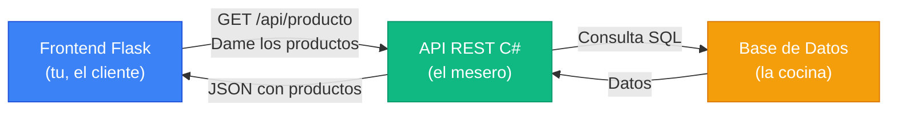

Los 4 "pedidos" que puedes hacer:

| Metodo HTTP | Analogía restaurante | Que hace |
|-------------|---------------------|----------|
| **GET** | "Traeme el menu" | Leer/consultar datos |
| **POST** | "Quiero ordenar un plato nuevo" | Crear un registro |
| **PUT** | "Cambiale la salsa a mi plato" | Actualizar un registro |
| **DELETE** | "Ya no quiero ese plato, retiremelo" | Eliminar un registro |

#### Qué es un middleware

**Analogía:** Es el guardia de seguridad en la puerta de un edificio. Antes de qué entres a cuálquier oficina (página), el guardia verifica:

1. Tienes credencial? (sesión activa)
2. Tienes permiso para está oficina? (ruta permitida)
3. Si no tienes credencial, te manda a recepcion (login)
4. Si no tienes permiso, te dice "acceso denegado" (página 403)

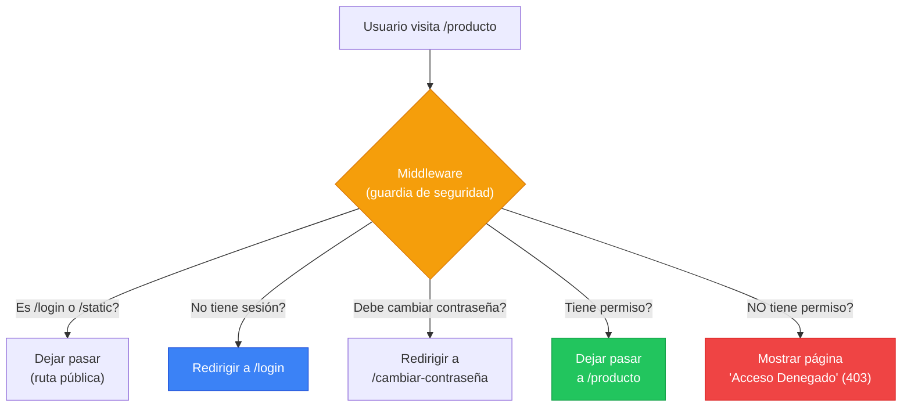

#### Qué es un template engine (Jinja2)

**Analogía:** Imagina una carta modelo con espacios en blanco:

```
Estimado __________, su pedido #________ por $________ está listo.
```

Jinja2 funciona igual, pero con HTML:

```html
<h1>Bienvenido, {{ nombre_usuario }}</h1>
<p>Tienes {{ roles|length }} roles asígnados.</p>


    <a href="/producto">Ver productos</a>

```

| Sintaxis Jinja2 | Que hace |
|-----------------|---------|
| `{{ variable }}` | Muestra el valor de una variable |
| `` | Condicional (mostrar u ocultar algo) |
| `` | Repetir un bloque para cada elemento |
| `` | Incluir otro archivo HTML dentro de este |
| `` | Definir una sección que las páginas hijas pueden llenar |

### Ejecutar el comando

```
/speckit-plan
```

(No necesita prompt adicional — lee `constitution.md` y `spec.md` automáticamente)

### Despues de ejecutar: como revisar el resultado

#### Checklist de revisión

- [ ] **Arquitectura de carpetas:** El plan define donde va cada archivo?
- [ ] **Componentes:** Lista todos los archivos Python (app.py, routes/*.py, services/*.py)?
- [ ] **Dependencias:** Menciona Flask, requests, pytest en un requirements.txt?
- [ ] **ApiService:** Define los métodos listar, crear, actualizar, eliminar, ejecutar_sp?
- [ ] **AuthService:** Define login, obtener_roles, obtener_rutas, cambiar_contraseña?
- [ ] **Middleware:** Define before_request y context_processor?
- [ ] **Templates:** Define base.html, nav_menu.html y las 14 páginas?
- [ ] **Respeta constitution:** No sugiere Django, React, ORM ni nada prohibido?

#### Ejercicio practico

Dibuja en un papel (si, papel físico) la arquitectura del plan:
- Cajas para cada componente (ApiService, AuthService, Middleware, Blueprints)
- Flechas mostrando quien llama a quien
- Colores para diferenciar frontend, servicios, API

Comparalo con el diagrama del plan.md. Son iguales? Falta algo?

#### Si el resultado no cumple tus expectativas

| Problema | Opcion | Que hacer |
|----------|--------|-----------|
| La estructura de carpetas no es la qué quieres | **A** (editar) | Corregir plan.md con tu estructura. El plan es TU diseño |
| Sugiere librerías prohibidas (ej: SQLAlchemy, React) | **C** (ambos) | Verificar que la constitution lo prohibe. Editar plan.md y re-ejecutar reforzando: "Respetar estrictamente la constitution" |
| Los componentes están listados pero sin detalle | **B** (re-ejecutar) | Agregar al prompt: "Detallar los métodos de cada servicio y los endpoints qué consume" |
| La arquitectura no coincide con la spec | **B** (re-ejecutar) | Algo se perdio entre spec y plan. Re-ejecutar `/plan` verificando qué spec.md está completo |

### Competencia adquirida

> **Despues de completar está fase, ya sabes:**
> Leer un plan técnico de implementación. Entiendes qué es una API REST, un middleware, un template engine y una arquitectura de carpetas. Sabes cómo se organizan los componentes de un proyecto web. Esto es lo que hace un **desarrollador full-stack** cuando planifica una feature.

---

## 7. FASE 4: /tasks — La lista de trabajo

### Antes de ejecutar: conceptos qué necesitas entender

#### Qué es una dependencia entre tareas

**Analogía:** No puedes pintar una pared que no existe. Primero construyes la pared, luego la pintas.

En software:
- No puedes crear el Blueprint de producto si no existe el ApiService (porque el Blueprint lo usa)
- No puedes crear el middleware si no existe el AuthService (porque el middleware llama al auth)
- No puedes crear el login si no existe el middleware (porque el login necesita rutas públicas)

#### Qué es una tarea aislada

Una buena tarea tiene estás caracteristicas:

| Caracteristica | Ejemplo bueno | Ejemplo malo |
|----------------|--------------|-------------|
| **Especifica** | "Crear api_service.py con método listar()" | "Hacer el servicio" |
| **Aislada** | "Crear Blueprint de producto" | "Crear todos los CRUDs" |
| **Testeable** | "Verificar qué listar('producto') retorna una lista" | "Verificar qué funciona" |
| **Pequena** | 30-60 minutos de trabajo | 2 dias de trabajo |

#### Qué es paralelizable

Dos tareas son paralelizables cuando **no dependen una de la otra**. Se pueden hacer al mismo tiempo (o en cuálquier orden):

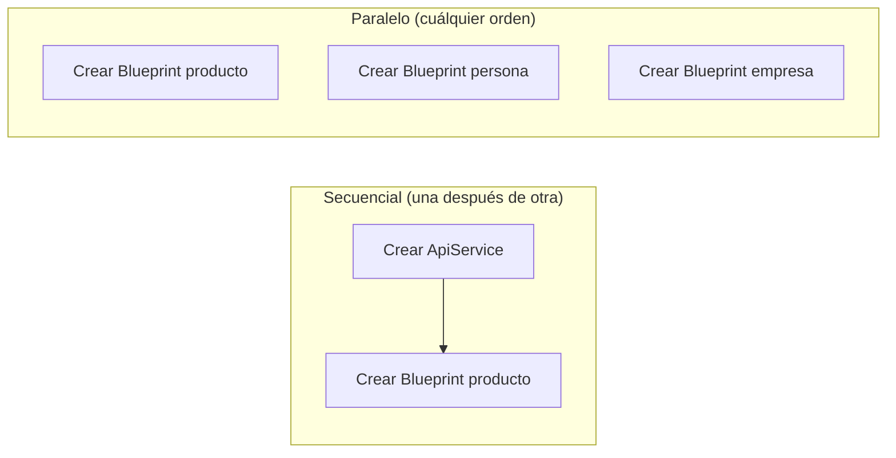

Los 7 CRUDs simples son paralelizables entre si (todos usan ApiService pero no dependen entre si).

### Ejecutar el comando

```
/speckit-tasks
```

(No necesita prompt adicional — lee `spec.md` y `plan.md`)

### Despues de ejecutar: como revisar el resultado

#### Cómo leer tasks.md

Cada tarea debe tener:

```markdown
- [ ] Task N: Titulo descriptivo
  - Depende de: Task X, Task Y
  - Archivo(s): ruta/al/archivo.py
  - Criterio: Cómo saber qué está terminada
```

#### Verificar el orden lógico

Preguntate para cada tarea: "Puedo hacer está tarea si las anteriores no están hechas?" Si la respuestá es "no", entonces la dependencia está correcta.

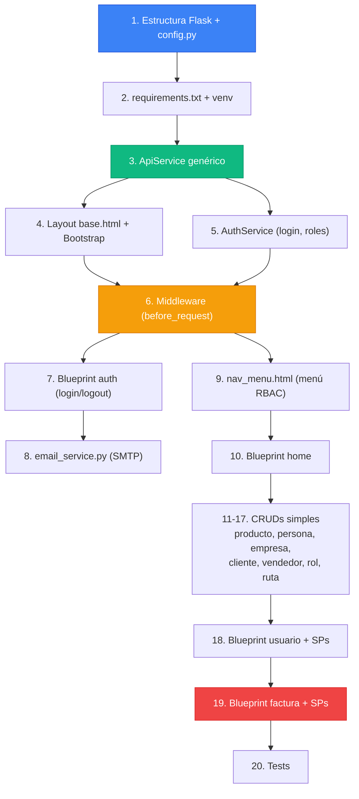

#### Ejercicio practico

Busca un error de dependencia en las tareas generadas. Ejemplo:
- Si la Task 7 (Blueprint auth) aparece antes de la Task 6 (Middleware), eso es un error — el login necesita qué existan las rutas públicas definidas en el middleware.

Corrige el orden en tasks.md.

#### Si el resultado no cumple tus expectativas

| Problema | Opcion | Que hacer |
|----------|--------|-----------|
| El orden de dependencias es incorrecto | **A** (editar) | Reordenar manualmente en tasks.md. Tu conoces las dependencias mejor que la IA |
| Hay tareas demasíado grandes (ej: "Crear todos los CRUDs") | **A** (editar) | Descomponer en tasks.md: una tarea por Blueprint |
| Faltan tareas para requisitos de la spec | **B** (ejecutar `/analyze`) | El comando `/analyze` detecta gaps automáticamente. Luego agrega las tareas faltantes |
| Las tareas no tienen criterios de completitud | **A** (editar) | Agregar a cada tarea una línea "Criterio: cómo saber qué está terminada" |

### Competencia adquirida

> **Despues de completar está fase, ya sabes:**
> Descomponer un proyecto en tareas manejables, ordenarlas por dependencia e identificar cuáles se pueden hacer en paralelo. Esto es lo que hace un **scrum master** o **tech lead** al planificar un sprint.

---

## 8. FASE 5: /analyze — La auditoría

### Antes de ejecutar: conceptos qué necesitas entender

#### Qué es consistencia entre documentos

Imagina que tu constitution dice "usar Flask" pero tu plan dice "instalar Django". Eso es una **inconsistencia**. El analyze busca este tipo de problemas entre los 4 documentos:

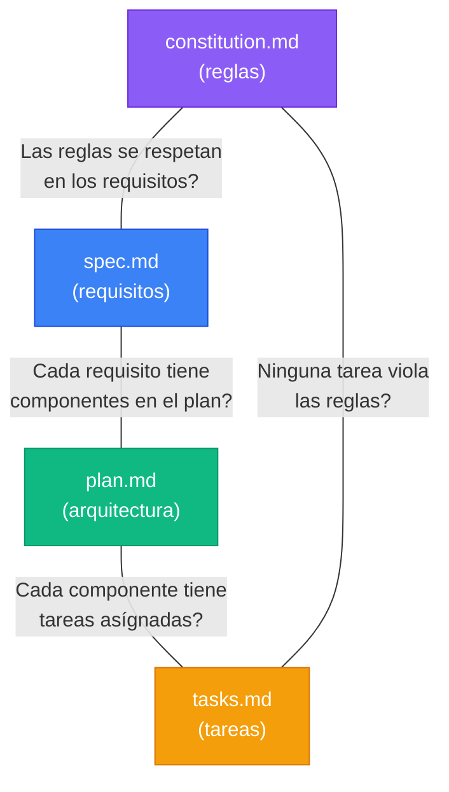

#### Qué es un gap

Un **gap** es algo qué falta. Ejemplos:

| Gap | Problema |
|-----|----------|
| Requisito sin tarea | La spec pide "recuperar contraseña" pero no hay tarea para implementarla |
| Tarea sin requisito | Hay una tarea "Crear módulo de reportes" pero la spec nunca pidió reportes |
| Componente sin plan | El plan menciona email_service.py pero no dice que métodos debe tener |

### Ejecutar el comando

```
/speckit-analyze
```

### Despues de ejecutar: cómo interpretar el reporte

El reporte mostrará:
- **Gaps:** requisitos sin tareas, tareas sin requisitos
- **Contradicciones:** reglas violadas, inconsistencias entre documentos
- **Sugerencias:** mejoras o puntos a clarificar

**Accion:** Corrige cada gap y contradiccion directamente en los archivos correspondientes. Luego re-ejecuta `/analyze` hasta que no haya errores.

#### Si el resultado no cumple tus expectativas

| Problema | Opcion | Que hacer |
|----------|--------|-----------|
| El analyze no detecto gaps que tu si ves | **A** (editar) | Corregir los archivos (spec, plan, tasks) manualmente con los gaps qué encontraste |
| El analyze reporta demasiados falsos positivos | **A** (ignorar) | Evaluar cada reporte con criterio. No todo lo que la IA marca como gap es realmente un problema |
| Despues de corregir, el analyze sigue reportando errores | **B** (re-ejecutar) | Puede ser que los archivos quedaron inconsistentes al editar. Re-ejecutar la fase anterior (ej: `/tasks`) para regenerar |

### Competencia adquirida

> **Despues de completar está fase, ya sabes:**
> Auditar documentación técnica y encontrar inconsistencias. Sabes que un proyecto profesional requiere qué sus documentos "cuadren" entre si. Esto es lo que hace un **QA analyst** o un **auditor técnico**.

---

## 9. FASE 6: /checklist — La lista del inspector

### Antes de ejecutar: conceptos qué necesitas entender

#### Qué es un test de aceptación

| Tipo de test | Quien lo hace | Que verifica | Ejemplo |
|-------------|---------------|-------------|---------|
| **Test unitario** | El programador | Que una función individual funciona | `listar("producto")` retorna una lista |
| **Test de integración** | El programador | Que dos componentes funcionan juntos | El Blueprint de producto puede llamar al ApiService |
| **Test de aceptación** | El usuario/cliente | Que la funcionalidad cumple lo que se pidió | "Puedo crear una factura con 3 productos y el total se calcula correctamente" |

La checklist es la versión escrita de los tests de aceptación — lo que el "cliente" verificaría.

#### Qué es "Definition of Done"

Es la respuestá a: **"Cuando podemos decir qué está tarea está TERMINADA?"**

No es solo "el código compila". Es:
- El código funciona en el navegador
- Pasa los criterios de la checklist
- Respeta la constitution
- Esta documentado

### Ejecutar el comando

```
/speckit-checklist
```

### Despues de ejecutar: revisar criterios

Ejemplo de lo que debe generar:

```markdown
## Autenticacion
- [ ] Al ingresar email y contraseña correctos, redirige a home con flash "Bienvenido"
- [ ] Al ingresar credenciales incorrectas, muestra flash "Error de autenticación" en rojo
- [ ] Al cerrar sesión, redirige a /login y no puede acceder a páginas protegidas
- [ ] La contraseña se valida: minimo 6 chars, 1 mayuscula, 1 número

## CRUD Producto
- [ ] La tabla muestra código, nombre, stock, valorunitario de todos los productos
- [ ] Al crear un producto, aparece en la lista con flash "success"
- [ ] Al editar un producto, los cambios se reflejan en la tabla
- [ ] Al eliminar un producto, desaparece de la lista con confirmación previa

## Factura
- [ ] Se puede seleccionar cliente y vendedor de dropdowns
- [ ] Se pueden agregar N productos con cantidad al formulario
- [ ] Al crear, el SP calcula subtotales, total y descuenta stock
- [ ] Al eliminar, el stock de los productos se restaura
```

#### Ejercicio practico

Marca cuáles criterios ya se cumplen en el proyecto existente (FrontFlaskTutorial). Esto te da una idea de cuanto trabajo hay vs cuanto está hecho.

#### Si el resultado no cumple tus expectativas

| Problema | Opcion | Que hacer |
|----------|--------|-----------|
| Los criterios son demasíado genéricos (ej: "el login funciona") | **A** (editar) | Reemplazar por criterios específicos: "Al ingresar email y contraseña correctos, redirige a home con flash 'Bienvenido'" |
| Faltan criterios para módulos completos | **A** (editar) | Agregar los criterios manualmente. Tu sabes que debe hacer cada módulo |
| La checklist repite criterios de la spec sin agregar valor | **B** (re-ejecutar) | Re-ejecutar pidiendo: "Generar criterios de aceptación VERIFICABLES, no repetir la spec" |

### Competencia adquirida

> **Despues de completar está fase, ya sabes:**
> Definir criterios de calidad medibles para cada funcionalidad. Sabes la diferencia entre un test unitario, de integración y de aceptación. Esto es lo que hace un **QA lead** al definir los criterios de entrega.

---

## 10. FASE 7: /implement — Manos a la obra

### Antes de ejecutar: conceptos qué necesitas entender

> **Nota:** El entorno virtual (venv) y las dependencias (flask, requests, pytest) ya los creaste en la Sección 2. Si no lo hiciste, regresa a la sección "Crear el entorno virtual de Python" y completala antes de continuar.

Verifica que tu venv está activo antes de empezar:

```bash
# Debes ver (venv) al inicio de tu terminal. Si no:
# Windows: venv\Scripts\activate
# Mac/Linux: source venv/bin/activate
```

#### Qué es Flask y como arranca

```python
# app.py — esto es TODO lo que necesitas para arrancar
from flask import Flask
app = Flask(__name__)

@app.route("/")           # Cuando el usuario visite "/"
def home():
    return "Hola mundo"   # Mostrar este texto

if __name__ == '__main__':
    app.run(port=5300)    # Arrancar en http://localhost:5300
```

#### Qué es un Blueprint

**Analogía:** Un Blueprint es un "módulo enchufable". Como un bloque de LEGO que puedes agregar o quitar sin afectar al resto.

```python
# routes/producto.py — Blueprint independiente
from flask import Blueprint, render_template
from services.api_service import ApiService

bp = Blueprint('producto', __name__)   # Crear el bloque
api = ApiService()

@bp.route('/producto')                  # Ruta de este bloque
def index():
    productos = api.listar('producto')  # Llamar a la API
    return render_template('pages/producto.html', registros=productos)
```

```python
# app.py — enchufar el bloque
from routes.producto import bp as producto_bp
app.register_blueprint(producto_bp)     # Listo, /producto funciona
```

#### Qué es Bootstrap

**Analogía:** Es un "kit de CSS listo para usar". En vez de escribir 200 líneas de CSS para que un botón se vea bonito, escribes:

```html
<!-- Sin Bootstrap (tienes qué escribir el CSS tu mismo) -->
<button style="background:blue; color:white; padding:10px; border-radius:5px; border:none; cursor:pointer;">
    Guardar
</button>

<!-- Con Bootstrap (una clase CSS y listo) -->
<button class="btn btn-primary">Guardar</button>
```

### Ejecutar por rondas

> **No ejecutes todo de golpe.** Divide en 4 rondas y verifica entre cada una.

#### Ronda 1: Cimientos (Tasks 1-5)

```
/speckit-implement

Ejecutar solamente las tareas 1 a 5 (estructura del proyecto, config.py, requirements.txt, ApiService genérico, layout base.html con Bootstrap).
Detenerse después de completarlas para revisión.
```

**Que se crea en está ronda:**

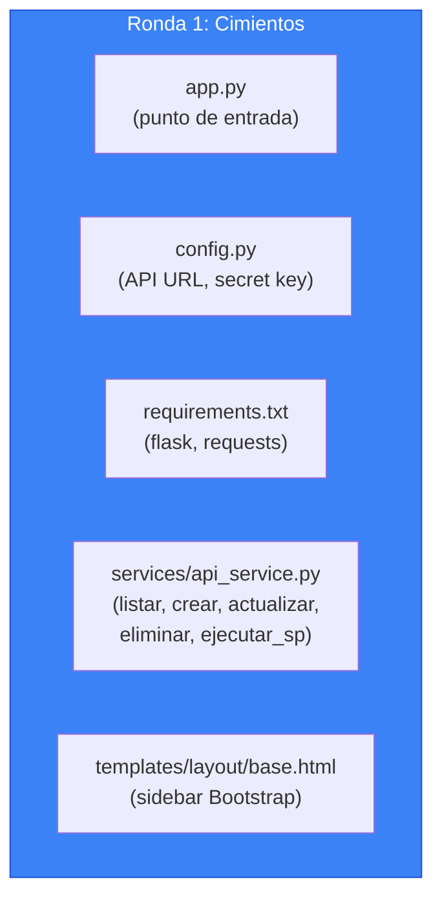

**Cómo verificar qué funciona:**

```bash
# 1. Verificar que el venv está activo (debes ver "(venv)" en tu terminal)
# Si no está activo: venv\Scripts\activate (Windows) o source venv/bin/activate (Mac/Linux)

# 2. Arrancar Flask
python app.py

# 3. Abrir navegador en http://localhost:5300
# Deberias ver la página base (aunque vacia)
```

**Prueba critica — ApiService se conecta a la API:**

Abre la terminal de Python y prueba:

```python
from services.api_service import ApiService
api = ApiService()
productos = api.listar("producto")
print(productos)
# Debe mostrar una lista de productos de la BD
```

Si muestra datos, el ApiService funciona. Si da error, la API no está corriendo o la URL en config.py es incorrecta.

---

#### Ronda 2: Seguridad (Tasks 6-11)

```
/speckit-implement

Continuar con las tareas 6 a 11 (AuthService, middleware de autenticación, Blueprint auth con login/logout/cambiar/recuperar contraseña, email_service, nav_menu.html, Blueprint home).
Detenerse después para verificar que el login funciona.
```

**Que se crea en está ronda:**

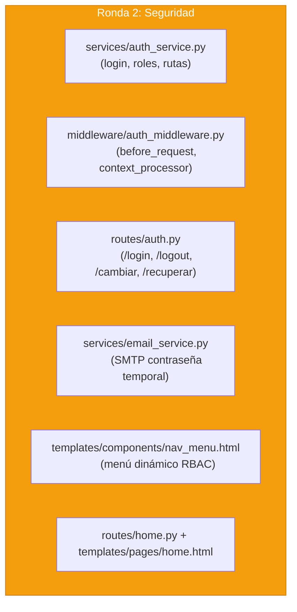

**Cómo verificar qué funciona:**

1. Abrir `http://localhost:5300` — debe redirigir a `/login`
2. Ingresar `admin@correo.com` con su contraseña — debe redirigir a home con "Bienvenido"
3. Visitar `/producto` — debe mostrar "Acceso denegado" o la página según los roles del usuario
4. Hacer logout — debe redirigir a `/login`

---

#### Ronda 3: CRUDs (Tasks 12-18)

```
/speckit-implement

Continuar con las tareas 12 a 18 (CRUDs simples: producto, persona, empresa, cliente, vendedor, rol, ruta).
Detenerse después para verificar qué todos los CRUDs funcionan.
```

**Que se crea en está ronda:**

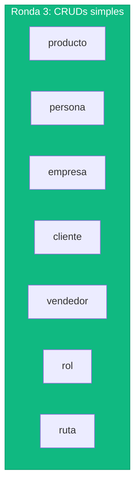

Cada uno genera 2 archivos: `routes/X.py` + `templates/pages/X.html`

**Cómo verificar qué funciona:**

Para cada CRUD (producto, persona, etc.):

1. Visitar `/producto` — debe mostrar tabla con datos
2. Clic en "Nuevo" — debe mostrar formulario vacio
3. Llenar formulario y guardar — debe aparecer en la tabla con flash verde
4. Clic en "Editar" — debe mostrar formulario con datos actuales
5. Modificar y guardar — debe reflejar cambios
6. Clic en "Eliminar" — debe pedir confirmación y eliminar

---

#### Ronda 4: Avanzado (Tasks 19-21)

```
/speckit-implement

Continuar con las tareas 19 a 21 (Blueprint usuario con gestion de roles vía stored procedures, Blueprint factura maestro-detalle vía stored procedures, tests con pytest).
```

**Que se crea en está ronda:**

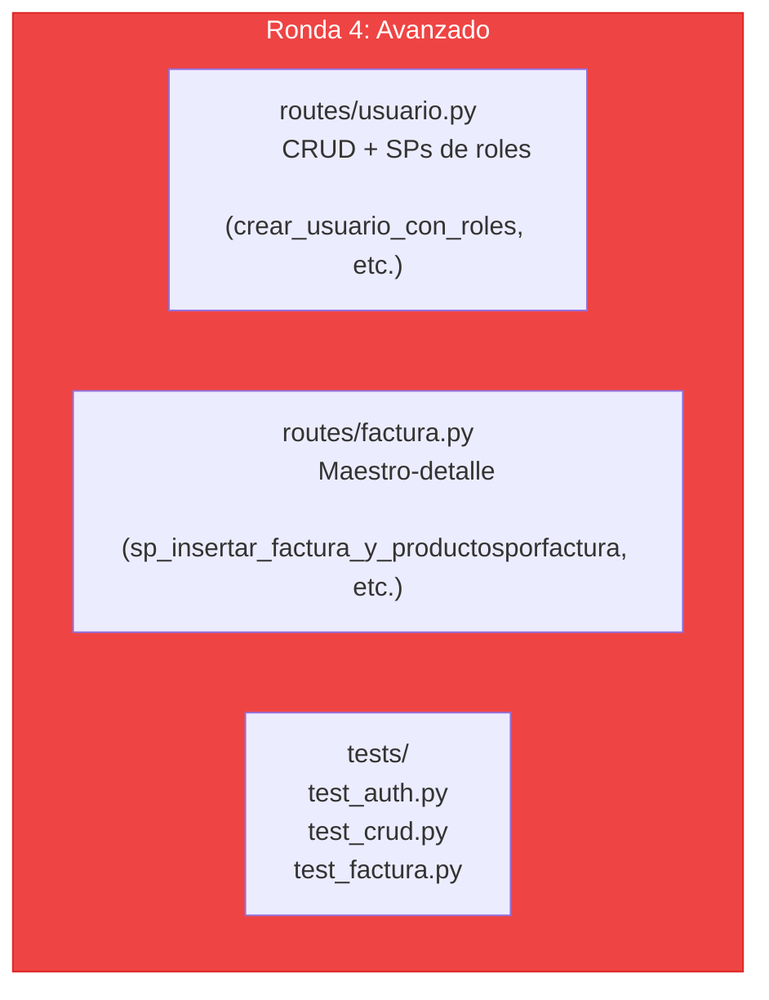

**Cómo verificar qué funciona — Factura (la prueba más completa):**

1. Ir a `/factura` — debe listar facturas existentes con totales
2. Clic en "Nueva factura"
3. Seleccionar un cliente del dropdown
4. Seleccionar un vendedor del dropdown
5. Agregar producto PR001 con cantidad 1
6. Agregar producto PR003 con cantidad 2
7. Guardar — debe crear la factura y redirigir a la lista
8. Verificar que el total se calculó correctamente (subtotales + total)
9. Verificar en `/producto` que el stock de PR001 y PR003 se descontó

#### Si el resultado no cumple tus expectativas

El código generado es donde MAS vas a necesitar corregir. Recuerda: **trata todo código de la IA como código de un junior sin revisar.**

| Problema | Opcion | Que hacer |
|----------|--------|-----------|
| El código no compila / no ejecuta | **Pedir corrección puntual** | Copiar el error exacto y decirle a la IA: "Este error ocurre al ejecutar. Corregir." No re-generar todo el código |
| El código funciona pero viola la constitution (ej: usa Django) | **B** (re-ejecutar la tarea) | Senalar la violación: "El código usa Django pero la constitution dice Flask. Regenerar está tarea" |
| El código es correcto pero demasíado complejo | **Pedir simplificación** | "Simplificar este método. Eliminar abstracciones innecesarias. KISS." |
| El código tiene bugs sutiles (seguridad, lógica) | **A** (editar tu mismo) | **Este es TU trabajo.** La IA no detecta sus propios bugs. Revisarlo línea por línea |
| Una ronda completa salio mal (todos los archivos incorrectos) | **B** (re-ejecutar la ronda) | Descartar los archivos y re-ejecutar la ronda con un prompt más específico |
| El código funciona pero no sigue el estilo educativo (sin comentarios) | **Pedir mejora** | "Agregar docstrings y comentarios explicativos en español a cada archivo generado" |

> **Importante:** En la fase de implementación, la corrección se hace **en el código**, no en la spec. Esta es la unica fase donde editas código directamente (o le pides a la IA qué lo corrija). En todas las fases anteriores, la corrección siempre se hace en los documentos (spec, plan, tasks).

### Competencia adquirida

> **Despues de completar está fase, ya sabes:**
> Construir un frontend web completo con autenticación JWT, control de acceso RBAC, CRUDs genéricos, formularios maestro-detalle con stored procedures, y recuperación de contraseña por email. Esto es lo que hace un **desarrollador full-stack junior-mid** en su día a día.

---

## 11. Mapa completo de competencias

```mermaid
graph TB
    subgraph Antes["ANTES del tutorial"]
        A1["Saber usar computador"]
        A2["Escribir en terminal"]
    end

    subgraph Fase0["FASE 0: Constitution"]
        B1["Arquitectura de software"]
        B2["Frameworks (Flask)"]
        B3["Patrones (Blueprint, Servicio, Middleware)"]
        B4["Seguridad (JWT, BCrypt, RBAC)"]
    end

    subgraph Fase1["FASE 1: Specify"]
        C1["Requisitos funcionales y no funcionales"]
        C2["CRUD y stored procedures"]
        C3["Flujos de usuario"]
        C4["Criterios de aceptación"]
    end

    subgraph Fase2["FASE 2: Clarify"]
        D1["Identificar ambigüedades"]
        D2["Hacer preguntas con criterio"]
        D3["Tomar decisiones de diseño"]
    end

    subgraph Fase3["FASE 3: Plan"]
        E1["Leer arquitectura de carpetas"]
        E2["APIs REST (GET, POST, PUT, DELETE)"]
        E3["Middleware y template engines"]
        E4["Dependencias y librerías"]
    end

    subgraph Fase4["FASE 4: Tasks"]
        F1["Descomponer trabajo"]
        F2["Ordenar por dependencias"]
        F3["Identificar paralelismo"]
    end

    subgraph Fase56["FASES 5-6: Analyze + Checklist"]
        G1["Auditar documentación"]
        G2["Encontrar gaps e inconsistencias"]
        G3["Definir criterios de calidad"]
    end

    subgraph Fase7["FASE 7: Implement"]
        H1["Configurar proyecto Flask"]
        H2["Crear servicio genérico API"]
        H3["Implementar autenticación JWT"]
        H4["Construir CRUDs completos"]
        H5["Maestro-detalle con SPs"]
        H6["Testing con pytest"]
    end

    subgraph Despues["DESPUES del tutorial"]
        I1["Desarrollador full-stack
        capaz de construir un frontend
        web profesional desde cero"]
    end

    Antes --> Fase0 --> Fase1 --> Fase2 --> Fase3 --> Fase4 --> Fase56 --> Fase7 --> Despues

    style Antes fill:#94a3b8,stroke:#64748b,color:#fff
    style Fase0 fill:#8b5cf6,stroke:#6d28d9,color:#fff
    style Fase1 fill:#3b82f6,stroke:#1d4ed8,color:#fff
    style Fase2 fill:#06b6d4,stroke:#0891b2,color:#fff
    style Fase3 fill:#10b981,stroke:#059669,color:#fff
    style Fase4 fill:#f59e0b,stroke:#d97706,color:#fff
    style Fase56 fill:#ef4444,stroke:#dc2626,color:#fff
    style Fase7 fill:#6366f1,stroke:#4f46e5,color:#fff
    style Despues fill:#22c55e,stroke:#16a34a,color:#fff
```

---

## 12. Qué hacer después

### Paso inmediato: comparar con otras IAs

Toma los prompts exactos del archivo `02_Comandos_SDD_FrontFlaskSDD.md` y ejecutalos en:

1. **GitHub Copilot** (VS Code Chat)
2. **Gemini CLI** (Terminal)
3. **Cursor** (IDE)

Usa la rubrica de comparacion de la sección 12 del archivo 02 para evaluar cada resultado.

### Paso siguiente: modificar el proyecto

Prueba agregar un módulo nuevo usando SDD. Ejemplo: "Agregar un módulo de reportes qué muestre las ventas por vendedor". Ejecuta las 7 fases para este módulo nuevo y observa como SDD te guia.

### Paso avanzado: aplicar SDD a un proyecto propio

Piensa en un proyecto qué quieras construir (una tienda online, un sistema de reservas, un blog). Ejecuta las 7 fases desde cero. El flujo es siempre el mismo:

```
constitution → specify → clarify → plan → tasks → analyze → checklist → implement
```

---

## 13. Glosario

| Termino | Definicion |
|---------|-----------|
| **API** | Application Programming Interface. Conjunto de URLs que un servidor expone para que otros programas le pidan datos o acciones |
| **BCrypt** | Algoritmo de hash para contraseñas. Convierte "miPassword123" en "$2a$12$3UgI..." de forma irreversible |
| **Blueprint** | En Flask, un módulo independiente con sus propias rutas y templates que se "enchufa" a la app principal |
| **Bootstrap** | Libreria CSS qué proporciona clases predefinidas para botónes, tablas, formularios, etc. |
| **CRUD** | Create, Read, Update, Delete. Las 4 operaciones básicas sobre datos |
| **Endpoint** | Una URL específica de una API. Ejemplo: `GET /api/producto` es un endpoint |
| **Flask** | Framework web ligero de Python para crear aplicaciónes web |
| **Foreign Key (FK)** | Columna de una tabla qué apunta a la clave primaria de otra tabla. Establece relaciones entre tablas |
| **Framework** | Conjunto de herramientas y convenciones qué fácilitan el desarrollo de software |
| **Gap** | Algo qué falta entre dos documentos. Ejemplo: un requisito sin tarea asígnada |
| **HTTP** | Protocolo de comunicación entre navegadores/clientes y servidores web |
| **Jinja2** | Motor de templates de Python. Permite meter variables y lógica dentro de archivos HTML |
| **JSON** | JavaScript Object Notation. Formato de texto para intercambiar datos: `{"nombre": "Laptop", "precio": 2500000}` |
| **JWT** | JSON Web Token. Credencial digital firmada que el servidor entrega al usuario después del login |
| **Maestro-detalle** | Patron donde un registro principal (factura) tiene N registros hijos (productos de esa factura) |
| **Middleware** | Código que se ejecuta automáticamente ANTES de cada petición HTTP |
| **ORM** | Object-Relational Mapping. Libreria qué traduce objetos Python a tablas de BD (no lo usamos) |
| **Primary Key (PK)** | Columna qué identifica de forma unica cada fila de una tabla. Ejemplo: `código` en producto |
| **RBAC** | Role-Based Access Control. Sistema de permisos basado en roles |
| **REST** | Representational State Transfer. Estilo de arquitectura para APIs web usando HTTP |
| **SDD** | Specification-Driven Development. Desarrollo guiado por especificaciónes |
| **Session** | Datos qué Flask guarda para cada usuario entre requests (en una cookie encriptada) |
| **SMTP** | Simple Mail Transfer Protocol. Protocolo para enviar correos electronicos |
| **Spec Kit** | Toolkit open-source de GitHub para aplicar SDD con agentes de IA |
| **Stored Procedure (SP)** | Programa guardado en la base de datos qué ejecuta multiples operaciones SQL como una sola |
| **Template** | Archivo HTML con espacios para variables que se llenan dinámicamente |
| **Transacción** | Grupo de operaciones en BD que se ejecutan todas o ninguna (todo o nada) |
| **Trigger** | Programa en la BD que se ejecuta automáticamente cuando se inserta, actualiza o elimina un registro |
| **venv** | Virtual environment. Entorno aislado de Python donde cada proyecto tiene sus propias librerías |
