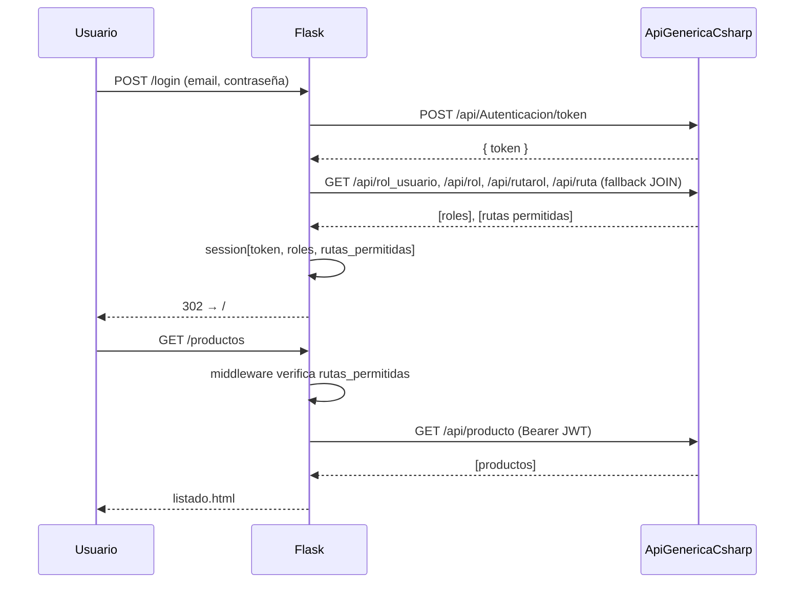

# FrontFlaskSDD

Frontend web del sistema de ventas **Zenith**, implementado en Flask 3 con
renderizado server-side. Consume la API REST genérica
[`ApiGenericaCsharp`](https://github.com/ccastro2050/ApiGenericaCsharp) y
aplica control de acceso por rol (RBAC), CRUDs de catálogos, administración
de usuarios/permisos y facturación maestro-detalle con borrado lógico.

El proyecto fue desarrollado siguiendo el flujo **Spec-Driven Development**:
`/speckit-constitution → /speckit-specify → /speckit-plan → /speckit-tasks → /speckit-implement`.

Todos los artefactos están en `specs/001-sistema-ventas-rbac/`.

## Arquitectura

```mermaid
flowchart LR
    Usuario --HTTP--> Flask[Frontend Flask<br/>FrontFlaskSDD]
    Flask --ApiService + JWT--> API[API REST<br/>ApiGenericaCsharp]
    API --Dapper--> BD[(MariaDB /<br/>PostgreSQL /<br/>SQL Server)]
    Flask -.SMTP.-> Gmail[Gmail SMTP<br/>recuperación contraseña]

    subgraph Flask [ ]
        Middleware{{@before_request<br/>RBAC por ruta}}
        Blueprints[routes/*.py<br/>12 blueprints]
        Templates[templates/<br/>Jinja2 + Bootstrap 5.3]
        CSS[static/css/app.css<br/>identidad Zenith]
        Servicios[services/<br/>ApiService + AuthService]
    end
```

## Flujo de login con RBAC



## Identidad visual

- Azul Zenith `#0A2647` · Dorado Zenith `#E8AA2E` · Azul Medio `#144272`
- Tipografías: **Inter** (cuerpo) + **JetBrains Mono** (códigos/números)
- Todo en `static/css/app.css` vía `:root` (overrides de Bootstrap 5.3)
- Iconos Bootstrap Icons

## Instalación

```bash
git clone <repo>
cd FrontFlaskSDD
python -m venv venv
# Windows
.\venv\Scripts\Activate.ps1
# Linux/Mac
source venv/bin/activate

pip install -r requirements.txt
cp .env.example .env
# edita .env con tu API_BASE_URL y SMTP

# Bootstrap: crea admin/vendedor/roles/rutas/permisos semilla
python scripts/bootstrap_db.py

# Arrancar
flask --app app run --debug
# http://127.0.0.1:5000
```

## Usuarios semilla (tras `bootstrap_db.py`)

| Email | Contraseña | Rol |
|-------|-----------|-----|
| `admin@zenith.test` | `Admin123` | administrador (todas las rutas) |
| `vendedor@zenith.test` | `Vende123` | vendedor (facturas, productos, clientes) |

## Estructura

```
app.py              # entry point, factoría de la app
config.py           # variables de entorno
middleware.py       # @before_request RBAC + context processor
services/
├── api_service.py  # CRUD genérico + SPs (HTTP → API REST)
└── auth_service.py # login, RBAC, contraseñas, descubrir PKs/FKs
routes/             # 12 blueprints (uno por módulo)
templates/
├── layout/         # base.html, login_layout, nav_menu
├── components/     # flash, tabla_crud, form_campo, confirm_modal
└── pages/          # una carpeta por blueprint
static/css/app.css  # único CSS con identidad Zenith
tests/
├── unit/           # validaciones puras (27 tests)
└── integration/    # contra API real (38+ tests)
scripts/
└── bootstrap_db.py # seed de datos
specs/001-sistema-ventas-rbac/
├── spec.md         # qué y por qué
├── plan.md         # cómo
├── research.md     # decisiones técnicas
├── data-model.md   # entidades
├── contracts/      # contratos de consumidor de la API
├── tasks.md        # 83 tareas ejecutadas
└── checklists/     # calidad de requisitos
```

## Rutas públicas (exhaustivas)

| Ruta | Uso |
|------|-----|
| `/login` | Inicio de sesión |
| `/logout` | Cierre de sesión |
| `/recuperar-contrasena` | Solicitar contraseña temporal por email |
| `/static/*` | Recursos estáticos (CSS, iconos) |

Todas las demás requieren sesión y están sujetas a RBAC.

## Tests

```bash
# todos (integración + unit, sin performance)
pytest -m "not performance"

# con performance (requiere API ≤ 5 segundos de latencia)
pytest

# sólo unit (rápido, sin API)
pytest tests/unit
```

Resultado actual (contra `http://localhost:5035`): **73/73 pasando** + 1 warning
sobre usuarios legacy con contraseña en claro (hallazgo documentado, fuera del
alcance de esta feature).

## Tecnologías (stack fijado por la Constitución)

- Python 3.12 · Flask 3 · Jinja2 · Bootstrap 5.3
- `requests` + `python-dotenv` + stdlib `smtplib`
- `pytest` + `pytest-flask`
- Sin ORM, sin drivers de BD, sin framework JS

## Constitución y principios

Cinco principios no negociables en `.specify/memory/constitution.md`:

1. Consumo exclusivo de API REST (sin ORM)
2. Arquitectura Blueprint + servicios genéricos
3. Seguridad JWT + RBAC + borrado lógico
4. Identidad visual Zenith (no Bootstrap por defecto)
5. Código en español, SSR y documentación tutorial
