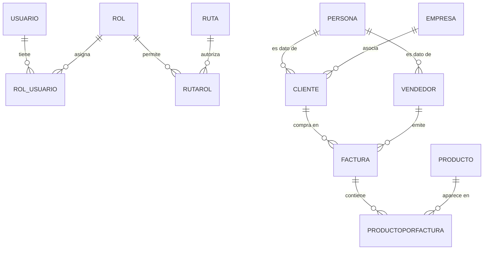
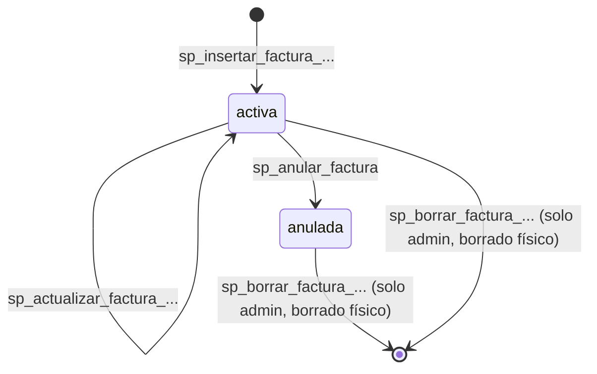

# Data Model — Sistema de Ventas con RBAC y Facturación

**Feature**: 001-sistema-ventas-rbac
**Fecha**: 2026-04-19

> Este documento describe **el modelo de datos que el frontend observa y manipula a través de la API REST**. No define esquema físico: la autoridad del esquema es `ApiGenericaCsharp` + la BD subyacente (SQL Server / PostgreSQL / MySQL). Aquí se fijan las formas de los recursos, los campos que el frontend usa, las relaciones y las reglas de validación aplicadas **en el frontend** antes de llamar a la API.

## Diagrama de relaciones

## Entidades

### Usuario

Representa una cuenta de acceso al sistema.

| Campo | Tipo | Obligatorio | Notas |
|-------|------|-------------|-------|
| `id` | int | sí (auto) | Identificador primario. |
| `email` | string | sí | Identificador funcional de login. Único. Formato email. |
| `contrasena` | string | sí en crear | **Nunca** se muestra ni se devuelve; la API la encripta (BCrypt) en servidor vía `camposEncriptar=["contrasena"]`. |
| `requiere_cambio` | bool | sí | `true` tras una recuperación o al crear el usuario; fuerza el flujo de cambio obligatorio. |
| `roles` | array&lt;int&gt; | sí | IDs de rol asignados (al menos 1). |

**Reglas de validación (frontend)**:
- `email` debe coincidir con `^[^@\s]+@[^@\s]+\.[^@\s]+$`.
- `contrasena` al crear o cambiar debe pasar `validar_contrasena_nueva`: ≥6 chars, ≥1 mayúscula, ≥1 dígito, no trivial, no igual al email.
- `roles` no puede ser lista vacía.

**Transiciones de estado**: `requiere_cambio=true` → (tras cambio exitoso) → `requiere_cambio=false`.

### Rol

| Campo | Tipo | Obligatorio | Notas |
|-------|------|-------------|-------|
| `id` | int | sí (auto) | PK. |
| `nombre` | string | sí | Único (p. ej. `administrador`, `vendedor`). |

### Ruta

| Campo | Tipo | Obligatorio | Notas |
|-------|------|-------------|-------|
| `id` | int | sí (auto) | PK. |
| `ruta` | string | sí | Path de Flask, con o sin parámetros (p. ej. `/productos`, `/facturas/nueva`). Único. |
| `descripcion` | string | sí | Texto legible para administradores; se usa también como etiqueta en el menú. |

### Permiso ruta-rol (`rutarol`)

Tabla puente que autoriza a un rol a una ruta.

| Campo | Tipo | Obligatorio |
|-------|------|-------------|
| `id` | int | sí (auto) |
| `fkid_rol` | int | sí |
| `fkid_ruta` | int | sí |

**Invariante**: la tupla (`fkid_rol`, `fkid_ruta`) es única.

### Persona

| Campo | Tipo | Obligatorio | Notas |
|-------|------|-------------|-------|
| `codigo` | string | sí | PK declarada. |
| `nombre` | string | sí | |
| `email` | string | sí | Formato email. |
| `telefono` | string | no | Libre. |

### Empresa

| Campo | Tipo | Obligatorio | Notas |
|-------|------|-------------|-------|
| `codigo` | string | sí | PK. |
| `nombre` | string | sí | |

### Producto

| Campo | Tipo | Obligatorio | Notas |
|-------|------|-------------|-------|
| `codigo` | string | sí | PK. |
| `nombre` | string | sí | |
| `stock` | int | sí | ≥ 0. |
| `valorunitario` | decimal(2) | sí | ≥ 0. |

**Regla**: el frontend bloquea valores negativos antes de enviar, pero la API es la autoridad final.

### Cliente

| Campo | Tipo | Obligatorio | Notas |
|-------|------|-------------|-------|
| `id` | int | sí (auto) | |
| `credito` | decimal(2) | sí | ≥ 0. |
| `fkcodpersona` | string (FK → Persona.codigo) | sí | |
| `fkcodempresa` | string (FK → Empresa.codigo) | sí | |

**Reglas**: `fkcodpersona` y `fkcodempresa` deben existir; la API rechaza el insert si no. El listado enriquece con `persona.nombre` y `empresa.nombre` (JOIN resuelto vía consulta consolidada o lookups).

### Vendedor

| Campo | Tipo | Obligatorio | Notas |
|-------|------|-------------|-------|
| `id` | int | sí (auto) | |
| `carnet` | string | sí | Documento legal. |
| `direccion` | string | no | |
| `fkcodpersona` | string (FK → Persona.codigo) | sí | |

### Factura (maestro)

| Campo | Tipo | Obligatorio | Notas |
|-------|------|-------------|-------|
| `id` | int | sí (auto) | |
| `fecha` | datetime | sí | Asignada por la API al insertar. |
| `fkid_cliente` | int | sí | |
| `fkid_vendedor` | int | sí | |
| `total` | decimal(2) | sí | Calculado por trigger/SP al crear/actualizar. |
| `estado` | string | sí | Dominio: `activa` \| `anulada`. |

**Transiciones de estado**:

**Invariantes**:
- `estado ∈ {activa, anulada}`.
- Una factura `anulada` no admite `sp_actualizar_factura` ni `sp_anular_factura` de nuevo (FR-033).
- Sólo rol `administrador` puede invocar `sp_borrar_factura_y_productosporfactura` (FR-034).

### Productoporfactura (detalle)

| Campo | Tipo | Obligatorio | Notas |
|-------|------|-------------|-------|
| `id` | int | sí (auto) | |
| `fkid_factura` | int | sí | |
| `fkcodproducto` | string | sí | |
| `cantidad` | int | sí | ≥ 1. |
| `valorunitario` | decimal(2) | sí | Snapshot al momento de facturar. Trigger lo toma del producto al insertar. |
| `subtotal` | decimal(2) | sí | Calculado por trigger (`cantidad * valorunitario`). |

## Reglas derivadas de la Spec

| Regla | Origen | Aplicación |
|-------|--------|------------|
| El stock no puede quedar negativo tras crear/actualizar factura | FR-028, SC-009 | Validación previa en el formulario (stock local contra cantidad) + rechazo final por la API. |
| Anular factura repone stock | FR-031, SC-005 | Garantizado por `sp_anular_factura` (autoridad = BD). Frontend sólo dispara. |
| Borrado físico restringido | FR-034 | Botón renderizado sólo si `'administrador' in session['roles']`; ruta `/facturas/eliminar/<id>` listada en `rutarol` solo para admin. |
| Factura anulada visible en historial | FR-032 | Listado de facturas muestra columna `estado` y filtra por defecto `todas` (no oculta anuladas). |
| Email neutro en recuperación | FR-015 | `AuthService.recuperar_contrasena` nunca revela si el email existe; response idéntica en ambos casos. |

## Entidades derivadas en memoria (no persistentes)

- **Sesión autenticada**: diccionario `flask.session` con claves `token`, `usuario` (id, email, nombre), `roles` (lista de nombres), `rutas_permitidas` (set de strings), `requiere_cambio_contrasena` (bool). No corresponde a una tabla; se reconstruye en cada login.
- **Menú de navegación**: lista calculada en context processor a partir de `rutas_permitidas` cruzando con un catálogo estático de iconos/labels definido en `templates/layout/nav_menu.html` según el Manual de Marca.

## Campos sensibles

- `Usuario.contrasena`: nunca sale en respuestas del API, nunca se loggea en el frontend, se marca en `camposEncriptar` al crear/actualizar.
- `session["token"]`: sólo accesible en código servidor; **no** pasar a templates.
