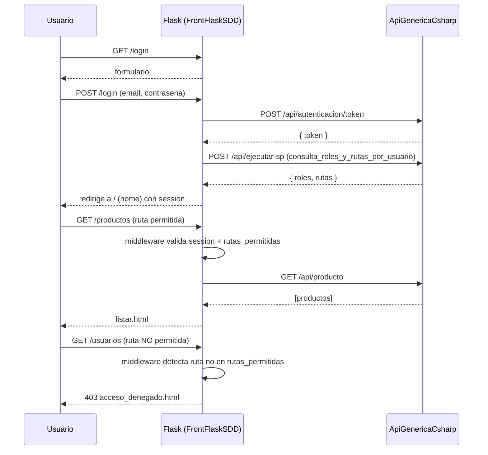
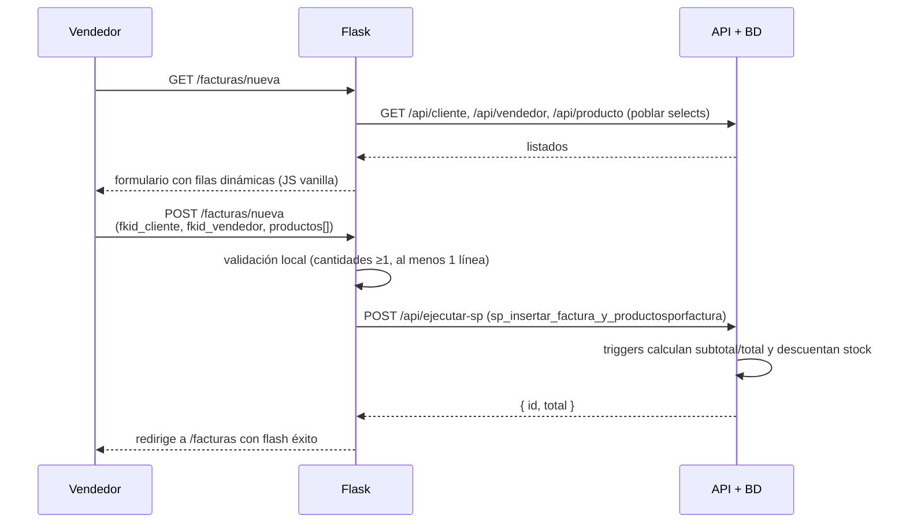

# Quickstart — Sistema de Ventas con RBAC y Facturación

**Feature**: 001-sistema-ventas-rbac
**Audiencia**: desarrolladores que se incorporan al frontend FrontFlaskSDD.

## 1. Requisitos previos

- Python 3.12 instalado.
- Acceso (URL + credenciales) a una instancia de `ApiGenericaCsharp` en ejecución, de preferencia un entorno de pruebas dedicado para no contaminar producción.
- Cuenta de Gmail con **App Password** habilitado para pruebas de SMTP (opcional si no vas a tocar recuperación de contraseña).
- `pip` y, si trabajas en Windows, `PowerShell` (ya disponible).

## 2. Clonar y preparar el entorno

```bash
git clone <este-repo>
cd FrontFlaskSDD
git checkout 001-sistema-ventas-rbac

python -m venv .venv
# Linux/macOS
source .venv/bin/activate
# Windows (PowerShell)
.\.venv\Scripts\Activate.ps1

pip install -r requirements.txt
cp .env.example .env
```

Edita `.env`:

```dotenv
SECRET_KEY=una_cadena_aleatoria_larga
API_BASE_URL=https://api-zenith-test.local
API_BASE_URL_TESTS=https://api-zenith-test.local
SMTP_HOST=smtp.gmail.com
SMTP_PORT=587
SMTP_USER=zenith.noreply@gmail.com
SMTP_APP_PASSWORD=xxxx xxxx xxxx xxxx
SMTP_FROM="Zenith <zenith.noreply@gmail.com>"
```

## 3. Arrancar el frontend

```bash
flask --app app run --debug
# por defecto escucha en http://127.0.0.1:5000
```

## 4. Datos semilla esperados en la API de pruebas

Los tests de integración asumen que la API de pruebas trae, como mínimo:

| Usuario | Rol | Uso |
|---------|-----|-----|
| `admin@zenith.test` / `Admin123` | `administrador` | Cobertura de todos los flujos, incluidos borrado físico de facturas y gestión de usuarios. |
| `vendedor@zenith.test` / `Vende123` | `vendedor` | Cobertura RBAC: acceso a `factura`, `producto` (lectura), denegación a `usuario`. |
| `invitado@zenith.test` / `Invita1` | `lectura` (solo `home`) | Cobertura de 403 sobre módulos no autorizados. |

Mínimo de catálogos presentes para tests:
- ≥1 `empresa`, ≥2 `persona` (una por cliente, otra por vendedor), ≥1 `cliente`, ≥1 `vendedor`, ≥3 `producto` con stock > 5.

Si el entorno de pruebas no los tiene, los fixtures de `tests/conftest.py` los crean al inicio con llamadas `POST` y los destruyen al final con `DELETE`.

## 5. Flujo del MVP (historia P1 de la spec)



## 6. Flujo crítico: crear factura



## 7. Ejecutar tests

```bash
# todos
pytest

# sólo integración del módulo de facturas
pytest tests/integration/test_factura.py -v

# con output detallado
pytest -v --tb=short
```

Los tests **no usan mocks** (Principio V). Si la API de pruebas no responde, fallarán con un error claro indicando `API_BASE_URL_TESTS` inválido o entorno caído.

## 8. Tareas de setup recomendadas antes de programar

- [ ] Verificar que `API_BASE_URL` responde a `GET /api/producto` (con token válido) sin errores.
- [ ] Crear los tres usuarios semilla arriba si no existen.
- [ ] Confirmar que la BD de pruebas tiene los SPs listados en `contracts/api-contracts.md`.
- [ ] Confirmar acceso SMTP haciendo `python -c "import smtplib; smtplib.SMTP_SSL('smtp.gmail.com',465).noop()"` (opcional).
- [ ] Revisar que `Manual_de_Marca_Zenith.md` esté presente en la raíz (Principio IV lo referencia).

## 9. Troubleshooting rápido

| Síntoma | Causa probable | Acción |
|---------|----------------|--------|
| `ApiError(401)` al iniciar sesión | Credenciales o `API_BASE_URL` mal | Revisar `.env`, reintentar con `curl`. |
| El menú aparece vacío tras login | `consulta_roles_y_rutas_por_usuario` falló y el fallback también | Revisar tabla `rutarol` en la BD; verificar SP desplegado. |
| `TemplateNotFound` al abrir una página | Falta archivo en `templates/pages/<modulo>/` | Crear siguiendo la convención `listar.html` / `formulario.html`. |
| Colores por defecto de Bootstrap asomando | `app.css` no carga o no sobrescribe variables `--bs-*` | Comprobar `<link>` y orden de carga en `base.html`. |
| Email de recuperación no llega | App Password inválida o 2FA no activado en la cuenta | Regenerar App Password. |

## 10. Referencias cruzadas

- Spec: [`spec.md`](./spec.md)
- Plan: [`plan.md`](./plan.md)
- Research: [`research.md`](./research.md)
- Data model: [`data-model.md`](./data-model.md)
- Contratos: [`contracts/api-contracts.md`](./contracts/api-contracts.md)
- Constitución: [`../../.specify/memory/constitution.md`](../../.specify/memory/constitution.md)
- Manual de marca: `Manual_de_Marca_Zenith.md` (raíz del repo)
